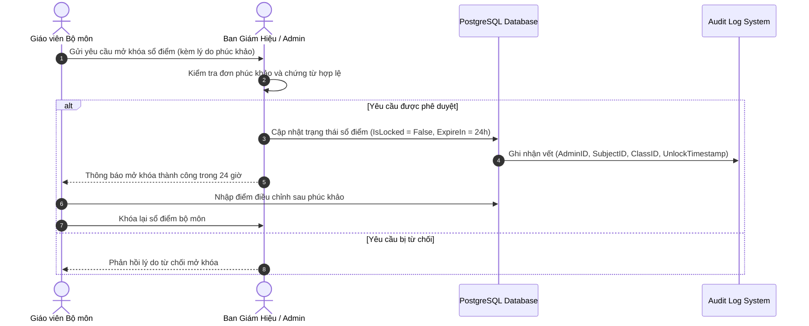

# BrainStorm Tuần 1: Phân Tích SRS - Hệ Thống Quản Lý Trường Học (School Management System - SMS)

Tài liệu phân tích Chi tiết Yêu cầu Phần mềm (SRS - Software Requirements Specification), xác định các Actors (Tác nhân tương tác), Ma trận Phân quyền (RBAC Matrix), các FC (Functional Categories / Feature Components - Phân hệ tính năng), Quy tắc Nghiệp vụ (Business Rules) và Căn cứ Pháp lý Tham khảo cho Hệ thống Quản lý Trường học.

---

## 1. Danh sách Actors và Mô tả Vai trò (Actors Description)

| STT | Actor (Tác nhân) | Mã Vai trò | Mô tả vai trò & Quyền hạn chi tiết |
| :--- | :--- | :--- | :--- |
| 1 | **Admin / Ban Giám Hiệu** *(System Administrator / Principal)* | `ROLE_ADMIN` | Quản trị toàn bộ hệ thống; tạo, cấp quyền và khóa tài khoản; cấu hình năm học, học kỳ; quản lý danh mục khối, lớp, môn học; phân công giảng dạy cho GVBM và phân công GVCN; phê duyệt báo cáo tổng kết toàn trường; duyệt cấp quyền mở lại sổ điểm đã khóa. |
| 2 | **Giáo viên Chủ nhiệm** *(Form Teacher)* | `ROLE_HOMEROOM_TEACHER` | Điểm danh chuyên cần hàng ngày cho lớp chủ nhiệm; duyệt đơn xin nghỉ học từ phụ huynh; nhập đánh giá Hạnh kiểm học kỳ/cả năm; theo dõi tổng quát tình hình học tập; xem học bạ, liên lạc và gửi thông báo trực tiếp tới phụ huynh của lớp. |
| 3 | **Giáo viên Bộ môn** *(Subject Teacher)* | `ROLE_SUBJECT_TEACHER` | Điểm danh theo từng tiết học phụ trách; nhập và chỉnh sửa điểm thành phần (miệng, 15 phút, 1 tiết, giữa kỳ, cuối kỳ) cho các lớp được phân công; tổng kết điểm trung bình môn (TBM); gửi yêu cầu khóa sổ điểm bộ môn sau khi hoàn thành. |
| 4 | **Học sinh** *(Student)* | `ROLE_STUDENT` | Tra cứu kết quả học tập cá nhân (bảng điểm chi tiết các môn, điểm trung bình tích lũy GPA hệ 10 và hệ 4); xem thời khóa biểu, lịch kiểm tra, lịch thi; xem nhật ký điểm danh chuyên cần; nhận thông báo chung từ nhà trường và giáo viên. |
| 5 | **Phụ huynh** *(Parent)* | `ROLE_PARENT` | Sử dụng như Sổ liên lạc điện tử; xem kết quả học tập, điểm số và hạnh kiểm của con em; gửi đơn xin nghỉ học trực tuyến; nhận thông báo điểm danh/vắng học tức thời; xem chi tiết thông báo học phí, lịch sử thanh toán và biên lai điện tử. |

---

## 2. Ma trận Phân quyền Chi tiết (RBAC Permission Matrix)

*Ký hiệu: **C** (Create - Tạo), **R** (Read - Xem), **U** (Update - Cập nhật), **D** (Delete - Xóa), **A** (Approve - Phê duyệt), **L** (Lock - Khóa/Mở).*

| Phân hệ / Đối tượng dữ liệu | Admin | GV Chủ nhiệm | GV Bộ môn | Học sinh | Phụ huynh |
| :--- | :---: | :---: | :---: | :---: | :---: |
| Quản lý Tài khoản & Phân quyền | C / R / U / D | R (Xem lớp) | R (Xem lớp) | R (Cá nhân) | R (Cá nhân) |
| Cấu hình Năm học / Môn / Lớp | C / R / U / D | R | R | R | R |
| Hồ sơ Học sinh | C / R / U / D | R / U (Lớp CN) | R (Lớp dạy) | R (Cá nhân) | R (Cá nhân) |
| Phân công Giảng dạy & TKB | C / R / U / D | R | R | R | R |
| Sổ điểm Thành phần & TBM | R / L | R (Xem lớp CN) | C / R / U (Lớp dạy) | R (Cá nhân) | R (Cá nhân) |
| Đánh giá Hạnh kiểm | R / A | C / R / U (Lớp CN) | - | R (Cá nhân) | R (Cá nhân) |
| Điểm danh Chuyên cần | R | C / R / U (Hàng ngày) | C / R / U (Theo tiết) | R (Cá nhân) | R (Cá nhân) |
| Đơn xin nghỉ học | R | R / A (Lớp CN) | R (Lớp dạy) | - | C / R / U |
| Thông báo & Sổ liên lạc | C / R / U / D | C / R / U (Lớp CN) | R | R | R |
| Quản lý Học phí & Thu chi | C / R / U / D | R (Xem lớp CN) | - | R (Cá nhân) | R / U (Thanh toán) |
| Báo cáo & Xuất Excel/PDF | C / R / U / D | R / U (Lớp CN) | R (Bộ môn) | R (Phiếu điểm) | R (Phiếu điểm) |

---

## 3. Phân tích Chi tiết Các Phân hệ Chức năng (FC - Functional Components)

### FC-01: Phân hệ Quản lý Tài khoản & Phân quyền (Authentication & Authorization)
- **FC-01.1**: Đăng nhập / Đăng xuất an toàn bằng Mã định danh (ID) và Mật khẩu.
- **FC-01.2**: Phân quyền hệ thống theo 5 vai trò (RBAC: Admin, Homeroom Teacher, Subject Teacher, Student, Parent).
- **FC-01.3**: Đổi mật khẩu cá nhân, khôi phục mật khẩu tự động qua Email xác nhận hoặc Mã OTP.
- **FC-01.4**: Tự động khóa tài khoản khi nhập sai mật khẩu quá 5 lần liên tiếp.
- **FC-01.5**: Quản lý phiên làm việc (Session & JWT Refresh Token Management), tự động đăng xuất sau 30 phút vô hiệu.
- **FC-01.6**: Ghi nhật ký truy cập và lưu vết thao tác người dùng (Audit Log) đảm bảo tính minh bạch.

### FC-02: Phân hệ Quản lý Hồ sơ Học sinh & Lớp học (Student & Class Management)
- **FC-02.1**: Quản lý hồ sơ học sinh toàn diện (Họ tên, ngày sinh, giới tính, dân tộc, địa chỉ, ảnh đại diện, thông tin phụ huynh, sức khỏe ban đầu).
- **FC-02.2**: Quản lý danh mục Khối lớp (Khối 10, 11, 12 hoặc các khối học), Lớp học, sĩ số tối đa (35 - 45 học sinh/lớp).
- **FC-02.3**: Xếp lớp tự động/thủ công, chuyển lớp, phân loại trạng thái học sinh (*Đang học, Thôi học, Chuyển trường, Đã tốt nghiệp*).
- **FC-02.4**: Quản lý hồ sơ Khen thưởng, Kỷ luật và tiền sử quá trình học tập của từng học sinh.
- **FC-02.5**: Bộ lọc và công cụ tìm kiếm học sinh thông minh theo Lớp, Khối, Họ tên, Mã học sinh, Học lực.

### FC-03: Phân hệ Quản lý Giảng dạy & Thời khóa biểu (Teaching & Schedule Management)
- **FC-03.1**: Quản lý danh mục Môn học (Toán, Văn, Anh, Lý, Hóa, Sinh, Sử, Địa, GDCD,...), số tiết/tuần, hệ số môn.
- **FC-03.2**: Phân công giảng dạy cho Giáo viên bộ môn theo Lớp và phân công Giáo viên chủ nhiệm.
- **FC-03.3**: Khởi tạo và hiển thị Thời khóa biểu trực quan dạng ma trận Thứ (Thứ 2 - Thứ 7) và Tiết học (Sáng/Chiều).
- **FC-03.4**: Thuật toán tự động kiểm tra trùng lịch dạy của Giáo viên và trùng phòng học khi xếp thời khóa biểu.
- **FC-03.5**: Quản lý đăng ký đổi tiết dạy, dạy bù và cập nhật lịch báo giảng trực tuyến.

### FC-04: Phân hệ Sổ điểm Điện tử & Đánh giá (Grade & Academic Assessment)
- **FC-04.1**: Nhập và chỉnh sửa điểm thành phần (Điểm kiểm tra thường xuyên/miệng, Điểm 15 phút, Điểm 1 tiết, Điểm Giữa kỳ, Điểm Cuối kỳ).
- **FC-04.2**: Cơ chế tự động tính Điểm trung bình môn (TBM) theo đúng trọng số quy định của Bộ Giáo dục & Đào tạo.
- **FC-04.3**: Tự động tính Điểm trung bình tích lũy học kỳ/cả năm (GPA Hệ 10.0 và Quy đổi Hệ 4.0).
- **FC-04.4**: Thuật toán tự động xếp loại Học lực quy chuẩn (*Xuất sắc, Giỏi, Khá, Trung bình, Yếu, Kém*) kết hợp điều kiện khống môn học.
- **FC-04.5**: Nhập, theo dõi và đánh giá Hạnh kiểm học sinh theo từng học kỳ/cả năm (*Tốt, Khá, Trung bình, Yếu*).
- **FC-04.6**: Quy trình Khóa/Mở chốt sổ điểm 2 cấp: GVBM khóa sổ điểm -> Ban Giám Hiệu duyệt mở lại khi có đơn phúc khảo.
- **FC-04.7**: Quản lý đơn xin phúc khảo điểm và lưu lại lịch sử sửa điểm cũ/điểm mới.

### FC-05: Phân hệ Điểm danh & Chuyên cần (Attendance Management)
- **FC-05.1**: Điểm danh chuyên cần hàng ngày (GVCN) hoặc theo từng tiết học (GVBM) trên giao diện Web/Mobile.
- **FC-05.2**: Quản lý trạng thái chuyên cần chi tiết: *Có mặt, Vắng có phép, Vắng không phép, Đi trễ*.
- **FC-05.3**: Phụ huynh nộp Đơn xin nghỉ học trực tuyến qua Sổ liên lạc điện tử; GVCN tiếp nhận và phê duyệt.
- **FC-05.4**: Tự động gửi thông báo/cảnh báo tức thời tới Phụ huynh khi học sinh vắng mặt không rõ lý do.
- **FC-05.5**: Thống kê tỷ lệ chuyên cần theo tháng/học kỳ và tự động đưa ra cảnh báo nguy cơ bị cấm thi do vắng quá 20% số tiết.

### FC-06: Phân hệ Quản lý Học phí & Thu chi (Tuition & Fee Management)
- **FC-06.1**: Khởi tạo và phát hành thông báo học phí theo tháng/học kỳ (gồm Học phí chính khóa, Tiền bán trú, BHYT, Cơ sở vật chất, Học bổng/Miễn giảm).
- **FC-06.2**: Theo dõi và cập nhật trạng thái thanh toán (*Chưa thanh toán, Đã thanh toán, Còn nợ, Thanh toán một phần*).
- **FC-06.3**: Tích hợp cổng thanh toán trực tuyến mô phỏng (Mã QR VietQR, VNPAY/MoMo) giúp phụ huynh đóng tiền dễ dàng.
- **FC-06.4**: Tự động xuất biên lai/hóa đơn thu tiền điện tử gửi tới tài khoản Phụ huynh.

### FC-07: Phân hệ Sổ liên lạc Điện tử & Báo cáo (Communication & Reporting)
- **FC-07.1**: Đăng tải thông báo chung toàn trường và tin nhắn trao đổi riêng giữa GVCN với Phụ huynh.
- **FC-07.2**: Thống kê phổ điểm (Biểu đồ phân bố điểm số) toàn lớp, toàn khối để đánh giá chất lượng giảng dạy.
- **FC-07.3**: Xuất báo cáo danh sách học sinh và bảng điểm tổng hợp lớp ra file **Excel** (chuẩn định dạng SheetJS).
- **FC-07.4**: Xuất Phiếu báo điểm cá nhân, Học bạ điện tử và Biên lai thu học phí ra file **PDF** (chuẩn định dạng jsPDF).

### FC-08: Ánh Xạ Phân Hệ Chức Năng Với Frontend Components (`members/member2_Frontend/src/pages/`)
- **FC-08.1**: `LoginPage.jsx` - Giao diện Đăng nhập đa vai trò, chọn Role, nhập mật khẩu và xử lý xác thực Token.
- **FC-08.2**: `BGHReportCenterPage.jsx` & `BGHAttendanceMonitorPage.jsx` - Portal dành cho Admin / Ban Giám Hiệu theo dõi báo cáo sĩ số, tỷ lệ chuyên cần và phổ điểm toàn trường.
- **FC-08.3**: `SystemSettingsPage.jsx` - Quản lý danh mục khối, lớp, năm học, môn học và cấu hình khóa/mở sổ điểm hệ thống.
- **FC-08.4**: `GradebookPage.jsx` - Sổ điểm điện tử dành cho Giáo viên bộ môn (nhập điểm miệng, 15p, 1 tiết, GK, CK, tự động tính TBM).
- **FC-08.5**: `AttendancePage.jsx` - Giao diện điểm danh chuyên cần dành cho GVCN/GVBM với các lựa chọn: Có mặt, Vắng có phép, Vắng không phép, Đi trễ.
- **FC-08.6**: `StudentSchedulePage.jsx` - Thời khóa biểu và Bảng điểm cá nhân dành cho Học sinh/Phụ huynh.
- **FC-08.7**: `ParentCommunicationPage.jsx` - Sổ liên lạc điện tử, đơn xin nghỉ học và thanh toán học phí cho Phụ huynh.

---

## 4. Quy tắc Nghiệp vụ Hệ thống (Business Rules - BR)

- **BR-01 (Công thức tính TBM)**:  
  $$\text{TBM} = \frac{\sum (\text{Điểm TX}) + 2 \times \text{Điểm GK} + 3 \times \text{Điểm CK}}{\text{Tổng hệ số}}$$  
  *(Điểm làm tròn đến 1 chữ số thập phân).*

- **BR-02 (Điều kiện Xếp loại Học lực Giỏi)**:  
  ĐTB các môn $\ge 8.0$, trong đó môn Toán hoặc Ngữ văn $\ge 8.0$; không có môn nào dưới $6.5$.

- **BR-03 (Quy định Chống Sửa Điểm)**:  
  Sau khi sổ điểm đã chốt khóa, mọi thao tác sửa điểm bắt buộc phải có sự đồng ý phê duyệt của Ban Giám Hiệu và hệ thống tự động ghi nhật ký Audit Log (Thời gian, Người sửa, Điểm cũ, Điểm mới, Lý do).

- **BR-04 (Quy định Chuyên cần)**:  
  Học sinh vắng không phép quá 45 buổi trong một năm học hoặc quá 20% tổng số tiết của môn học sẽ không được lên lớp/bị cấm thi môn đó.

- **BR-05 (Quy định Danh hiệu Thi đua Khen thưởng)**:  
  - *Học sinh Xuất sắc*: ĐTB tất cả các môn $\ge 9.0$, tất cả các môn đánh giá bằng điểm $\ge 8.0$, Hạnh kiểm đạt Tốt.  
  - *Học sinh Giỏi*: ĐTB tất cả các môn $\ge 8.0$, tất cả các môn đánh giá bằng điểm $\ge 6.5$, Hạnh kiểm đạt Tốt.

- **BR-06 (Quy định Rèn luyện Hè & Kiểm tra Khảo sát Thi lại)**:  
  Học sinh có ĐTB cả năm từ $3.5$ đến dưới $5.0$ hoặc có môn học dưới $3.5$ nhưng thuộc diện được rèn luyện hè sẽ phải tham gia kỳ thi lại/kiểm tra đánh giá bổ sung trước khi xét duyệt lên lớp năm học mới.

### Sơ đồ Quy trình Phê duyệt Mở khóa Sổ điểm (Unlock Gradebook Workflow)

---

## 5. Yêu cầu Phi chức năng Chi tiết (NFR - Non-Functional Requirements)

- **Bảo mật (Security)**:
  - Mã hóa mật khẩu bằng thuật toán BCrypt.
  - Xác thực Token JWT với chữ ký mã hóa SSL/TLS (HTTPS).
  - Phòng chống các lỗ hổng bảo mật tiêu chuẩn OWASP (SQL Injection, XSS, CSRF).
  - Phân quyền theo đường dẫn API (Route Authorization).
- **Tính toàn vẹn Dữ liệu (Data Integrity)**:
  - Ràng buộc giá trị điểm thành phần hợp lệ nằm trong khoảng từ `0.0` đến `10.0`.
  - Sử dụng giao dịch CSDL (Database Transactions) đảm bảo tính ACID khi cập nhật điểm hoặc thu học phí hàng loạt.
- **Hiệu năng & Độ sẵn sàng (Performance & Availability)**:
  - Thời gian phản hồi API (Response Time) $< 1$ giây với các truy vấn thông thường.
  - Thời gian tải bảng điểm lớp có sĩ số 45 học sinh $< 500\text{ms}$.
  - Độ sẵn sàng hệ thống (Availability) đạt $99.9\%$, hỗ trợ sao lưu dữ liệu tự động hàng ngày (Daily Auto-Backup).
- **Tính Khả dụng & Tương thích (Usability & Compatibility)**:
  - Giao diện chuẩn UX/UI hiện đại, thân thiện, dễ nhìn cho người lớn tuổi (Giáo viên, Phụ huynh).
  - Tương thích Responsive mượt mà trên tất cả các trình duyệt phổ biến (Chrome, Firefox, Safari, Edge) và thiết bị di động (iOS, Android).

---

## 6. Tài liệu Tham khảo & Căn cứ Pháp lý (References & Legal Framework)

### 6.1. Căn cứ Pháp lý & Quy chế Đào tạo (Legal & Educational Decrees)
- **Thông tư 22/2021/TT-BGDĐT**: Quy định về đánh giá học sinh trung học cơ sở và trung học phổ thông của Bộ Giáo dục & Đào tạo.  
  *Ứng dụng*: Công thức tính điểm trung bình môn, GPA, tiêu chuẩn xếp loại Học lực và đánh giá Hạnh kiểm.
- **Thông tư 32/2020/TT-BGDĐT**: Ban hành Điều lệ trường trung học cơ sở, trường trung học phổ thông và trường phổ thông có nhiều cấp học.  
  *Ứng dụng*: Xác định vai trò, quyền hạn và trách nhiệm của Ban Giám Hiệu, Giáo viên Chủ nhiệm, Giáo viên Bộ môn, Học sinh và Phụ huynh.
- **Nghị định 13/2023/NĐ-CP**: Nghị định của Chính phủ về bảo vệ dữ liệu cá nhân.  
  *Ứng dụng*: Ràng buộc pháp lý về bảo mật thông tin hồ sơ lý lịch học sinh, phụ huynh và tài chính học phí.

### 6.2. Tiêu chuẩn Kỹ thuật & Thiết kế Phần mềm (Technical Standards & Architecture)
- **IEEE Std 830-1998 / ISO/IEC/IEEE 29148:2018**: Recommended Practice for Software Requirements Specifications.  
  *Ứng dụng*: Khung chuẩn quốc tế cấu trúc tài liệu Phân tích Yêu cầu Phần mềm (SRS).
- **OWASP Top 10 Web Application Security Risks**: Open Web Application Security Project.  
  *Phạm vi áp dụng*: Tiêu chuẩn phòng chống lỗ hổng bảo mật Web (SQL Injection, XSS, CSRF, Broken Access Control).
- **RFC 7519 (JSON Web Token - JWT Specification)**: Internet Engineering Task Force (IETF).  
  *Phạm vi áp dụng*: Chuẩn xác thực phân quyền Token RBAC không trạng thái (Stateless Authorization).
- **PostgreSQL 15 Documentation & ACID Compliance Standards**: PostgreSQL Global Development Group.  
  *Phạm vi áp dụng*: Thiết kế và tối ưu hóa Cơ sở Dữ liệu Quan hệ cho điểm số và học phí.

### 6.3. Liên kết Công cụ & Thư viện Mở Tham khảo (Online Technical Documentation Links)
- **SheetJS (xlsx) Documentation**: [https://sheetjs.com](https://sheetjs.com) (Thư viện xuất và xử lý dữ liệu Excel phía Client/Server).
- **jsPDF API Reference**: [https://rawgit.com/MrRio/jsPDF/master/docs/index.html](https://rawgit.com/MrRio/jsPDF/master/docs/index.html) (Thư viện khởi tạo và xuất PDF Học bạ/Biên lai).
- **Cổng Thông tin Điện tử Bộ GD&ĐT**: [https://moet.gov.vn](https://moet.gov.vn) (Tra cứu quy chế, văn bản pháp luật ngành giáo dục).
