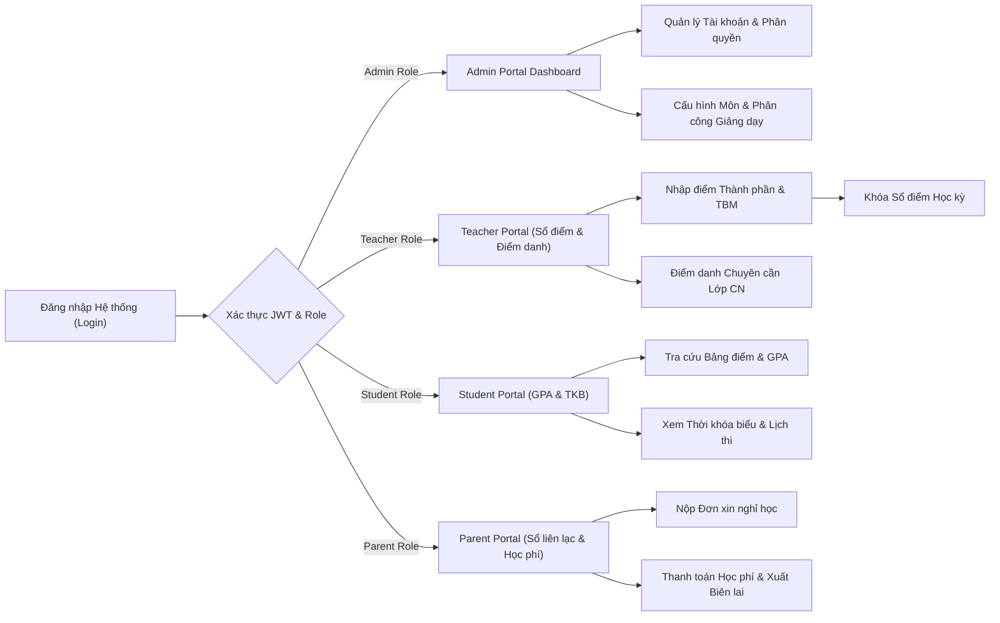

# BrainStorm Tuần 2: Chuyên Đề Nghiên Cứu UI/UX & Lựa Chọn Nền Tảng Thiết Kế Giao Diện Hệ Thống Quản Lý Trường Học (SMS)

Tài liệu nghiên cứu chuyên sâu về thiết kế Giao diện người dùng (UI - User Interface) và Tối ưu hóa Trải nghiệm người dùng (UX - User Experience), đánh giá so sánh giữa WinForms, Web và Mobile App; phân tích các Framework Front-end (React, Angular, Vue.js) và Công cụ Thiết kế (Figma, Google Stitch, Miro) nhằm quyết định phương án công nghệ cho **Hệ thống Quản lý Trường học (School Management System - SMS)**.

---

## CHƯƠNG I. MỤC TIÊU VÀ PHẠM VI NGHIÊN CỨU

### 1. Mục tiêu
Chuyên đề này được thực hiện nhằm đánh giá toàn diện các nền tảng, công nghệ và công cụ phục vụ cho công tác thiết kế giao diện (UI) và tối ưu hóa trải nghiệm (UX) trong phát triển phần mềm. Kết quả nghiên cứu cung cấp luận cứ khoa học thực tiễn để nhóm quyết định phương án công nghệ tối ưu nhất cho **Dự án Hệ thống Quản lý Trường học (SMS)**.

### 2. Giới hạn và Phạm vi nghiên cứu
Chuyên đề tập trung nghiên cứu và đánh giá các nền tảng và công nghệ UI/UX với phạm vi cụ thể bao gồm:
- Phân tích ưu điểm, nhược điểm và tính ứng dụng của 3 môi trường phần mềm chính: **Desktop (WinForms)**, **Trình duyệt (Web)** và **Thiết bị di động (Mobile App)**.
- Đánh giá các Framework Front-end Web nổi bật hiện nay: **React.js**, **Angular**, và **Vue.js**.
- Khảo sát các công cụ thiết kế UI/UX chuyên dụng: **Figma**, **Google Stitch/Design System**, **Miro** và **Kiro Extension**.
- Đối chiếu các nền tảng dựa trên tiêu chuẩn về tính mở rộng, khả năng tương tác đa vai trò (Admin, Giáo viên, Học sinh, Phụ huynh) và độ phản hồi màn hình (Responsive) nhằm chốt phương án kỹ thuật cuối cùng.

---

## CHƯƠNG II. NGHIÊN CỨU VÀ SO SÁNH UI/UX TRÊN WINFORMS, WEB VÀ MOBILE

### 1. Ứng dụng Desktop với WinForms (Windows Forms)

#### 1.1. Đặc điểm chung
WinForms là bộ khung phát triển giao diện đồ họa (GUI) do Microsoft cung cấp, chuyên dùng cho các phần mềm cài đặt trực tiếp trên hệ điều hành Windows. Trải nghiệm UI/UX trên WinForms phụ thuộc chủ yếu vào thao tác bằng chuột và bàn phím máy tính.

#### 1.2. Hệ sinh thái kỹ thuật
Xây dựng trên ngôn ngữ C# và nền tảng .NET Framework/.NET Core, tận dụng IDE Visual Studio với công cụ Kéo-Thả (Drag-and-Drop) trực quan các thành phần giao diện (`Button`, `TextBox`, `Label`, `DataGridView`, `ComboBox`) và cơ chế quản lý liên kết dữ liệu hai chiều (`Data Binding`).

#### 1.3. Điểm mạnh và Hạn chế
- **Điểm mạnh**:
  - Tốc độ phát triển ứng dụng nội bộ rất nhanh với kho Control phong phú tích hợp sẵn.
  - Tương tác trực tiếp và truy xuất phần cứng, file hệ thống Windows với độ trễ gần như bằng 0.
  - Xử lý dữ liệu bảng biểu lớn (`DataGridView`) mượt mà, hỗ trợ tốt phím tắt nhập liệu nhanh cho cán bộ văn phòng.
- **Hạn chế**:
  - Không có tính đa nền tảng (chỉ chạy trên Windows OS, không hỗ trợ macOS, Linux, iOS hay Android).
  - Rất khó thiết kế giao diện Co-dãn Tự động (Responsive) theo nhiều độ phân giải màn hình khác nhau.
  - Người dùng bắt buộc phải tải tệp cài đặt (`.exe` / `.msi`) và cập nhật thủ công trên từng máy tính.
  - Thẩm mỹ UI bị giới hạn bởi các control chuẩn của Windows, dễ bị đánh giá là kém hiện đại nếu không dùng thêm thư viện đồ họa trả phí (DevExpress, Bunifu).

---

### 2. Nền tảng Trình duyệt (Web Platform)

#### 2.1. Đặc điểm chung
Ứng dụng Web hoạt động dựa trên môi trường Internet/Intranet, nơi người dùng tương tác trực tiếp thông qua trình duyệt Web (Client) trong khi dữ liệu được xử lý và phản hồi từ máy chủ (Server).

#### 2.2. Hệ sinh thái kỹ thuật
Cấu trúc giao diện Web được định hình bởi 3 công nghệ cốt lõi:
- **HTML5**: Xây dựng cấu trúc ngữ nghĩa và thành phần nội dung.
- **CSS3**: Định dạng trang trí, bố cục (`Flexbox`, `Grid`), màu sắc, hiệu ứng hoạt họa (`Animations`, `Transitions`).
- **JavaScript (ES6+) / TypeScript**: Xử lý logic tương tác phía người dùng, thao tác DOM và giao tiếp API.

#### 2.3. Các Thư viện / Framework Front-end Nổi bật

##### a. React.js
- **Đặc điểm**: Thư viện mã nguồn mở từ Meta (Facebook), nổi bật với kiến trúc hướng Thành phần (Component-Based) và cơ chế DOM Ảo (Virtual DOM) nâng cao hiệu năng hiển thị.
- **Ưu điểm**: Quản lý State linh hoạt (`Redux`, `Context API`), tái sử dụng component cao, cộng đồng hỗ trợ lớn nhất thế giới.
- **Tài liệu tham khảo chính thống**: [https://react.dev/learn](https://react.dev/learn) (Xem bản tiếng Việt: [https://viblo.asia/p/reactjs-docs-phan-1-Qpmle74VKrd](https://viblo.asia/p/reactjs-docs-phan-1-Qpmle74VKrd))

##### b. Angular
- **Đặc điểm**: Framework toàn diện do Google phát triển, sử dụng ngôn ngữ mã nguồn cứng TypeScript, tích hợp sẵn các công cụ điều hướng (`Routing`), quản lý Form (`Reactive Forms`) và Kiểm tra dữ liệu (`Validation`).
- **Ưu điểm**: Cấu trúc chặt chẽ theo mô hình MVVM/MVC, thích hợp cho các dự án Enterprise quy mô cực lớn.
- **Tài liệu tham khảo chính thống**: [https://angular.dev/docs](https://angular.dev/docs) (Xem bản v17: [https://v17.angular.io/docs](https://v17.angular.io/docs))

##### c. Vue.js
- **Đặc điểm**: Framework linh hoạt, nhẹ nhàng với cơ chế Tự động đồng bộ Dữ liệu và Giao diện (Reactivity System) giúp lộ trình học tập dễ tiếp cận nhất.
- **Ưu điểm**: Dễ dàng tích hợp vào dự án có sẵn, cú pháp template HTML thân thiện.
- **Tài liệu tham khảo chính thống**: [https://vuejs.org/guide/introduction.html](https://vuejs.org/guide/introduction.html)

#### 2.4. Điểm mạnh và Hạn chế của Nền tảng Web
- **Điểm mạnh**:
  - **Tính Đa nền tảng tuyệt đối**: Truy cập từ bất kỳ thiết bị nào có trình duyệt (PC, Laptop, Tablet, Smartphone).
  - Không cần cài đặt ứng dụng: Người dùng chỉ cần nhập địa chỉ URL.
  - Cập nhật tức thời tập trung tại Server, tất cả người dùng luôn sử dụng phiên bản mới nhất.
  - Khả năng Responsive linh hoạt với CSS Media Queries và Flexbox/Grid Layout.
- **Hạn chế**:
  - Phụ thuộc vào kết nối mạng Internet/Intranet.
  - Yêu cầu xử lý bảo mật đường truyền (HTTPS, CORS, JWT, chống OWASP XSS/CSRF).

---

### 3. Ứng dụng Thiết bị Di động (Mobile App)

#### 3.1. Đặc điểm chung
Nền tảng thiết kế dành riêng cho Điện thoại thông minh (Smartphone) và Máy tính bảng (Tablet), lấy thao tác cảm ứng chạm (`Tap`), vuốt (`Swipe`), chạm giữ (`Touch & Hold`) làm trọng tâm thiết kế UX.

#### 3.2. Hệ sinh thái kỹ thuật
- **Native App**: Android Studio (Java/Kotlin) cho Android và Xcode (Swift/Objective-C) cho iOS.
- **Cross-Platform**: Flutter (Dart) hoặc React Native (JavaScript).

#### 3.3. Điểm mạnh và Hạn chế
- **Điểm mạnh**:
  - Trải nghiệm cá nhân hóa cao, tận dụng phần cứng thiết bị (Camera quét mã QR, Sinh trắc học Vân tay/FaceID, GPS).
  - Hỗ trợ Thông báo Đẩy tức thời (Push Notification) rất hiệu quả cho việc nhắc lịch học, điểm danh và học phí.
- **Hạn chế**:
  - Diện tích màn hình nhỏ, khó thao tác với các bảng biểu phức tạp như Sổ điểm tổng hợp sĩ số 45 học sinh.
  - Người dùng phải cài đặt qua App Store / Google Play và tốn chi phí duyệt ứng dụng.

---

### 4. Bảng So Sánh Tổng Hợp 3 Nền Tảng (Comparative Analysis Matrix)

| Tiêu chí Đánh giá | WinForms (Desktop) | Web Platform (Trình duyệt) | Mobile App (Di động) |
| :--- | :--- | :--- | :--- |
| **Khả năng Đa nền tảng** | Kém (Chỉ chạy trên Windows) | **Rất cao** (Windows, macOS, Linux, iOS, Android) | Trung bình (Cần build riêng APK/IPA) |
| **Yêu cầu Cài đặt** | Bắt buộc cài đặt file `.exe` | **Không cần** (Chạy trực tiếp qua Trình duyệt) | Bắt buộc tải từ App Store / Google Play |
| **Khả năng Responsive** | Khó thiết kế linh hoạt | **Tối ưu xuất sắc** (Tự động co dãn màn hình) | Giới hạn khung hình màn hình nhỏ |
| **Thao tác Bảng điểm lớn** | Tốt (`DataGridView`) | **Tốt** (Data Table + Sticky Headers) | Kém (Phải cuộn ngang nhiều) |
| **Bảo trì & Cập nhật** | Phức tạp (Update từng máy) | **Rất dễ** (Cập nhật 1 lần trên Server) | Cần duyệt ứng dụng trên App Store |
| **Trải nghiệm UX Đa vai trò** | Phù hợp với 1 vai trò Admin | **Phù hợp hoàn hảo cho cả 4 Roles** | Phù hợp cho xem tin nhắn, thông báo |

---

## CHƯƠNG III. CÁC CÔNG CỤ & PHẦN MỀM THIẾT KẾ GIAO DIỆN (UI/UX DESIGN TOOLS)

### 1. Figma
- **Đặc điểm**: Phần mềm thiết kế giao diện và làm mẫu thử (Prototype) dựa trên nền tảng điện toán đám mây hàng đầu thế giới.
- **Ứng dụng trong dự án**:
  - Xây dựng bản vẽ khung xương (Wireframe) và giao diện chi tiết (Hi-Fi Prototype) cho 4 phân hệ người dùng.
  - Cho phép 5 thành viên trong nhóm cùng làm việc song song trực tuyến (Real-time Collaboration).
  - Xuất các CSS Tokens (mã màu HSL, typography font size, padding/margin) hỗ trợ lập trình viên Frontend.
- **Trang chủ chính thống**: [https://help.figma.com](https://help.figma.com)

### 2. Google Stitch & Design System Standards
- **Đặc điểm**: Tập hợp các chuẩn mực thiết kế giao diện hiện đại từ Google (Material Design 3 / Stitch System).
- **Ứng dụng trong dự án**:
  - Định hình CSS Custom Properties (Variables) đồng nhất cho toàn hệ thống: Bảng màu tailoring HSL, Font chữ chủ đạo (`Inter` và `Outfit`).
  - Áp dụng phong cách thị giác Glassmorphism (Thẻ hiệu ứng kính mờ, đổ bóng mềm `box-shadow`, bo góc `border-radius`).
  - Xây dựng hiệu ứng tương thích động (Micro-animations) khi hover nút bấm, chuyển tab và hiển thị thông báo Toast.
- **Trang chủ chính thống**: [https://m3.material.io](https://m3.material.io)

### 3. Miro & Kiro Extension
- **Đặc điểm**: Công cụ bảng trắng tư duy (Visual Collaboration Whiteboard) và tiện ích sơ đồ hóa luồng người dùng.
- **Ứng dụng trong dự án**:
  - Phân tích Bản đồ Hành trình Người dùng (User Journey Map) cho từng vai trò: Giáo viên nhập điểm -> Học sinh xem GPA -> Phụ huynh nhận thông báo.
  - Sơ đồ hóa Luồng Chuyển màn hình UI (UI Flowchart Diagram).

---

## CHƯƠNG IV. ĐỀ XUẤT VÀ LỰA CHỌN PHƯƠNG ÁN CÔNG NGHỆ NỀN TẢNG CHO DỰ ÁN (SMS)

### 1. Kết luận Phương án Công nghệ Chốt
Dựa trên kết quả phân tích so sánh kỹ thuật ở Chương II và yêu cầu thực tiễn của đề tài, nhóm quyết định lựa chọn **Nền tảng Web Application (Web Platform)** kết hợp cùng **Kiến trúc Single Page Application (SPA)** làm nền tảng công nghệ UI/UX chính thức cho **Hệ thống Quản lý Trường học (SMS)**.

---

### 2. Luận cứ Khoa học cho Lựa chọn Web Application

1. **Phù hợp hoàn hảo với Mô hình Phân quyền 4 Roles**:
   - Hệ thống Quản lý Trường học phục vụ 4 nhóm người dùng với nhu cầu thiết bị hoàn toàn khác nhau:
     - *Admin & Giáo viên*: Thao tác chủ yếu trên Laptop/Desktop để nhập điểm, xếp thời khóa biểu và quản lý sĩ số.
     - *Học sinh & Phụ huynh*: Thao tác chủ yếu trên Smartphone/Tablet để xem kết quả học tập, thông báo chuyên cần và đóng học phí.
   - Nền tảng Web giúp đáp ứng tất cả các nhóm người dùng trên cùng một địa chỉ hệ thống duy nhất.

2. **Tối ưu UX cho Sổ điểm Điện tử & Thời khóa biểu**:
   - Bố cục Web Layout cho phép thiết kế Bảng điểm linh hoạt với Sticky Header (cố định cột Họ tên khi cuộn ngang) và phím tắt chuyển ô nhập điểm (`Enter`, `Tab`, các phím mũi tên) giúp Giáo viên nhập điểm nhanh gấp 3 lần so với ứng dụng di động.

3. **Tiết kiệm Chi phí Triển khai & Bảo trì**:
   - Không cần phát triển 2 ứng dụng riêng biệt (Android/iOS), chỉ cần 1 bộ mã nguồn Web Responsive chuẩn HTML5/CSS3/JS.

---

### 3. Quy chuẩn Định hình Giao diện (UI/UX Guidelines) áp dụng cho 4 Vai trò

- **Admin Dashboard UI**:
  - Bố cục Sidebar bên trái (Collapsible Sidebar), Header cố định chứa công cụ tìm kiếm và bộ chuyển vai trò (Role Switcher).
  - Màn hình trung tâm hiển thị các thẻ Thống kê (Cards) sĩ số, biểu đồ phân bố điểm số và bảng quản lý phân quyền.
- **Teacher View (Sổ điểm & Điểm danh)**:
  - Giao diện dạng Lưới dữ liệu (Data Grid) phẳng, tương phản màu sắc rõ ràng giữa các cột điểm thường xuyên, giữa kỳ và cuối kỳ.
  - Màu sắc cảnh báo trực quan: Học sinh vắng học (Màu đỏ), Học sinh đi trễ (Màu vàng), Điểm khống/chưa nhập (Màu xám).
- **Student & Parent View (Sổ liên lạc & Kết quả)**:
  - Thiết kế dạng Thẻ (Cards View) mượt mà, điểm trung bình GPA hiển thị nổi bật với Badge màu sắc xếp loại Học lực (*Xuất sắc: Xanh dương, Giỏi: Xanh lá, Khá: Vàng, TB: Cam, Yếu: Đỏ*).
  - Tối ưu hiển thị Responsive 1 cột khi truy cập trên thiết bị di động.

---

## CHƯƠNG V. SƠ ĐỒ KIẾN TRÚC VÀ BẢN VẼ GIAO DIỆN CHI TIẾT (VISUAL DIAGRAMS & UI WIREFRAMES)

### 1. Sơ đồ So sánh Kiến trúc Tương tác 3 Nền tảng (Platform Architecture Diagram)

```mermaid
graph TD
    subgraph Desktop_WinForms ["Desktop Application (WinForms)"]
        W1["C# .NET Executable (.exe)"] --> W2["Local WinForms DataGridView"]
        W2 --> W3["Windows OS Direct Hardware Access"]
        W3 --> W4["Direct Database Connection"]
    end

    subgraph Web_Platform ["Web Application Platform (Selected)"]
        WB1["Web Browser (Chrome/Safari/Edge/Mobile)"] --> WB2["Single Page Application (SPA UI)"]
        WB2 --> WB3["RESTful API Gateway / JWT Auth"]
        WB3 --> WB4["PostgreSQL Database & Storage"]
    end

    subgraph Mobile_App ["Mobile Application"]
        M1["Mobile Operating System (iOS / Android)"] --> M2["Native Touch UI (Flutter/React Native)"]
        M2 --> M3["Device Sensors & Push Notification"]
        M3 --> M4["Mobile API Service"]
    end
```



### 2. Sơ đồ Luồng Hành trình Người dùng trên Giao diện Web (UI User Journey Flowchart)



### 3. Bản vẽ Bố cục Giao diện Chi tiết (UI Layout Wireframes)

#### 3.1. Bố cục Giao diện Quản trị & Giáo viên (Admin & Teacher Web Dashboard Wireframe)
```
+-----------------------------------------------------------------------------------+
| SCHOOL MANAGEMENT SYSTEM (SMS)              [Role: Teacher] [User: Nguyễn Văn A]   |
+------------------+----------------------------------------------------------------+
| NAV MENU         | DASHBOARD > SỔ ĐIỂM LỚP 10A1 > MÔN TOÁN                       |
|                  +----------------------------------------------------------------+
| - Tổng quan      | [Lớp: 10A1 v] [Môn: Toán v] [Học kỳ: HK1 v] [Nút Khóa Sổ Điểm] |
| - Quản lý Học sinh+----------------------------------------------------------------+
| - Sổ điểm        | STT | Mã HS  | Họ và Tên   | Miệng | 15p | 1 Tiết | GK  | CK  | TBM |
| - Điểm danh      |-----+--------+-------------+-------+-----+--------+-----+-----+-----+
| - Thời khóa biểu | 01  | HS0001 | Nguyễn Văn B| 8.5   | 9.0 | 8.0    | 8.5 | 9.0 | 8.7 |
| - Học phí        | 02  | HS0002 | Trần Thị C  | 7.0   | 7.5 | 8.0    | 7.0 | 8.0 | 7.6 |
| - Thống kê       | 03  | HS0003 | Lê Hoàng D  | 6.0   | 6.5 | 7.0    | 6.0 | 7.5 | 6.7 |
|                  +----------------------------------------------------------------+
| [Đăng xuất]      | [Thêm Học Sinh] [Xuất Excel] [Xuất PDF] | Trang: < [1] 2 3 >     |
+------------------+----------------------------------------------------------------+
```

#### 3.2. Bố cục Giao diện Di động Sổ Liên Lạc (Parent Mobile Responsive Wireframe)
```
+-----------------------------------+
|  [=] SỔ LIÊN LẠC ĐIỆN TỬ   [noti] |
+-----------------------------------+
|  HỌC SINH: NGUYỄN VĂN B           |
|  Lớp: 10A1 - Trường THPT HSU      |
+-----------------------------------+
|  [ GPA HK1: 8.7 ] (Học lực Giỏi)  |
+-----------------------------------+
|  THÔNG BÁO TỪ GVCN:               |
|  - Đã có kết quả điểm thi Giữa Kỳ |
|  - Thông báo đóng học phí HK1     |
+-----------------------------------+
|  CHUYÊN CẦN THÁNG:                |
|  [Có mặt: 22 ngày] [Vắng: 0 ngày] |
+-----------------------------------+
|  HỌC PHÍ HỌC KỲ 1:                |
|  Số tiền: 2.500.000 VNĐ           |
|  Trạng thái: [ĐÃ THANH TOÁN]      |
+-----------------------------------+
| [Bảng Điểm] [Nghỉ Học] [Học Phí]  |
+-----------------------------------+
```

---

## CHƯƠNG VI. NGUỒN TÀI LIỆU THAM KHẢO CHÍNH THỐNG (OFFICIAL REFERENCES)

### 1. Tài liệu Kỹ thuật & Frameworks Chính thống (Official Tech Documentation)
1. **Microsoft Learn WinForms Documentation**: Microsoft Corporation.  
   Link: [https://learn.microsoft.com/en-us/dotnet/desktop/winforms/](https://learn.microsoft.com/en-us/dotnet/desktop/winforms/)
2. **W3C Web Architecture & Standards (HTML5, CSS3, ECMAScript Specification)**: World Wide Web Consortium.  
   Link: [https://www.w3.org/TR/](https://www.w3.org/TR/)
3. **React.js Official Documentation**: Meta Open Source.  
   Link: [https://react.dev/learn](https://react.dev/learn) (Xem bản tiếng Việt: [https://viblo.asia/p/reactjs-docs-phan-1-Qpmle74VKrd](https://viblo.asia/p/reactjs-docs-phan-1-Qpmle74VKrd))
4. **Angular Developer Documentation**: Google LLC.  
   Link: [https://angular.dev/docs](https://angular.dev/docs) (Tài liệu phiên bản v17: [https://v17.angular.io/docs](https://v17.angular.io/docs))
5. **Vue.js Official Guide & API Reference**: Evan You & Vue Core Team.  
   Link: [https://vuejs.org/guide/introduction.html](https://vuejs.org/guide/introduction.html)

### 2. Tiêu chuẩn Thiết kế UI/UX & Công cụ (UI/UX Design Standards & Tools)
6. **Figma Help Center & Design System Manual**: Figma Inc.  
   Link: [https://help.figma.com](https://help.figma.com)
7. **Google Material Design 3 (Stitch Design System)**: Google Design Guidelines.  
   Link: [https://m3.material.io](https://m3.material.io)
8. **Nielsen Norman Group (NN/g) - 10 Usability Heuristics for User Interface Design**: Jakob Nielsen.  
   Link: [https://www.nngroup.com/articles/ten-usability-heuristics/](https://www.nngroup.com/articles/ten-usability-heuristics/)
9. **Apple Human Interface Guidelines (HIG)**: Apple Inc.  
   Link: [https://developer.apple.com/design/human-interface-guidelines](https://developer.apple.com/design/human-interface-guidelines)
