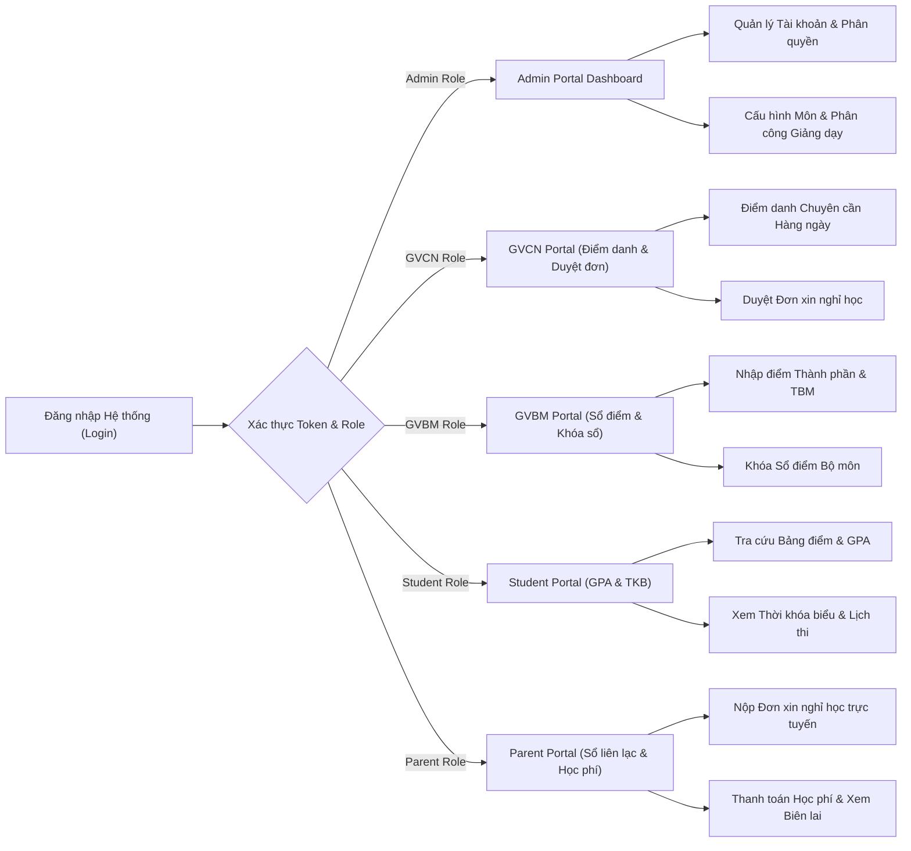

# BrainStorm Tuần 2: Chuyên Đề Nghiên Cứu UI/UX & Lựa Chọn Nền Tảng Thiết Kế Giao Diện Hệ Thống Quản Lý Trường Học (HTQLLH)

Tài liệu nghiên cứu chuyên sâu về thiết kế Giao diện người dùng (UI - User Interface) và Tối ưu hóa Trải nghiệm người dùng (UX - User Experience), đánh giá so sánh giữa WinForms, Web và Mobile App; phân tích các Framework Front-end (React, Angular, Vue.js, Svelte) và Công cụ Thiết kế (Figma, Google Stitch, Kiro) nhằm quyết định phương án công nghệ cho **Hệ thống Quản lý Trường học (HTQLLH)**.

---

## BẢNG PHÂN CÔNG NHIỆM VỤ THÀNH VIÊN

| STT | Họ và tên | Nhiệm vụ phân công | Tỷ lệ hoàn thành |
| :---: | :--- | :--- | :---: |
| 1 | **Võ Duy Bình** | Phụ trách mảng công nghệ nền tảng Web và thiết kế UI/UX Web | 30% |
| 2 | **Nguyễn Vũ Minh Huy** | Phụ trách mảng nền tảng Mobile và thiết kế UI/UX cho thiết bị di động | 10% |
| 3 | **Trần Quang Vinh** | Phụ trách tổng quan khái niệm UI/UX, công cụ Figma và các tiêu chí chọn lựa công nghệ | 20% |
| 4 | **Võ Hoàng Sơn** | Phụ trách nghiên cứu mảng ứng dụng Desktop với WinForms | 20% |
| 5 | **Huỳnh Trung Tính** | Hỗ trợ UI/UX và hoàn thiện tài liệu | 20% |

---

## CHƯƠNG I. MỤC TIÊU VÀ PHẠM VI NGHIÊN CỨU

### 1. Mục tiêu
Chuyên đề này được thực hiện nhằm đánh giá toàn diện các nền tảng, công nghệ và công cụ phục vụ cho công tác thiết kế giao diện (UI) và tối ưu hóa trải nghiệm (UX) trong phát triển phần mềm. Kết quả nghiên cứu cung cấp luận cứ khoa học thực tiễn để nhóm quyết định phương án công nghệ tối ưu nhất cho **Dự án Hệ thống Quản lý Trường học (HTQLLH)**.

### 2. Phạm vi nghiên cứu
Chuyên đề tập trung nghiên cứu và đánh giá các nền tảng và công nghệ phục vụ thiết kế UI/UX cho hệ thống quản lý trường học, bao gồm:
- Phân tích ưu, nhược điểm và tính ứng dụng của ba môi trường phần mềm chính: **Desktop (WinForms)**, **Trình duyệt (Web)** và **Thiết bị di động (Mobile App)**.
- Đánh giá các framework Front-end nổi bật hiện nay dành cho Web: **React**, **Angular**, **Vue.js** và **Svelte**.
- Khảo sát các công cụ thiết kế chuyên dụng và công cụ AI hỗ trợ: **Figma**, **Google Stitch** và **Kiro Agent**.
- Đối chiếu các nền tảng dựa trên các tiêu chuẩn về tính mở rộng, khả năng tương tác và độ phản hồi (responsive) nhằm chốt phương án kỹ thuật cuối cùng cho hệ thống.

---

## CHƯƠNG II. NGHIÊN CỨU UI/UX TRÊN WINFORMS, WEB VÀ MOBILE

### 1. Nền tảng WinForms (Windows Forms)

#### 1.1. Định nghĩa & Hệ sinh thái kỹ thuật
- **Định nghĩa**: WinForms là bộ khung phát triển giao diện đồ họa (GUI) do Microsoft cung cấp, chuyên dùng cho các phần mềm cài đặt trực tiếp trên hệ điều hành Windows. Trải nghiệm UI/UX trên WinForms phụ thuộc chủ yếu vào thao tác bằng chuột và bàn phím máy tính.
- **Hệ sinh thái kỹ thuật**: Xây dựng trên ngôn ngữ C# và nền tảng .NET, tận dụng Visual Studio để kéo thả trực quan các thành phần giao diện (`Button`, `Label`, `TextBox`, `DataGridView`, `ComboBox`) và quản lý liên kết dữ liệu (`Data Binding`).

#### 1.2. Điểm mạnh và Hạn chế
- **Điểm mạnh**:
  - Tốc độ phát triển phần mềm nội bộ rất nhanh với kho control phong phú và tích hợp sâu với cơ sở dữ liệu.
  - Tương tác trực tiếp và truy xuất phần cứng, tệp tin hệ thống Windows với độ trễ thấp.
  - Thao tác dữ liệu bảng biểu lớn (`DataGridView`) mượt mà, hỗ trợ tốt phím tắt nhập liệu cho cán bộ văn phòng.
- **Hạn chế**:
  - Thiếu tính đa nền tảng (chỉ hoạt động trên Windows OS, không hỗ trợ macOS, Linux, iOS hay Android).
  - Khó thiết kế giao diện co-dãn tự động (responsive) trên các độ phân giải màn hình khác nhau.
  - Người dùng bắt buộc phải tải tệp tin cài đặt (`.exe` / `.msi`) và cập nhật thủ công trên từng máy trạm.
  - Giao diện dễ bị đánh giá là kém hiện đại nếu không dùng thêm thư viện đồ họa của bên thứ ba.
  - Thích hợp làm ứng dụng quản lý kho, kế toán hoặc quản trị nội bộ nhà trường ở phạm vi hẹp.

---

### 2. Nền tảng Trình duyệt (Web Platform)

#### 2.1. Đặc điểm chung
Ứng dụng Web hoạt động dựa trên môi trường Internet/Intranet, nơi người dùng tương tác thông qua trình duyệt (Client) trong khi dữ liệu được xử lý tại máy chủ (Server).

#### 2.2. Hệ sinh thái kỹ thuật
Cấu trúc giao diện Web được định hình bởi ba ngôn ngữ cốt lõi:
- **HTML**: Cấu trúc nội dung và ngữ nghĩa trang web.
- **CSS**: Định dạng trang trí, bố cục (`Flexbox`, `Grid Layout`), màu sắc và hiệu ứng chuyển động.
- **JavaScript / TypeScript**: Xử lý logic tương tác phía người dùng, thao tác DOM và giao tiếp API qua HTTP.

#### 2.3. Các Thư viện / Framework Front-end Nổi bật
- **React**: Giải pháp mã nguồn mở từ Facebook (Meta), nổi bật với kiến trúc Component cho phép tách nhỏ và tái sử dụng giao diện. React cung cấp cơ chế quản lý state hiệu quả, cho phép cập nhật từng phần màn hình theo tương tác thực mà không cần tải lại toàn bộ trang (Virtual DOM).  
  *Tài liệu tham khảo: [https://viblo.asia/p/reactjs-docs-phan-1-Qpmle74VKrd](https://viblo.asia/p/reactjs-docs-phan-1-Qpmle74VKrd)*
- **Angular**: Framework toàn diện do Google phát triển, sử dụng TypeScript bắt buộc, tích hợp sẵn các công cụ quản lý điều hướng (`Routing`), quản lý Form và kiểm tra dữ liệu đầu vào (`Validation`). Rất phù hợp với các dự án lớn, cấu trúc phức tạp nhưng tốn thời gian học hỏi.  
  *Tài liệu tham khảo: [https://v17.angular.io/docs](https://v17.angular.io/docs)*
- **Vue.js**: Dễ tiếp cận nhất trong ba loại, tính linh hoạt cao và sở hữu tính năng Reactive tự động đồng bộ giao diện với dữ liệu.  
  *Tài liệu tham khảo: [https://vuejs.org/guide/introduction.html](https://vuejs.org/guide/introduction.html)*

#### 2.4. Điểm mạnh và Hạn chế của Nền tảng Web
- **Điểm mạnh**: Lợi thế tuyệt đối của Web là tính đa nền tảng (PC, tablet, mobile), người dùng không cần cài đặt và nhà phát triển dễ dàng đẩy bản cập nhật tập trung tại máy chủ. Khả năng co dãn linh hoạt theo kích thước màn hình thông qua CSS Media Queries.
- **Hạn chế**: Sự phụ thuộc vào chất lượng kết nối Internet và yêu cầu bảo mật đường truyền (HTTPS, CORS, chống tấn công XSS/CSRF).
- **Phù hợp**: Web là lựa chọn hàng đầu cho các hệ thống giáo dục, trường học và cổng thông tin trực tuyến đa người dùng.

---

### 3. Nền tảng Thiết bị Di động (Mobile Application)

#### 3.1. Khái niệm & Không gian hiển thị
Giao diện trên thiết bị di động bị giới hạn về không gian vật lý (màn hình trung bình từ 4 đến 6 inch). Giao diện không sử dụng khái niệm cửa sổ (Window) như PC, mà sử dụng các lớp (Views/Activities trên Android, ViewControllers trên iOS) xếp chồng lên nhau. Công nghệ render gồm Native (Swift trên iOS, Kotlin trên Android) hoặc Cross-platform (Flutter dùng Skia engine tự vẽ UI, React Native dùng bridge biên dịch ra UI gốc).

#### 3.2. Nguyên tắc UX Đặc thù trên Mobile
1. **Kích thước điểm chạm (Touch Targets)**:
   - Người dùng thao tác bằng ngón tay thay vì con trỏ chuột chính xác, mọi nút bấm và vùng chọn phải đạt kích thước tối thiểu.
   - Apple yêu cầu vùng chạm ít nhất là $44 \times 44\text{ pt}$ (theo Human Interface Guidelines).
   - Google quy định vùng chạm ít nhất là $48 \times 48\text{ dp}$ (theo Material Design).
2. **Khu vực ngón tay cái (The Thumb Zone)**:
   - Hơn 70% người dùng cầm điện thoại bằng một tay.
   - UX Mobile bắt buộc phải đặt các menu điều hướng quan trọng nhất (Bottom Navigation) và nút thao tác chính (Floating Action Button) ở nửa dưới màn hình để ngón cái dễ dàng với tới.
   - Vùng trên cùng (Top Bar) chỉ dùng để hiển thị thông tin tĩnh.
3. **Điều hướng bằng cử chỉ (Gesture Navigation)**:
   - Tận dụng tối đa các thao tác vuốt (swipe) để chuyển tab hoặc xóa, kéo từ trên xuống (Pull to refresh) để làm mới dữ liệu, và chụm (Pinch) để phóng to thu nhỏ.
   - Không có khái niệm hover (rê chuột) như trên Web hay WinForms, mọi hướng dẫn đều phải hiển thị trực quan.
4. **Bộ quy chuẩn thiết kế quốc tế**:
   - Google Material Design 3: Quy định rõ về khoảng cách lưới (8dp), typography và màu sắc.  
     *Tài liệu: [https://m3.material.io/](https://m3.material.io/)*
   - Apple Human Interface Guidelines (HIG): Tài liệu chuẩn mực để thiết kế UX mượt mà cho hệ sinh thái iOS/iPadOS.  
     *Tài liệu: [https://developer.apple.com/design/human-interface-guidelines/](https://developer.apple.com/design/human-interface-guidelines/)*

#### 3.3. Điểm mạnh và Hạn chế của Mobile
- **Điểm mạnh**: Cho phép sử dụng mọi lúc mọi nơi; tối ưu hóa thao tác chạm vuốt; khai thác phần cứng thiết bị (camera quét mã QR, thông báo đẩy Push Notification); mang lại trải nghiệm cá nhân hóa cao cho học sinh và phụ huynh.
- **Hạn chế**: Không gian hiển thị nhỏ hẹp, khó khăn khi hiển thị bảng điểm lớn của lớp 45 học sinh; người dùng phải tải và cài đặt ứng dụng; kiểm thử phức tạp trên nhiều kích thước màn hình; chi phí phát triển và duy trì trên cả hai nền tảng Android/iOS cao.

---

### 4. Công cụ và Phần mềm Thiết kế UI/UX

#### 4.1. Figma
- **Đặc điểm**: Figma là công cụ thiết kế giao diện trực tuyến hàng đầu, cho phép thiết kế trực tiếp ngay trên trình duyệt web.
- **Điểm mạnh**:
  - Hỗ trợ làm việc nhóm, cho phép nhiều thành viên cùng tham gia cộng tác, chỉnh sửa và nhận xét trực tiếp trên cùng một bản thiết kế (Real-time Collaboration).
  - Cung cấp tính năng tạo Component và Design System giúp tái sử dụng các thành phần giao diện đồng nhất.
  - Sở hữu thế mạnh trong việc xây dựng wireframe, mockup và tạo prototype mô phỏng luồng tương tác thực tế giữa các màn hình.
  - Xuất các CSS Tokens (màu sắc, khoảng cách, typography) hỗ trợ trực tiếp lập trình viên Front-end.

#### 4.2. Google Stitch
- **Đặc điểm**: Google Stitch là công cụ thiết kế giao diện vận hành bằng AI do Google Labs phát triển. Stitch đóng vai trò cầu nối từ ý tưởng đến mã nguồn thực tế, tự động sinh ra các bản mẫu (prototype) đa màn hình và hệ thống thiết kế (design system) thông qua nhập các mô tả bằng văn bản (prompt), đường dẫn hoặc hình ảnh phác thảo.
- **Điểm mạnh**:
  - Biến các đoạn mô tả prompt, hình ảnh phác thảo (sketch) hoặc wireframe thành giao diện web/app hoàn chỉnh chỉ trong vài phút, hữu ích cho giai đoạn lên ý tưởng ban đầu.
  - Có khả năng xuất thẳng ra mã nguồn Front-end (HTML/CSS).
  - Cung cấp tính năng khoanh vùng (Annotate) để yêu cầu AI chỉ cập nhật hoặc thay đổi một thành phần cụ thể trên màn hình (như sửa menu, đổi màu nút bấm) mà không làm ảnh hưởng cấu trúc tổng thể.
  - Tối ưu hóa việc chia sẻ bản thiết kế để thu thập phản hồi từ các bên liên quan.
- **Điểm hạn chế**:
  - Kết quả UI tạo ra thường thiếu sự hoàn thiện chi tiết về khoảng cách (spacing), phân cấp thông tin và khả năng tiếp cận (accessibility), đòi hỏi phải tinh chỉnh thủ công.
  - Khó duy trì tính đồng bộ giao diện khi yêu cầu AI tạo ra hệ thống nhiều màn hình với các luồng nghiệp vụ đan xen phức tạp.
  - Sử dụng cơ chế điểm tín dụng (credits) giới hạn số lượt tạo giao diện mỗi ngày.

#### 4.3. Kiro (Software Engineering Agent IDE)
- **Đặc điểm**: Khác với công cụ chat AI thông thường, Kiro là một trợ lý kỹ sư phần mềm tự trị (Software Engineering Agent) do AWS xây dựng. Kiro cho phép người dùng định nghĩa yêu cầu và kết quả mong muốn bằng ngôn ngữ tự nhiên; sau đó AI tự động lập kế hoạch, phân tích hệ thống, tạo môi trường độc lập (sandbox) và viết mã nguồn từ Front-end đến Back-end. Cuối cùng, Kiro đóng gói và gửi yêu cầu gộp mã (Pull Request) để nhóm kiểm duyệt.
- **Điểm mạnh**:
  - Tự động phân tích prompt để chuyển đổi thành tài liệu đặc tả, thiết kế kiến trúc và danh sách công việc có cấu trúc rõ ràng trước khi viết code.
  - Chạy ngầm độc lập trong môi trường IDE, giúp nhà phát triển dễ dàng ủy quyền các tác vụ lập trình lặp đi lặp lại.
  - Hỗ trợ xuyên suốt từ bước dựng nguyên mẫu (prototype) sơ khai đến khi triển khai hệ thống phần mềm thực tế.
- **Điểm hạn chế**:
  - Nếu yêu cầu nghiệp vụ mô tả mơ hồ hoặc thiếu logic, AI có thể sinh ra kiến trúc không phù hợp.
  - Với các dự án có logic nghiệp vụ học vụ đặc thù (như công thức tính điểm TBM, quy chế xếp loại Thông tư 22), lập trình viên bắt buộc phải kiểm tra kỹ lưỡng các Pull Request do AI tạo ra để tránh sai lệch dữ liệu.

---

## CHƯƠNG III. SO SÁNH VÀ LỰA CHỌN CÔNG NGHỆ FRONT-END

### 1. Bảng So Sánh 4 Frameworks: React, Angular, Vue.js, Svelte

| Tiêu chí Đánh giá | React | Angular | Vue.js | Svelte |
| :--- | :--- | :--- | :--- | :--- |
| **Nhà phát triển** | Meta (Facebook) & Cộng đồng | Google | Evan You & Cộng đồng | Rich Harris & Cộng đồng |
| **Phân loại** | Thư viện UI (UI Library) | Framework toàn diện (Full-fledged) | Framework tăng tiến (Progressive) | Trình biên dịch (Compiler / Framework) |
| **Ngôn ngữ chính** | JavaScript / TypeScript (JSX) | TypeScript (Bắt buộc) | JavaScript / TypeScript | JavaScript / TypeScript |
| **Cơ chế Render (DOM)** | **Virtual DOM (DOM ảo)** | Real DOM (DOM thật) | Virtual DOM (DOM ảo) | **Không dùng Virtual DOM (Thao tác trực tiếp Real DOM lúc compile)** |
| **Quản lý Dữ liệu** | **Ràng buộc 1 chiều (One-way data binding)** | Ràng buộc 2 chiều (Two-way data binding) | Ràng buộc 2 chiều (Two-way data binding) | Phản ứng tự động lúc biên dịch (Build-time reactivity) |
| **Độ khó tiếp cận** | Trung bình (Cần học JSX, Hooks, State) | Khó (Nhiều khái niệm: DI, RxJS, Services) | Dễ (Cú pháp tách bạch HTML, CSS, JS) | Rất dễ (Code gần giống HTML/JS thuần) |
| **Hiệu suất & Dung lượng** | Nhanh, dung lượng bundle ở mức trung bình | Tốt cho dự án lớn, file build khá nặng | Rất nhanh, framework nhẹ | Cực nhanh, file build siêu nhỏ gọn |
| **Hệ sinh thái & Cộng đồng** | **Khổng lồ, vô số thư viện bên thứ 3** | Rất lớn, chuẩn hóa doanh nghiệp | Lớn, tài liệu hướng dẫn chi tiết | Đang phát triển nhanh, cộng đồng nhỏ hơn 3 thư viện trên |
| **Ứng dụng tiêu biểu** | Facebook, Netflix, Airbnb | Gmail, Forbes, Upwork | Alibaba, GitLab, Nintendo | Spotify, The New York Times, Brave |

---

### 2. Lựa chọn Công nghệ Front-end cho Dự án

Sau khi phân tích và đối chiếu các đặc điểm kỹ thuật của React, Angular, Vue.js và Svelte, nhóm quyết định lựa chọn **React (kết hợp công cụ Vite và Tailwind CSS)** làm nền tảng Front-end cốt lõi để phát triển Hệ thống Quản lý Trường học.

**Các lý do lựa chọn chính**:
1. **Tối ưu hóa tái sử dụng giao diện (Component-based)**: Cho phép xây dựng các thành phần UI phức tạp nhưng dùng chung nhiều lần (Bảng nhập điểm `GradebookTable`, Dropdown chọn khối/lớp, Thẻ thông báo, Widget thời khóa biểu), giúp tiết kiệm thời gian phát triển và đảm bảo tính đồng nhất toàn hệ thống.
2. **Quản lý trạng thái (State) nghiệp vụ phức tạp**: Cơ chế React Hooks (`useState`, `useEffect`, `useMemo`) giúp xử lý dữ liệu động mượt mà, rất phù hợp với các phân hệ yêu cầu cập nhật liên tục như sổ điểm điện tử, điểm danh chuyên cần hàng ngày và thay đổi trạng thái đóng học phí.
3. **Khả năng tương thích hệ sinh thái cao**: Dễ dàng kết hợp với các công cụ hiện đại như Vite (build tool siêu tốc), React Router DOM (điều hướng trang không reload) và đặc biệt tương thích hoàn hảo với Tailwind CSS để tùy biến giao diện linh hoạt.
4. **Trải nghiệm đa nền tảng (Responsive & SPA)**: Hỗ trợ xây dựng ứng dụng trang đơn (Single Page Application) tải trang mượt mà. Mang lại trải nghiệm tối ưu trên màn hình lớn Desktop (dành cho Admin, Giáo viên nhập liệu bảng biểu) và tự động co dãn 1 cột trên Mobile Web (dành cho Phụ huynh, Học sinh tra cứu điểm số).
5. **Khả năng mở rộng và bảo trì**: Hệ sinh thái khổng lồ, tài liệu dồi dào giúp nhóm dễ dàng bảo trì mã nguồn và thuận tiện tích hợp thêm các phân hệ mới trong tương lai.

---

## CHƯƠNG IV. ĐỀ XUẤT VÀ LỰA CHỌN PHƯƠNG ÁN CÔNG NGHỆ NỀN TẢNG CHO DỰ ÁN

### 1. Kết luận Phương án Công nghệ Chốt
Dựa trên kết quả phân tích so sánh kỹ thuật ở Chương II và yêu cầu thực tiễn của đề tài, nhóm quyết định lựa chọn **Nền tảng Web Application (Web Platform)** kết hợp cùng **Kiến trúc Single Page Application (SPA) trên nền React** làm nền tảng công nghệ UI/UX chính thức cho **Hệ thống Quản lý Trường học (HTQLLH)**.

### 2. Luận cứ Khoa học cho Lựa chọn Web Application
1. **Phù hợp với Mô hình Đa vai trò (5 Vai trò người dùng)**:
   - Hệ thống phục vụ 5 vai trò: Admin / Ban Giám Hiệu, Giáo viên Chủ nhiệm, Giáo viên Bộ môn, Học sinh và Phụ huynh.
   - *Admin và Giáo viên*: Thao tác nhập liệu nhiều trên máy tính để bàn hoặc laptop.
   - *Học sinh và Phụ huynh*: Thao tác tra cứu chủ yếu trên điện thoại thông minh.
   - Nền tảng Web Responsive đáp ứng tất cả các nhóm người dùng trên cùng một địa chỉ URL duy nhất mà không bắt buộc cài đặt ứng dụng riêng.
2. **Tối ưu UX cho Sổ điểm Điện tử & Thời khóa biểu**:
   - Web layout cho phép thiết kế bảng điểm linh hoạt với Sticky Header (cố định cột Họ tên khi cuộn ngang) và hỗ trợ phím tắt chuyển ô nhập điểm (`Enter`, `Tab`, phím mũi tên) giúp giáo viên nhập điểm nhanh chóng.
3. **Tiết kiệm chi phí triển khai và bảo trì**:
   - Cập nhật phiên bản mới tập trung một lần duy nhất tại máy chủ web, tất cả người dùng đều nhận được phiên bản mới nhất ngay khi mở trình duyệt.

---

## CHƯƠNG V. SƠ ĐỒ VÀ BẢN VẼ GIAO DIỆN CHI TIẾT (UI WIREFRAMES)

### 1. Sơ đồ Luồng Hành trình Người dùng trên Giao diện Web (User Journey Flowchart)


```mermaid
flowchart LR
    A["Đăng nhập Hệ thống (Login)"] --> B{"Xác thực Token & Role"}
    B -->|Admin Role| C["Admin Portal Dashboard"]
    B -->|GVCN Role| D1["GVCN Portal (Điểm danh & Duyệt đơn)"]
    B -->|GVBM Role| D2["GVBM Portal (Sổ điểm & Khóa sổ)"]
    B -->|Student Role| E["Student Portal (GPA & TKB)"]
    B -->|Parent Role| F["Parent Portal (Sổ liên lạc & Học phí)"]

    C --> C1["Quản lý Tài khoản & Phân quyền"]
    C --> C2["Cấu hình Môn & Phân công Giảng dạy"]

    D1 --> D11["Điểm danh Chuyên cần Hàng ngày"]
    D1 --> D12["Duyệt Đơn xin nghỉ học"]

    D2 --> D21["Nhập điểm Thành phần & TBM"]
    D2 --> D22["Khóa Sổ điểm Bộ môn"]

    E --> E1["Tra cứu Bảng điểm & GPA"]
    E --> E2["Xem Thời khóa biểu & Lịch thi"]

    F --> F1["Nộp Đơn xin nghỉ học trực tuyến"]
    F --> F2["Thanh toán Học phí & Xem Biên lai"]
```

### 2. Bản vẽ Bố cục Giao diện Sổ điểm Giáo viên (Teacher Gradebook Wireframe)
```
+-----------------------------------------------------------------------------------+
| HE THONG QUAN LY TRUONG HOC (HTQLLH)        [Vai tro: GVBM] [User: Tran Quang Vinh] |
+------------------+----------------------------------------------------------------+
| MENU CHUC NANG   | SO DIEM DIEN TU > LOP 10A1 > MON TOAN                         |
|                  +----------------------------------------------------------------+
| - Tong quan      | [Lop: 10A1 v] [Mon: Toan v] [Hoc ky: HK1 v]  [Nut Khoa So Diem]|
| - Quan ly hoc sinh+----------------------------------------------------------------+
| - So diem        | STT | Ma HS  | Ho va Ten   | Mieng | 15p | 1 Tiet | GK  | CK  | TBM |
| - Diem danh      |-----+--------+-------------+-------+-----+--------+-----+-----+-----+
| - Thoi khoa bieu | 01  | HS0001 | Nguyen Van A| 8.5   | 9.0 | 8.0    | 8.5 | 9.0 | 8.7 |
| - Hoc phi        | 02  | HS0002 | Tran Thi B  | 7.0   | 7.5 | 8.0    | 7.0 | 8.0 | 7.6 |
| - Thong ke       | 03  | HS0003 | Le Hoang C  | 6.0   | 6.5 | 7.0    | 6.0 | 7.5 | 6.7 |
|                  +----------------------------------------------------------------+
| [Dang xuat]      | [Them Hoc Sinh] [Xuat Excel] [Xuat PDF]   | Trang: < [1] 2 3 > |
+------------------+----------------------------------------------------------------+
```

### 3. Bản vẽ Bố cục Giao diện Mobile Sổ Liên Lạc Phụ Huynh (Parent Mobile Wireframe)
```
+-----------------------------------+
|  [=] SO LIEN LAC DIEN TU   [noti] |
+-----------------------------------+
|  HOC SINH: NGUYEN VAN A           |
|  Lop: 10A1 - Truong THPT HSU      |
+-----------------------------------+
|  [ GPA HK1: 8.7 ] (Hoc luc: Gioi) |
+-----------------------------------+
|  THONG BAO TU NHA TRUONG:         |
|  - Ket qua kiem tra giua ky da co |
|  - Thong bao dong hoc phi HK1     |
+-----------------------------------+
|  CHUYEN CAN THANG:                |
|  [Co mat: 22 buoi] [Vang: 0 buoi] |
+-----------------------------------+
|  HOC PHI HOC KY 1:                |
|  So tien: 2.500.000 VND           |
|  Trang thai: [DA THANH TOAN]      |
+-----------------------------------+
| [Bang Diem] [Nghi Hoc] [Hoc Phi]  |
+-----------------------------------+
```

---

## CHƯƠNG VI. TÀI LIỆU THAM KHẢO

1. **React.js Documentation**: Meta Open Source.  
   Link: [https://react.dev/learn](https://react.dev/learn) (Bản tiếng Việt: [https://viblo.asia/p/reactjs-docs-phan-1-Qpmle74VKrd](https://viblo.asia/p/reactjs-docs-phan-1-Qpmle74VKrd))
2. **Angular Documentation**: Google LLC.  
   Link: [https://v17.angular.io/docs](https://v17.angular.io/docs)
3. **Vue.js Official Guide**: Evan You & Vue Team.  
   Link: [https://vuejs.org/guide/introduction.html](https://vuejs.org/guide/introduction.html)
4. **Figma Help Center**: Figma Inc.  
   Link: [https://help.figma.com](https://help.figma.com)
5. **Google Material Design 3**: Google LLC.  
   Link: [https://m3.material.io/](https://m3.material.io/)
6. **Apple Human Interface Guidelines**: Apple Inc.  
   Link: [https://developer.apple.com/design/human-interface-guidelines/](https://developer.apple.com/design/human-interface-guidelines/)
7. **WinForms Documentation**: Microsoft Learn.  
   Link: [https://learn.microsoft.com/en-us/dotnet/desktop/winforms/](https://learn.microsoft.com/en-us/dotnet/desktop/winforms/)
8. **Mã nguồn dự án Phat-Trien-Du-An-Phan-Mem**: Tài liệu nội bộ nhóm thực hiện đề tài Xây dựng Hệ thống Quản lý Trường học.
