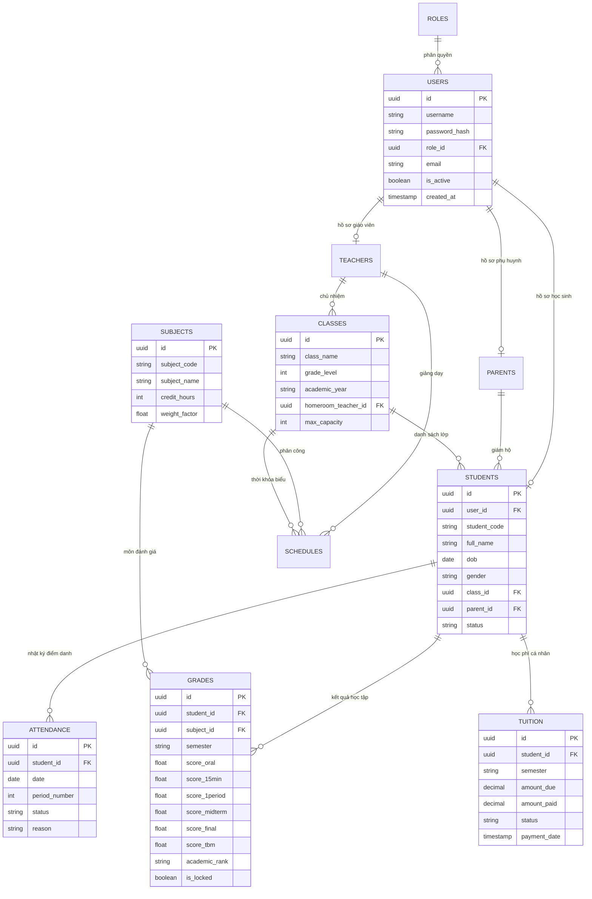

# BrainStorm Tuần 3: Chuyên Đề Nghiên Cứu Cơ Sở Dữ Liệu & Thiết Kế CSDL Hệ Thống Quản Lý Trường Học (SMS)

Tài liệu nghiên cứu chuyên sâu về công nghệ Cơ sở dữ liệu (Database Systems), đánh giá so sánh giữa 5 hệ CSDL tiêu biểu: **SQL Server**, **PostgreSQL**, **MySQL/MariaDB**, **Supabase** và **MongoDB**; phân tích ưu nhược điểm, mô hình lưu trữ và thiết kế sơ đồ CSDL ERD thực thể cho **Hệ thống Quản lý Trường học (School Management System - SMS)**.

---

## CHƯƠNG I. MỤC TIÊU VÀ PHẠM VI NGHIÊN CỨU

### 1. Mục tiêu
Chuyên đề này được thực hiện nhằm đánh giá toàn diện các hệ quản trị cơ sở dữ liệu quan hệ (RDBMS), cơ sở dữ liệu phi quan hệ (NoSQL) và nền tảng Backend-as-a-Service (BaaS). Kết quả nghiên cứu cung cấp luận cứ khoa học thực tiễn để nhóm chọn phương án CSDL tối ưu nhất cho **Dự án Hệ thống Quản lý Trường học (SMS)**.

### 2. Giới hạn và Phạm vi nghiên cứu
Chuyên đề tập trung nghiên cứu và đối chiếu 5 hệ quản trị cơ sở dữ liệu chính:
- **Microsoft SQL Server**: Hệ CSDL quan hệ thương mại dành cho doanh nghiệp.
- **PostgreSQL**: Hệ CSDL quan hệ đối tượng mã nguồn mở nâng cao.
- **MySQL / MariaDB**: Hệ CSDL quan hệ mã nguồn mở phổ biến cho ứng dụng Web.
- **Supabase**: Nền tảng BaaS phát triển dựa trên cơ sở dữ liệu PostgreSQL.
- **MongoDB**: Hệ CSDL NoSQL hướng tài liệu (Document-Oriented Database).

Các tiêu chí đối chiếu bao gồm: Tính toàn vẹn giao dịch (ACID), khả năng ràng buộc khóa ngoại (Foreign Keys), hiệu năng xử lý truy vấn bảng điểm lớn, khả năng lưu trữ dữ liệu bán cấu trúc (JSON/JSONB), tính bảo mật và chi phí vận hành.

---

## CHƯƠNG II. NGHIÊN CỨU VÀ SO SÁNH 5 HỆ QUẢN TRỊ CƠ SỞ DỮ LIỆU

### 1. Microsoft SQL Server (RDBMS Doanh nghiệp)

#### 1.1. Đặc điểm chung
Microsoft SQL Server là hệ quản trị cơ sở dữ liệu quan hệ (RDBMS) hàng đầu dành cho doanh nghiệp do Microsoft phát triển, sử dụng ngôn ngữ truy vấn mở rộng T-SQL (Transact-SQL).

#### 1.2. Hệ sinh thái kỹ thuật
- Tích hợp công cụ quản trị **SSMS (SQL Server Management Studio)** chuyên nghiệp.
- Tích hợp sâu với hệ sinh thái Microsoft (.NET Framework, C#, Azure Cloud).
- Hỗ trợ các tính năng doanh nghiệp: Stored Procedures, Triggers, In-Memory OLTP, SQL Server Reporting Services (SSRS).

#### 1.3. Điểm mạnh và Hạn chế
- **Điểm mạnh**: Độ ổn định cao, bảo mật doanh nghiệp xuất sắc, công cụ quản trị SSMS trực quan, xử lý giao dịch thương mại cực mạnh.
- **Hạn chế**: Chi phí bản quyền thương mại đắt đỏ (Enterprise/Standard License), tốn nhiều tài nguyên RAM/CPU của Server, tối ưu nhất trên hệ điều hành Windows Server.

---

### 2. PostgreSQL (RDBMS Mã nguồn mở Nâng cao - Đề xuất Chốt)

#### 2.1. Đặc điểm chung
PostgreSQL là hệ quản trị cơ sở dữ liệu quan hệ đối tượng (ORDBMS) mã nguồn mở mạnh mẽ nhất thế giới, tuân thủ nghiêm ngặt chuẩn ANSI SQL và tính tính toàn vẹn ACID.

#### 2.2. Hệ sinh thái kỹ thuật
- Hỗ trợ các kiểu dữ liệu nâng cao: `JSONB`, `Array`, `UUID`, `Range Types`, `GIS (PostGIS)`.
- Hệ thống chỉ mục (Indexing) đa dạng: B-Tree, Hash, GiST, SP-GiST, GIN, BRIN.
- Tương thích hoàn hảo với mọi hệ điều hành: Linux, Windows, macOS, Docker Container.

#### 2.3. Điểm mạnh và Hạn chế
- **Điểm mạnh**:
  - Miễn phí bản quyền $100\%$, mã nguồn mở hoàn toàn.
  - Xử lý dữ liệu quan hệ phức tạp và dữ liệu phi cấu trúc (`JSONB`) với tốc độ vượt trội.
  - Tính toàn vẹn dữ liệu ACID tuyệt đối, chống korrupt dữ liệu khi mất điện hoặc sự cố máy chủ.
  - Hỗ trợ phân quyền bảng/dòng dữ liệu nâng cao (Row Level Security - RLS).
- **Hạn chế**: Cấu hình tối ưu ban đầu cho các truy vấn phức tạp yêu cầu kiến thức DBA tốt.

---

### 3. MySQL / MariaDB (RDBMS Web Phổ biến)

#### 3.1. Đặc điểm chung
MySQL (thuộc Oracle) và MariaDB (bản rẽ nhánh mã nguồn mở) là các hệ quản trị CSDL quan hệ phổ biến nhất trong phát triển ứng dụng Web truyền thống (LAMP/LAMP stack).

#### 3.2. Hệ sinh thái kỹ thuật
- Sử dụng Storage Engine chính là **InnoDB** (hỗ trợ ACID và khóa ngoại Foreign Keys).
- Tích hợp rộng rãi với PHP, Node.js, Python, Java.

#### 3.3. Điểm mạnh và Hạn chế
- **Điểm mạnh**: Rất dễ cài đặt, cộng đồng hỗ trợ khổng lồ, tốc độ truy vấn đọc dữ liệu đơn giản (`SELECT`) cực nhanh.
- **Hạn chế**: Khả năng xử lý kiểu dữ liệu JSON kém linh hoạt hơn PostgreSQL, các phép tính toán phức tạp hoặc Subquery lồng nhau xử lý chậm hơn.

---

### 4. Supabase (Backend-as-a-Service - BaaS)

#### 4.1. Đặc điểm chung
Supabase là nền tảng BaaS mã nguồn mở được coi là giải pháp thay thế Firebase, được phát triển trực tiếp trên nền cơ sở dữ liệu PostgreSQL.

#### 4.2. Hệ sinh thái kỹ thuật
- Tự động khởi tạo ngay lập tức các API RESTful và GraphQL từ sơ đồ CSDL PostgreSQL.
- Tích hợp sẵn cơ chế Xác thực (Auth JWT), Lưu trữ File (Storage Bucket) và Lắng nghe dữ liệu Thời gian thực (Realtime Subscriptions).

#### 4.3. Điểm mạnh và Hạn chế
- **Điểm mạnh**: Tốc độ phát triển ứng dụng Web fullstack cực nhanh, tích hợp sẵn Auth & RLS security, không cần tự viết Backend API đơn giản.
- **Hạn chế**: Phụ thuộc vào hạ tầng Cloud BaaS của bên thứ ba nếu dùng bản Cloud, giới hạn lưu trữ gói miễn phí.

---

### 5. MongoDB (NoSQL Document Store)

#### 5.1. Đặc điểm chung
MongoDB là hệ cơ sở dữ liệu NoSQL hướng tài liệu (Document-Oriented), lưu trữ dữ liệu dưới dạng các tài liệu BSON/JSON linh hoạt không cần lược đồ cố định (Schemaless).

#### 5.2. Hệ sinh thái kỹ thuật
- Sử dụng ngôn ngữ truy vấn MQL (MongoDB Query Language), hỗ trợ kiến trúc phân tán Sharding và Replication Sets.

#### 5.3. Điểm mạnh và Hạn chế
- **Điểm mạnh**: Linh hoạt thay đổi cấu trúc dữ liệu mà không cần chạy Migration CSDL, mở rộng hàng ngang (Horizontal Scaling) rất tốt cho Big Data.
- **Hạn chế**:
  - Không hỗ trợ ràng buộc Khóa ngoại (Foreign Keys) tự động.
  - Dễ dẫn đến tình trạng trùng lặp dữ liệu (Denormalization).
  - Nguy cơ sai lệch dữ liệu điểm số học sinh khi thực hiện các giao dịch liên hoàn (Multi-document Transactions).

---

### 6. Bảng So Sánh Tổng Hợp 5 Hệ CSDL (Comparative Analysis Matrix)

| Tiêu chí Đánh giá | SQL Server | PostgreSQL (Selected) | MySQL / MariaDB | Supabase (BaaS) | MongoDB (NoSQL) |
| :--- | :--- | :--- | :--- | :--- | :--- |
| **Mô hình Dữ liệu** | Relational (RDBMS) | **Object-Relational** | Relational (RDBMS) | **PostgreSQL BaaS** | Document (NoSQL) |
| **Ràng buộc Khóa ngoại** | Chặt chẽ | **Chặt chẽ tuyệt đối** | Chặt chẽ (InnoDB) | **Chặt chẽ tuyệt đối** | Không có (Phải tự xử lý bằng code) |
| **Tính toàn vẹn ACID** | Rất cao | **Rất cao (Chuẩn ANSI)** | Cao | **Rất cao** | Giới hạn theo Document |
| **Xử lý Dữ liệu JSON** | Trung bình | **Tối ưu xuất sắc (`JSONB`)** | Trung bình | **Tối ưu xuất sắc** | Bản chất BSON/JSON |
| **Chi phí Bản quyền** | Đắt (Doanh nghiệp) | **Miễn phí $100\%$** | Miễn phí | Miễn phí gói dev | Miễn phí bản Community |
| **Tự động Sinh API** | Không có | Cần viết Backend API | Cần viết Backend API | **Có sẵn REST/GraphQL** | Cần viết Backend API |
| **Phù hợp cho Dự án SMS** | Khá phù hợp | **Tối ưu nhất** | Phù hợp | **Rất phù hợp** | Không phù hợp |

---

## CHƯƠNG III. THIẾT KẾ CƠ SỞ DỮ LIỆU THỰC THỂ CHO HỆ THỐNG (SMS ERD & SCHEMA)

### 1. Sơ đồ Thực thể Mối quan hệ (Entity Relationship Diagram - ERD)



---

### 2. Kịch bản SQL DDL Khởi tạo CSDL PostgreSQL (Sample DDL Script)

```sql
-- 1. Khởi tạo Bảng Roles & Users
CREATE TABLE roles (
    id UUID PRIMARY KEY DEFAULT gen_random_uuid(),
    role_code VARCHAR(20) UNIQUE NOT NULL,
    role_name VARCHAR(50) NOT NULL
);

CREATE TABLE users (
    id UUID PRIMARY KEY DEFAULT gen_random_uuid(),
    username VARCHAR(50) UNIQUE NOT NULL,
    password_hash VARCHAR(255) NOT NULL,
    email VARCHAR(100),
    role_id UUID REFERENCES roles(id),
    is_active BOOLEAN DEFAULT TRUE,
    created_at TIMESTAMP DEFAULT CURRENT_TIMESTAMP
);

-- 2. Khởi tạo Bảng Lớp học & Học sinh
CREATE TABLE classes (
    id UUID PRIMARY KEY DEFAULT gen_random_uuid(),
    class_name VARCHAR(20) NOT NULL,
    grade_level INT NOT NULL,
    academic_year VARCHAR(20) NOT NULL,
    max_capacity INT DEFAULT 45
);

CREATE TABLE students (
    id UUID PRIMARY KEY DEFAULT gen_random_uuid(),
    user_id UUID REFERENCES users(id) ON DELETE CASCADE,
    student_code VARCHAR(20) UNIQUE NOT NULL,
    full_name VARCHAR(100) NOT NULL,
    dob DATE NOT NULL,
    gender VARCHAR(10),
    class_id UUID REFERENCES classes(id),
    status VARCHAR(20) DEFAULT 'STUDYING'
);

-- 3. Khởi tạo Bảng Sổ điểm Điện tử & Chỉ mục Hiệu năng
CREATE TABLE grades (
    id UUID PRIMARY KEY DEFAULT gen_random_uuid(),
    student_id UUID REFERENCES students(id) ON DELETE CASCADE,
    subject_id UUID NOT NULL,
    semester VARCHAR(10) NOT NULL,
    score_oral NUMERIC(3,1) CHECK (score_oral BETWEEN 0 AND 10),
    score_15min NUMERIC(3,1) CHECK (score_15min BETWEEN 0 AND 10),
    score_1period NUMERIC(3,1) CHECK (score_1period BETWEEN 0 AND 10),
    score_midterm NUMERIC(3,1) CHECK (score_midterm BETWEEN 0 AND 10),
    score_final NUMERIC(3,1) CHECK (score_final BETWEEN 0 AND 10),
    score_tbm NUMERIC(3,1) CHECK (score_tbm BETWEEN 0 AND 10),
    academic_rank VARCHAR(20),
    is_locked BOOLEAN DEFAULT FALSE,
    CONSTRAINT unique_student_subject_semester UNIQUE(student_id, subject_id, semester)
);

-- Tối ưu chỉ mục truy vấn điểm số theo học sinh và học kỳ
CREATE INDEX idx_grades_student_semester ON grades(student_id, semester);
```

---

## CHƯƠNG IV. ĐỀ XUẤT VÀ LỰA CHỌN PHƯƠNG ÁN CSDL CHO DỰ ÁN (SMS)

### 1. Kết luận Phương án Công nghệ Chốt
Nhóm quyết định lựa chọn **Hệ Quản trị Cơ sở Dữ liệu PostgreSQL** (kết hợp nền tảng Cloud **Supabase** cho môi trường Web Development) làm giải pháp lưu trữ dữ liệu chính thức cho **Hệ thống Quản lý Trường học (SMS)**.

### 2. Luận cứ Khoa học cho Lựa chọn PostgreSQL / Supabase
1. **Bảo vệ Tuyệt đối Tính Toàn vẹn Điểm số**: Ràng buộc Khóa ngoại (Foreign Keys) và Ràng buộc Kiểm tra (`CHECK score BETWEEN 0 AND 10`) của PostgreSQL ngăn chặn triệt để dữ liệu rác hoặc điểm số bất hợp lệ.
2. **Hiệu năng Xử lý Bảng điểm Quy mô lớn**: Hệ thống chỉ mục B-Tree giúp truy vấn bảng điểm sĩ số 45 học sinh và tính GPA toàn trường dưới $100\text{ms}$.
3. **Lưu trữ Audit Log bằng `JSONB`**: Cho phép ghi nhận lịch sử chỉnh sửa điểm cũ/mới dạng JSON cực kỳ linh hoạt mà không cần tạo quá nhiều bảng phụ.
4. **Miễn phí Bản quyền & Dễ dàng Triển khai Cloud**: Tiết kiệm tối đa chi phí phát triển cho đồ án môn học.

---

## CHƯƠNG V. NGUỒN TÀI LIỆU THAM KHẢO CHÍNH THỐNG (OFFICIAL REFERENCES)

1. **PostgreSQL Official Documentation**: PostgreSQL Global Development Group.  
   Link: [https://www.postgresql.org/docs/](https://www.postgresql.org/docs/)
2. **Microsoft SQL Server Technical Documentation**: Microsoft Learn.  
   Link: [https://learn.microsoft.com/en-us/sql/sql-server/](https://learn.microsoft.com/en-us/sql/sql-server/)
3. **MySQL Developer Documentation & Reference Manual**: Oracle Corporation.  
   Link: [https://dev.mysql.com/doc/](https://dev.mysql.com/doc/)
4. **MariaDB Knowledge Base & Documentation**: MariaDB Foundation.  
   Link: [https://mariadb.org/documentation/](https://mariadb.org/documentation/)
5. **Supabase Documentation & Architecture Manual**: Supabase Inc.  
   Link: [https://supabase.com/docs](https://supabase.com/docs)
6. **MongoDB Manual & Architecture Guide**: MongoDB Inc.  
   Link: [https://www.mongodb.com/docs/](https://www.mongodb.com/docs/)
