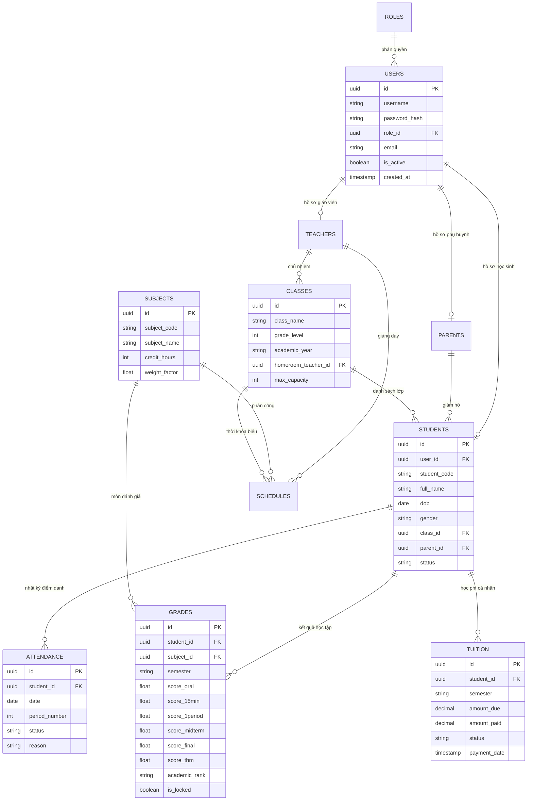

# BrainStorm Tuần 3: Chuyên Đề Nghiên Cứu Cơ Sở Dữ Liệu & Thiết Kế CSDL Hệ Thống Quản Lý Trường Học (HTQLLH)

Tài liệu nghiên cứu chuyên sâu về công nghệ Cơ sở dữ liệu (Database Systems), khảo sát và đánh giá 5 giải pháp CSDL tiêu biểu: **Microsoft SQL Server**, **PostgreSQL**, **MySQL/MariaDB**, **Supabase** và **MongoDB**; hướng dẫn sử dụng chuyên sâu PostgreSQL và thiết kế sơ đồ CSDL ERD thực thể cho **Hệ thống Quản lý Trường học (HTQLLH)**.

---

## BẢNG PHÂN CÔNG NHIỆM VỤ THÀNH VIÊN

| STT | Họ và tên | Nhiệm vụ phân công | Tỷ lệ hoàn thành |
| :---: | :--- | :--- | :---: |
| 1 | **Võ Duy Bình** | Khảo sát và phân tích Microsoft SQL Server, đánh giá ưu điểm, hạn chế và khả năng đáp ứng yêu cầu của hệ thống quản lý trường học | 20% |
| 2 | **Nguyễn Minh Quốc Bảo** | Khảo sát và phân tích PostgreSQL, tập trung vào đặc điểm, ưu điểm, hạn chế và khả năng đáp ứng yêu cầu của hệ thống | 20% |
| 3 | **Trần Quang Vinh** | Khảo sát và phân tích MySQL/MariaDB, Supabase và MongoDB, đồng thời tổng hợp đặc điểm và khả năng áp dụng của các giải pháp | 20% |
| 4 | **Võ Hoàng Sơn** | Biên soạn Chương I, Chương V, tổng hợp kết quả khảo sát, rà soát và chuẩn hóa nội dung, hình thức báo cáo | 20% |
| 5 | **Huỳnh Trung Tính** | Nghiên cứu chuyên sâu và hướng dẫn sử dụng PostgreSQL | 20% |

---

## CHƯƠNG I. MỤC TIÊU VÀ PHẠM VI NGHIÊN CỨU

### 1. Mục tiêu
Chuyên đề này được thực hiện nhằm khảo sát, đánh giá và lựa chọn giải pháp Cơ sở Dữ liệu (CSDL) phù hợp cho đồ án "Xây dựng Hệ thống Quản lý Trường học". Trên cơ sở tài liệu đặc tả yêu cầu phần mềm (SRS) đã được xây dựng, chuyên đề tập trung nghiên cứu các giải pháp CSDL phổ biến, so sánh theo các tiêu chí kỹ thuật và thực tiễn, từ đó lựa chọn PostgreSQL để nghiên cứu chuyên sâu và áp dụng cho hệ thống.

Cụ thể, chuyên đề hướng đến các mục tiêu sau:
- Khảo sát 5 giải pháp CSDL tiêu biểu: Microsoft SQL Server, PostgreSQL, MySQL/MariaDB, Supabase và MongoDB.
- So sánh và đánh giá các giải pháp trên các tiêu chí: Data Integrity, ACID, Performance, Security, Scalability, khả năng quản trị và chi phí.
- Đối chiếu đặc điểm của từng giải pháp với các yêu cầu của hệ thống quản lý trường học, đặc biệt là dữ liệu có cấu trúc, tính toàn vẹn và độ an toàn cao.
- Lựa chọn PostgreSQL và nghiên cứu chuyên sâu về kiến trúc, cách thức hoạt động, cài đặt, sử dụng và các chức năng quản trị cơ bản.

### 2. Giới hạn nghiên cứu
- **Khảo sát công nghệ CSDL**: Tập trung vào 5 giải pháp đại diện cho các hướng tiếp cận khác nhau (RDBMS: SQL Server, PostgreSQL, MySQL/MariaDB; BaaS: Supabase; NoSQL: MongoDB).
- **Nghiên cứu chuyên sâu PostgreSQL**: Tập trung vào kiến trúc, cách hoạt động, cài đặt, quản trị, SQL, quan hệ giữa các bảng, ràng buộc, Transaction, Index, phân quyền và Backup/Restore.
- **Bối cảnh đánh giá**: Mọi tiêu chí đánh giá được đặt trong bối cảnh hệ thống quản lý trường học với dữ liệu có cấu trúc chặt chẽ, yêu cầu cao về tính toàn vẹn, nhất quán và bảo mật.
- **Phạm vi nghiên cứu**: Báo cáo khảo sát lý thuyết sử dụng các ví dụ về học sinh, lớp học, điểm số để minh họa cho các chức năng của PostgreSQL. Sau phần khảo sát, tài liệu mở rộng thiết kế ERD và schema triển khai thực tế cho dự án.

---

## CHƯƠNG II. NGHIÊN CỨU CÁC CƠ SỞ DỮ LIỆU

### 1. Tổng quan các trường phái và mô hình thiết kế dữ liệu
- **CSDL quan hệ (RDBMS)**: Lưu trữ dữ liệu dưới dạng các bảng (Table) có cấu trúc cột/hàng cố định, các bảng liên kết với nhau qua khóa ngoại (Foreign Key), đảm bảo tính toàn vẹn tham chiếu và tuân thủ chuẩn ACID (Atomicity, Consistency, Isolation, Durability). Phù hợp với dữ liệu có quan hệ rõ ràng, cần độ chính xác cao.
- **Nền tảng CSDL tích hợp dịch vụ (BaaS - Backend-as-a-Service)**: Cung cấp CSDL quan hệ đám mây đi kèm các dịch vụ tích hợp sẵn như Auto-generated REST/GraphQL API, Authentication, Realtime subscriptions và Row-Level Security. Giúp đơn giản hóa tầng Backend và kết nối trực tiếp với các framework Frontend hiện đại (React).
- **CSDL phi quan hệ (NoSQL)**: Lưu trữ dữ liệu linh hoạt dưới dạng tài liệu (Document), cột (Column), khóa-giá trị (Key-Value) hoặc đồ thị (Graph), không bắt buộc lược đồ cố định (schema-less), ưu tiên khả năng mở rộng ngang (horizontal scaling) và tốc độ ghi/đọc với khối lượng dữ liệu lớn, biến động.

---

### 2. Microsoft SQL Server
- **Đặc điểm chung**: Hệ quản trị CSDL quan hệ do Microsoft phát triển, sử dụng ngôn ngữ truy vấn T-SQL (Transact-SQL), vận hành ổn định trên cả Windows và Linux (từ phiên bản 2017 trở đi).
- **Hệ sinh thái kỹ thuật**: Tích hợp chặt chẽ với bộ công cụ SQL Server Management Studio (SSMS) để quản trị trực quan; hỗ trợ mạnh cho hệ sinh thái .NET/C# thông qua Entity Framework, ADO.NET; có phiên bản đám mây Azure SQL Database cho phép mở rộng linh hoạt.
- **Cơ chế kỹ thuật**: Trang dữ liệu chuẩn Page (8KB), Extent (64KB); Buffer Pool quản lý bộ nhớ; cơ chế Write-Ahead Logging (WAL) đảm bảo an toàn giao dịch; In-Memory OLTP và Columnstore Index phục vụ phân tích dữ liệu lớn.
- **Điểm mạnh**: Bảo mật doanh nghiệp nâng cao (Always Encrypted, Row-Level Security, Transparent Data Encryption), công cụ backup/restore và giám sát hiệu năng (Query Store) trực quan.
- **Hạn chế**: Chi phí bản quyền cho phiên bản Standard/Enterprise cao; phiên bản miễn phí SQL Server Express bị giới hạn dung lượng CSDL 10GB.

---

### 3. PostgreSQL
- **Đặc điểm chung**: Hệ quản trị CSDL quan hệ - đối tượng (Object-Relational DBMS) mã nguồn mở, miễn phí hoàn toàn, được đánh giá cao về mức độ tuân thủ chuẩn ANSI SQL nghiêm ngặt và khả năng mở rộng kiểu dữ liệu phong phú (JSON, JSONB, mảng, hình học).
- **Hệ sinh thái kỹ thuật**: Triển khai trên đa nền tảng (Linux, Windows, macOS, Docker container), tương thích tốt với nhiều ngôn ngữ lập trình (Node.js, Python, Java, C#) qua các driver và ORM phổ biến.
- **Cơ chế kỹ thuật**:
  - Kiểm soát đồng thời đa phiên bản (MVCC - Multi-Version Concurrency Control) giúp đọc và ghi không chặn lẫn nhau.
  - Cơ chế lưu trữ TOAST tự động nén và cắt nhỏ các thuộc tính dữ liệu kích thước lớn.
  - Hỗ trợ đa dạng chỉ mục: B-Tree, GIN (chuyên dụng cho mảng và JSONB), GiST, BRIN.
  - Hỗ trợ Row-Level Security (RLS) cho phép bảo mật phân quyền đến từng dòng dữ liệu.
- **Điểm mạnh**: Miễn phí $100\%$, mã nguồn mở, hiệu năng xử lý truy vấn quan hệ phức tạp xuất sắc, hỗ trợ kiểu JSONB lai giữa quan hệ và phi quan hệ, tuân thủ ACID nghiêm ngặt.
- **Hạn chế**: Công cụ giao diện pgAdmin tiêu tốn RAM hơn so với SSMS; cần hiểu biết cấu hình để tối ưu tài nguyên cho các hệ thống lớn.

---

### 4. MySQL / MariaDB
- **Đặc điểm chung**: Hai hệ quản trị CSDL quan hệ phổ biến nhất trong phát triển ứng dụng Web truyền thống, tuân thủ chuẩn SQL và sử dụng engine lưu trữ mặc định InnoDB hỗ trợ giao dịch ACID.
- **Hệ sinh thái kỹ thuật**: Thành phần cốt lõi của LAMP/LEMP stack, hỗ trợ công cụ quản trị đa dạng như MySQL Workbench, phpMyAdmin, DBeaver.
- **Cơ chế kỹ thuật**: Kiến trúc Pluggable Storage Engine (InnoDB, MyISAM, Memory); InnoDB Buffer Pool; Redo Log và Undo Log phục vụ khôi phục và rollback giao dịch.
- **Điểm mạnh**: Miễn phí, mã nguồn mở, nhẹ, dễ cài đặt và cấu hình; cộng đồng hỗ trợ khổng lồ; truy vấn đọc đơn giản rất nhanh.
- **Hạn chế**: Các tính năng bảo mật nâng cao và tối ưu hóa truy vấn phức tạp (subquery lồng nhau, JSON query nâng cao) chưa mạnh mẽ bằng PostgreSQL.

---

### 5. Supabase
- **Đặc điểm chung**: Nền tảng mã nguồn mở thay thế cho Firebase, được xây dựng trực tiếp trên nền CSDL PostgreSQL, cung cấp giải pháp dữ liệu quan hệ đi kèm bộ công cụ lập trình hiện đại.
- **Hệ sinh thái kỹ thuật**: Cung cấp CSDL PostgreSQL tích hợp tự động RESTful API (PostgREST) và GraphQL API, tích hợp dịch vụ Xác thực (Auth), Lưu trữ tệp (Storage) và Realtime Subscriptions; cung cấp SDK chính thức cho React.
- **Điểm mạnh**: Tốc độ phát triển ứng dụng cực nhanh; kế thừa trọn vẹn độ tin cậy và tính toàn vẹn dữ liệu của PostgreSQL; hỗ trợ Row-Level Security trực quan.
- **Hạn chế**: Gói miễn phí đám mây có giới hạn dung lượng và tạm ngưng dự án nếu không truy cập; nếu tự host bằng Docker đòi hỏi kỹ năng vận hành hạ tầng.

---

### 6. MongoDB
- **Đặc điểm chung**: Hệ quản trị CSDL NoSQL hướng tài liệu (Document-Oriented), lưu dữ liệu dưới định dạng BSON (Binary JSON), không yêu cầu lược đồ cố định (schema-less).
- **Hệ sinh thái kỹ thuật**: Phổ biến trong các ứng dụng MERN stack (MongoDB, Express, React, Node.js), hỗ trợ mở rộng ngang dễ dàng qua Sharding và Replica Sets.
- **Cơ chế kỹ thuật**: WiredTiger Storage Engine, nén dữ liệu Snappy, Journaling ghi vết giao dịch.
- **Điểm mạnh**: Tốc độ ghi/đọc rất nhanh với dữ liệu phi cấu trúc hoặc cấu trúc thường xuyên biến đổi, phù hợp cho mạng xã hội, log hệ thống, chat.
- **Hạn chế**: Do không hỗ trợ ràng buộc khóa ngoại và phép JOIN nguyên bản giữa các collection, việc đảm bảo tính toàn vẹn dữ liệu cho các nghiệp vụ học vụ (học sinh - lớp - môn - điểm số - học phí) đòi hỏi phải tự viết logic phức tạp ở tầng ứng dụng, tiềm ẩn rủi ro sai lệch dữ liệu.

---

## CHƯƠNG III. SO SÁNH VÀ LỰA CHỌN CƠ SỞ DỮ LIỆU

### 1. Đánh giá mức độ đáp ứng theo Yêu cầu Phi chức năng (SRS)
Để làm cơ sở tham chiếu khoa học cho việc quyết định công nghệ ở giai đoạn triển khai, các giải pháp CSDL đã khảo sát được đối chiếu trực tiếp với các nhóm yêu cầu phi chức năng cốt lõi đã đặc tả trong SRS của hệ thống:
1. **Yêu cầu Bảo mật và Phân quyền (Security)**: Phân quyền 5 vai trò (BGH, GVCN, GVBM, Học sinh, Phụ huynh) và bảo mật dữ liệu điểm số, thông tin cá nhân. PostgreSQL và SQL Server hỗ trợ mạnh mẽ cơ chế Role/Permission và Row-Level Security (RLS) đến từng dòng dữ liệu (ví dụ học sinh chỉ xem được dòng điểm của chính mình).
2. **Yêu cầu Tính toàn vẹn dữ liệu (Data Integrity)**: Dữ liệu học vụ yêu cầu chính xác tuyệt đối, tuân thủ ACID. Các hệ quan hệ (PostgreSQL, SQL Server, MySQL) vượt trội nhờ ràng buộc Primary Key, Foreign Key, CHECK constraint (điểm số $0.0 - 10.0$), NOT NULL và UNIQUE.
3. **Yêu cầu Giao dịch và Tính nhất quán (Transaction & ACID)**: Các thao tác lưu bảng điểm cả lớp 45 học sinh hoặc thu học phí phải nằm trong một giao dịch (BEGIN, COMMIT, ROLLBACK), đảm bảo tính nguyên tử (Atomicity).
4. **Yêu cầu Hiệu năng và Tải hệ thống (Performance)**: Phản hồi API dưới 1 giây, xử lý tốt truy vấn JOIN nhiều bảng, GROUP BY và phân trang khi xuất danh sách học sinh.
5. **Yêu cầu Khả năng mở rộng (Scalability)**: Hỗ trợ chỉ mục Index (B-Tree, GIN), partitioning bảng khi số lượng học sinh tăng qua các năm học.
6. **Yêu cầu Tương thích và Tích hợp (Compatibility & Integration)**: Kết nối thuận tiện với ứng dụng Web Node.js/Express thông qua thư viện `pg`, hỗ trợ dữ liệu bán cấu trúc qua kiểu `JSONB`.

---

### 2. Bảng Tổng Hợp Đánh Giá 5 Giải Pháp CSDL theo Tiêu Chí SRS

| Yêu cầu SRS | Nội dung yêu cầu | Giải pháp đáp ứng tốt | Cơ chế kỹ thuật |
| :--- | :--- | :--- | :--- |
| **Security** | Phân quyền người dùng, hạn chế truy cập và bảo vệ dữ liệu nhạy cảm | **PostgreSQL**, SQL Server, Supabase | Role/Permission; PostgreSQL hỗ trợ Row-Level Security (RLS); Supabase cung cấp RLS dựa trên PostgreSQL |
| **Data Integrity** | Đảm bảo dữ liệu điểm số, điểm danh, học phí chính xác và nhất quán | **PostgreSQL**, SQL Server, MySQL/MariaDB | Primary Key, Foreign Key, UNIQUE, NOT NULL, CHECK Constraint; Transaction và ACID |
| **Transaction & ACID**| Đảm bảo cập nhật dữ liệu không dở dang khi có lỗi (nhập điểm cả lớp, thu học phí) | **PostgreSQL**, SQL Server, MySQL/MariaDB | BEGIN, COMMIT, ROLLBACK; cơ chế Transaction và các thuộc tính ACID |
| **Performance** | Truy vấn nhanh, xử lý tốt khi số lượng dữ liệu và người dùng tăng | **PostgreSQL**, SQL Server, MySQL/MariaDB | Index (B-Tree, GIN), Query Planner/Optimizer, JOIN, GROUP BY, phân trang Paging |
| **Scalability** | Đáp ứng khi dữ liệu điểm số và học sinh tích lũy qua nhiều năm học | **PostgreSQL**, SQL Server, MongoDB | Index tối ưu, Table Partitioning, Connection Pooling |
| **Compatibility** | Kết nối với ứng dụng Web Node.js và hỗ trợ các kiểu dữ liệu hiện đại | **PostgreSQL**, MySQL/MariaDB, Supabase | Driver `pg`, chuẩn SQL ANSI, kiểu `JSONB`; Supabase cung cấp SDK |

---

### 3. Phân tích và Lựa chọn PostgreSQL
- **SQL Server**: Rất mạnh nhưng chi phí bản quyền thương mại đắt đỏ khi triển khai thực tế.
- **MySQL/MariaDB**: Phổ biến nhưng xử lý JSON và tính năng bảo mật nâng cao không bằng PostgreSQL.
- **MongoDB**: Không phù hợp với dữ liệu học vụ có nhiều mối quan hệ liên kết chặt chẽ.
- **Supabase**: Rất thuận tiện và thực chất sử dụng PostgreSQL làm nền tảng CSDL cốt lõi.
- **PostgreSQL**: Cân bằng tối ưu giữa tính toàn vẹn dữ liệu, giao dịch ACID, hiệu năng xử lý truy vấn phức tạp, bảo mật dòng dữ liệu RLS, hỗ trợ JSONB và hoàn toàn miễn phí mã nguồn mở.

**Kết luận**: Nhóm thống nhất lựa chọn **PostgreSQL** làm hệ quản trị cơ sở dữ liệu chính thức cho Hệ thống Quản lý Trường học.

---

## CHƯƠNG IV. NGHIÊN CỨU VÀ HƯỚNG DẪN SỬ DỤNG POSTGRESQL

### 1. Tổng quan Kiến trúc Client - Server của PostgreSQL
PostgreSQL hoạt động theo mô hình Client - Server:
- **Client**: Gửi câu lệnh SQL (`psql`, `pgAdmin`, ứng dụng backend Node.js).
- **Parser**: Tiếp nhận, phân tích cú pháp câu lệnh SQL và kiểm tra tính hợp lệ.
- **Planner / Optimizer**: Phân tích các phương án thực thi và chọn kế hoạch thực thi tối ưu nhất (sử dụng Index quét bảng hay tuần tự).
- **Executor**: Thực thi kế hoạch truy vấn do Planner lựa chọn và truy xuất dữ liệu từ bộ nhớ hoặc đĩa cứng.
- **Storage & WAL (Write-Ahead Logging)**: Lưu trữ dữ liệu thực tế trên đĩa và ghi nhận nhật ký giao dịch trước khi ghi dữ liệu nhằm phục hồi hệ thống khi gặp sự cố.

### 2. Cài đặt và Quản trị Cơ bản

#### 2.1. Cài đặt và Kiểm tra
PostgreSQL hoạt động mặc định trên cổng `5432` (hoặc cấu hình cổng phụ `5434` nếu máy đã có service khác). Kiểm tra phiên bản bằng dòng lệnh PowerShell:
```powershell
psql --version
# Kết quả: psql (PostgreSQL) 17.x
```

#### 2.2. Đăng nhập qua psql CLI
```powershell
psql -U postgres -p 5432
# Sau khi nhập mật khẩu, dấu nhắc lệnh hiển thị: postgres=#
```
Các lệnh điều khiển hữu ích trong psql:
- `\l`: Xem danh sách tất cả Database.
- `\c <dbname>`: Kết nối đến một Database cụ thể.
- `\dt`: Xem danh sách các bảng trong Schema hiện tại.
- `\d <tablename>`: Xem cấu trúc chi tiết của một bảng.
- `\q`: Thoát khỏi psql.

#### 2.3. Sử dụng pgAdmin
pgAdmin cung cấp giao diện đồ họa trực quan hỗ trợ: tạo Database, tạo bảng, nhập liệu trực quan, chạy truy vấn Query Tool, quản lý User/Role, xem kế hoạch thực thi EXPLAIN và thực hiện Backup/Restore.

---

### 3. Kiểu Dữ Liệu, Ràng Buộc & Thao Tác SQL Cơ Bản

#### 3.1. Các kiểu dữ liệu phổ biến trong hệ thống
| Kiểu dữ liệu | Ý nghĩa | Ví dụ trong hệ thống |
| :--- | :--- | :--- |
| `INTEGER` | Số nguyên 4 bytes | Sĩ số lớp, số tiết học |
| `BIGINT` | Số nguyên lớn 8 bytes | Khóa chính tự tăng khi cần |
| `VARCHAR(n)` | Chuỗi ký tự độ dài giới hạn | Mã học sinh, họ tên, email |
| `TEXT` | Chuỗi văn bản độ dài không giới hạn | Nội dung thông báo, lý do nghỉ học |
| `DATE` | Ngày tháng năm | Ngày sinh, ngày điểm danh |
| `TIMESTAMP` | Ngày và giờ chính xác | Thời điểm tạo bản ghi, thời điểm đóng học phí |
| `BOOLEAN` | Đúng / Sai (`TRUE`/`FALSE`) | Trạng thái khóa sổ điểm, tài khoản kích hoạt |
| `NUMERIC(p, s)` | Số thập phân chính xác | Điểm số `NUMERIC(3, 1)`, số tiền học phí `NUMERIC(12, 2)` |
| `JSONB` | Dữ liệu JSON định dạng nhị phân | Cấu hình môn học, nhật ký chỉnh sửa điểm (Audit Log) |

#### 3.2. Các Ràng buộc Dữ liệu (Constraints)
- **PRIMARY KEY**: Định danh duy nhất bản ghi (`student_id` hoặc `id UUID`).
- **FOREIGN KEY**: Tham chiếu ràng buộc toàn vẹn quan hệ giữa các bảng.
- **NOT NULL**: Bắt buộc phải có giá trị (họ tên học sinh, tên lớp).
- **UNIQUE**: Không được trùng lặp (mã học sinh, email người dùng).
- **CHECK Constraint**: Kiểm tra miền giá trị hợp lệ ngay tại tầng CSDL:
  ```sql
  CHECK (score_tbm >= 0.0 AND score_tbm <= 10.0)
  ```

#### 3.3. Thao tác CRUD Cơ bản
```sql
-- Thêm học sinh
INSERT INTO students (student_code, full_name, dob, gender, class_id)
VALUES ('HS0001', 'Nguyen Van A', '2008-05-15', 'Nam', 1);

-- Truy vấn học sinh
SELECT student_code, full_name FROM students WHERE class_id = 1;

-- Cập nhật thông tin
UPDATE students SET full_name = 'Nguyen Van Anh' WHERE student_code = 'HS0001';

-- Xóa dữ liệu
DELETE FROM students WHERE student_code = 'HS0001';
```

---

### 4. Transaction và Chuẩn ACID
Transaction là một nhóm thao tác được thực thi như một khối công việc duy nhất:
- **Atomicity (Tính nguyên tử)**: Tất cả câu lệnh cùng thành công hoặc cùng bị hủy bỏ.
- **Consistency (Tính nhất quán)**: Dữ liệu chuyển từ trạng thái hợp lệ này sang trạng thái hợp lệ khác, không vi phạm ràng buộc.
- **Isolation (Tính cô lập)**: Các giao dịch đồng thời không gây sai lệch dữ liệu lẫn nhau.
- **Durability (Tính bền vững)**: Dữ liệu sau khi COMMIT được lưu chắc chắn xuống đĩa cứng, không bị mất khi mất điện.

Ví dụ nghiệp vụ thu học phí đảm bảo ACID:
```sql
BEGIN;
  -- Bước 1: Ghi nhận thanh toán vào bảng giao dịch
  INSERT INTO payment_transactions (student_id, amount, payment_method)
  VALUES (101, 2500000, 'VIETQR');

  -- Bước 2: Cập nhật trạng thái học phí
  UPDATE tuition_bills SET status = 'PAID', paid_at = CURRENT_TIMESTAMP
  WHERE student_id = 101 AND semester = 'HK1';
COMMIT;
-- Nếu có lỗi ở bước 2, hệ thống tự động ROLLBACK toàn bộ.
```

---

### 5. Index & Tối Ưu Truy Vấn
Tạo chỉ mục giúp tăng tốc độ tìm kiếm từ quét toàn bộ bảng (Seq Scan) sang quét chỉ mục (Index Scan):
```sql
CREATE INDEX idx_grades_student_subject ON grades (student_id, subject_id);
```
Kiểm tra hiệu năng truy vấn bằng lệnh `EXPLAIN ANALYZE`:
```sql
EXPLAIN ANALYZE
SELECT * FROM grades WHERE student_id = 101 AND subject_id = 5;
```

---

### 6. Phân Quyền User/Role và Sao Lưu Backup/Restore
- **Tạo Role và Phân quyền**:
  ```sql
  CREATE ROLE school_app_user WITH LOGIN PASSWORD 'secure_password';
  GRANT CONNECT ON DATABASE school_management TO school_app_user;
  GRANT SELECT, INSERT, UPDATE ON ALL TABLES IN SCHEMA public TO school_app_user;
  ```
- **Sao lưu Backup bằng `pg_dump`**:
  ```powershell
  pg_dump -U postgres -d school_management -F p -f backup_school.sql
  ```
- **Khôi phục Restore**:
  ```powershell
  psql -U postgres -d school_management -f backup_school.sql
  ```

---

## CHƯƠNG V. THIẾT KẾ CƠ SỞ DỮ LIỆU THỰC TẾ CHO HỆ THỐNG (HTQLLH ERD & SCHEMA)

Sau khi hoàn thành khảo sát và nghiên cứu PostgreSQL, nhóm tiến hành thiết kế mô hình dữ liệu quan hệ hoàn chỉnh phục vụ triển khai phần mềm quản lý trường học.

### 1. Sơ đồ Thực thể Mối quan hệ (ERD - Entity Relationship Diagram)


```mermaid
erDiagram
    ROLES ||--o{ USERS : "phân quyền"
    USERS ||--o| STUDENTS : "hồ sơ học sinh"
    USERS ||--o| TEACHERS : "hồ sơ giáo viên"
    USERS ||--o| PARENTS : "hồ sơ phụ huynh"
    PARENTS ||--o{ STUDENTS : "giám hộ"
    CLASSES ||--o{ STUDENTS : "danh sách lớp"
    TEACHERS ||--o{ CLASSES : "chủ nhiệm"
    TEACHERS ||--o{ SCHEDULES : "giảng dạy"
    SUBJECTS ||--o{ SCHEDULES : "phân công"
    CLASSES ||--o{ SCHEDULES : "thời khóa biểu"
    STUDENTS ||--o{ GRADES : "kết quả học tập"
    SUBJECTS ||--o{ GRADES : "môn đánh giá"
    STUDENTS ||--o{ ATTENDANCE : "nhật ký điểm danh"
    STUDENTS ||--o{ TUITION : "học phí cá nhân"

    USERS {
        uuid id PK
        string username
        string password_hash
        uuid role_id FK
        string email
        boolean is_active
        timestamp created_at
    }

    STUDENTS {
        uuid id PK
        uuid user_id FK
        string student_code
        string full_name
        date dob
        string gender
        uuid class_id FK
        uuid parent_id FK
        string status
    }

    CLASSES {
        uuid id PK
        string class_name
        int grade_level
        string academic_year
        uuid homeroom_teacher_id FK
        int max_capacity
    }

    SUBJECTS {
        uuid id PK
        string subject_code
        string subject_name
        int credit_hours
        float weight_factor
    }

    GRADES {
        uuid id PK
        uuid student_id FK
        uuid subject_id FK
        string semester
        float score_oral
        float score_15min
        float score_1period
        float score_midterm
        float score_final
        float score_tbm
        string academic_rank
        boolean is_locked
    }

    ATTENDANCE {
        uuid id PK
        uuid student_id FK
        date date
        int period_number
        string status
        string reason
    }

    TUITION {
        uuid id PK
        uuid student_id FK
        string semester
        decimal amount_due
        decimal amount_paid
        string status
        timestamp payment_date
    }
```

---

### 2. Kịch bản SQL DDL Khởi tạo CSDL PostgreSQL (Sample DDL Script)

```sql
-- 1. Khởi tạo Bảng Roles & Users
CREATE TABLE roles (
    id UUID PRIMARY KEY DEFAULT gen_random_uuid(),
    role_code VARCHAR(30) UNIQUE NOT NULL,
    role_name VARCHAR(100) NOT NULL
);

CREATE TABLE users (
    id UUID PRIMARY KEY DEFAULT gen_random_uuid(),
    username VARCHAR(50) UNIQUE NOT NULL,
    password_hash VARCHAR(255) NOT NULL,
    email VARCHAR(100),
    role_id UUID REFERENCES roles(id),
    is_active BOOLEAN DEFAULT TRUE,
    created_at TIMESTAMP DEFAULT CURRENT_TIMESTAMP
);

-- 2. Khởi tạo Bảng Lớp học & Học sinh
CREATE TABLE classes (
    id UUID PRIMARY KEY DEFAULT gen_random_uuid(),
    class_name VARCHAR(20) NOT NULL,
    grade_level INT NOT NULL,
    academic_year VARCHAR(20) NOT NULL,
    max_capacity INT DEFAULT 45
);

CREATE TABLE students (
    id UUID PRIMARY KEY DEFAULT gen_random_uuid(),
    user_id UUID REFERENCES users(id) ON DELETE CASCADE,
    student_code VARCHAR(20) UNIQUE NOT NULL,
    full_name VARCHAR(100) NOT NULL,
    dob DATE NOT NULL,
    gender VARCHAR(10),
    class_id UUID REFERENCES classes(id),
    status VARCHAR(20) DEFAULT 'STUDYING'
);

-- 3. Khởi tạo Bảng Môn học
CREATE TABLE subjects (
    id UUID PRIMARY KEY DEFAULT gen_random_uuid(),
    subject_code VARCHAR(20) UNIQUE NOT NULL,
    subject_name VARCHAR(100) NOT NULL,
    weight_factor NUMERIC(2,1) DEFAULT 1.0
);

-- 4. Khởi tạo Bảng Sổ điểm Điện tử với Ràng buộc Tính toàn vẹn
CREATE TABLE grades (
    id UUID PRIMARY KEY DEFAULT gen_random_uuid(),
    student_id UUID REFERENCES students(id) ON DELETE CASCADE,
    subject_id UUID REFERENCES subjects(id),
    semester VARCHAR(10) NOT NULL,
    score_oral NUMERIC(3,1) CHECK (score_oral BETWEEN 0 AND 10),
    score_15min NUMERIC(3,1) CHECK (score_15min BETWEEN 0 AND 10),
    score_1period NUMERIC(3,1) CHECK (score_1period BETWEEN 0 AND 10),
    score_midterm NUMERIC(3,1) CHECK (score_midterm BETWEEN 0 AND 10),
    score_final NUMERIC(3,1) CHECK (score_final BETWEEN 0 AND 10),
    score_tbm NUMERIC(3,1) CHECK (score_tbm BETWEEN 0 AND 10),
    academic_rank VARCHAR(20),
    is_locked BOOLEAN DEFAULT FALSE,
    CONSTRAINT unique_student_subject_semester UNIQUE(student_id, subject_id, semester)
);

-- Tối ưu chỉ mục truy vấn điểm số
CREATE INDEX idx_grades_student_semester ON grades(student_id, semester);
```

---

## CHƯƠNG VI. KẾT LUẬN

1. Báo cáo chuyên đề đã hoàn thành mục tiêu khảo sát, phân tích và so sánh 5 giải pháp CSDL phổ biến (SQL Server, PostgreSQL, MySQL/MariaDB, Supabase, MongoDB) dựa trên các yêu cầu phi chức năng cốt lõi của Hệ thống Quản lý Trường học.
2. PostgreSQL được chứng minh là lựa chọn tối ưu nhất nhờ khả năng bảo toàn toàn vẹn dữ liệu học vụ, hỗ trợ transaction ACID mạnh mẽ, bảo mật Row-Level Security, hỗ trợ kiểu JSONB và hoàn toàn miễn phí mã nguồn mở.
3. Chuyên đề đã nghiên cứu và làm chủ các kỹ năng thực hành PostgreSQL (psql, pgAdmin, CRUD, Constraints, Transactions, Indexing, Roles và Backup/Restore), tạo nền tảng vững chắc để triển khai CSDL hoàn chỉnh cho dự án.

---

## CHƯƠNG VII. TÀI LIỆU THAM KHẢO

1. **PostgreSQL Documentation**: PostgreSQL Global Development Group.  
   Link: [https://www.postgresql.org/docs/](https://www.postgresql.org/docs/)
2. **Microsoft SQL Server Documentation**: Microsoft Learn.  
   Link: [https://learn.microsoft.com/en-us/sql/sql-server/](https://learn.microsoft.com/en-us/sql/sql-server/)
3. **MySQL Documentation**: Oracle Corporation.  
   Link: [https://dev.mysql.com/doc/](https://dev.mysql.com/doc/)
4. **Supabase Documentation**: Supabase Inc.  
   Link: [https://supabase.com/docs](https://supabase.com/docs)
5. **MongoDB Documentation**: MongoDB Inc.  
   Link: [https://www.mongodb.com/docs/](https://www.mongodb.com/docs/)
6. **Mã nguồn dự án Phat-Trien-Du-An-Phan-Mem**: Tài liệu nội bộ nhóm thực hiện đề tài Xây dựng Hệ thống Quản lý Trường học.
