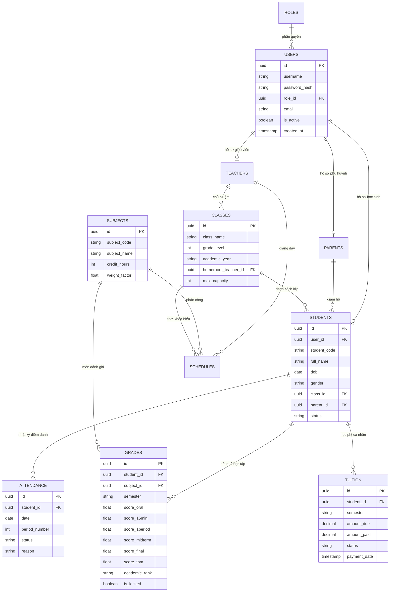

# BrainStorm Tuần 3: Chuyên Đề Nghiên Cứu Cơ Sở Dữ Liệu & Thiết Kế CSDL Hệ Thống Quản Lý Trường Học (SMS)

Tài liệu nghiên cứu chuyên sâu về công nghệ Cơ sở dữ liệu (Database Systems), đánh giá so sánh giữa 5 hệ CSDL tiêu biểu: **SQL Server**, **PostgreSQL**, **MySQL/MariaDB**, **Supabase** và **MongoDB**; phân tích ưu nhược điểm, mô hình lưu trữ và thiết kế sơ đồ CSDL ERD thực thể cho **Hệ thống Quản lý Trường học (School Management System - SMS)**.

---

## CHƯƠNG I. MỤC TIÊU VÀ PHẠM VI NGHIÊN CỨU

### 1. Mục tiêu
Chuyên đề này được thực hiện nhằm đánh giá toàn diện các hệ quản trị cơ sở dữ liệu quan hệ (RDBMS), cơ sở dữ liệu phi quan hệ (NoSQL) và nền tảng Backend-as-a-Service (BaaS). Kết quả nghiên cứu cung cấp luận cứ khoa học thực tiễn để nhóm chọn phương án CSDL tối ưu nhất cho **Dự án Hệ thống Quản lý Trường học (SMS)**.

### 2. Giới hạn và Phạm vi nghiên cứu
Chuyên đề tập trung nghiên cứu và đối chiếu 5 hệ quản trị cơ sở dữ liệu chính:
- **Microsoft SQL Server**: Hệ CSDL quan hệ thương mại dành cho doanh nghiệp.
- **PostgreSQL**: Hệ CSDL quan hệ đối tượng mã nguồn mở nâng cao.
- **MySQL / MariaDB**: Hệ CSDL quan hệ mã nguồn mở phổ biến cho ứng dụng Web.
- **Supabase**: Nền tảng BaaS phát triển dựa trên cơ sở dữ liệu PostgreSQL.
- **MongoDB**: Hệ CSDL NoSQL hướng tài liệu (Document-Oriented Database).

Các tiêu chí đối chiếu bao gồm: Tính toàn vẹn giao dịch (ACID), khả năng ràng buộc khóa ngoại (Foreign Keys), hiệu năng xử lý truy vấn bảng điểm lớn, khả năng lưu trữ dữ liệu bán cấu trúc (JSON/JSONB), tính bảo mật và chi phí vận hành.

---

## CHƯƠNG II. NGHIÊN CỨU VÀ SO SÁNH PHÂN TÍCH CHI TIẾT 5 HỆ QUẢN TRỊ CSDL

### 1. Microsoft SQL Server (RDBMS Doanh nghiệp)

#### 1.1. Đặc điểm chung & Tổng quan Kiến trúc
Microsoft SQL Server là hệ quản trị cơ sở dữ liệu quan hệ (RDBMS) hàng đầu dành cho doanh nghiệp do Microsoft phát triển, sử dụng ngôn ngữ truy vấn mở rộng T-SQL (Transact-SQL).


#### 1.2. Các Cơ chế Kỹ thuật Chi tiết (Core Mechanisms)
1. **Cơ chế Lưu trữ Dữ liệu (Storage Engine Architecture)**:
   - Sử dụng các tệp tin lưu trữ chính bao gồm `.mdf` (Master Data File), `.ndf` (Secondary Data File) và `.ldf` (Transaction Log File).
   - Đơn vị lưu trữ cơ bản là trang dữ liệu **Page (8 KB)**. Tập hợp 8 trang dữ liệu liên tiếp hình thành một **Extent (64 KB)** giúp tối ưu hóa thao tác đọc/ghi I/O đĩa cứng.
2. **Cơ chế Quản lý Bộ nhớ (Buffer Pool & Memory Management)**:
   - **Buffer Pool**: Vùng nhớ RAM dành riêng để lưu trữ các trang dữ liệu (`Data Pages`) và trang chỉ mục (`Index Pages`).
   - **Lazy Writer & Checkpoint**: Quá trình `Lazy Writer` liên tục dọn dẹp các trang nhớ ít dùng, trong khi tiến trình `Checkpoint` tự động đồng bộ các trang nhớ đã thay đổi (`Dirty Pages`) từ RAM xuống đĩa cứng để đảm bảo tính sẵn sàng.
3. **Cơ chế Giao dịch & Ghi vết (Write-Ahead Logging - WAL)**:
   - Áp dụng thuật toán phục hồi ARIES. Mọi thao tác ghi/sửa dữ liệu đều phải được ghi lại vào tệp nhật ký `Transaction Log (.ldf)` trước khi trang dữ liệu thực sự được ghi xuống tệp `.mdf`.
4. **Tính năng Doanh nghiệp Nâng cao (Advanced Features)**:
   - **In-Memory OLTP (Hekaton)**: Cho phép tạo các bảng tối ưu trực tiếp trong bộ nhớ RAM với các thủ tục lưu trữ biên dịch mã máy Native Compilation DLLs.
   - **Columnstore Index**: Chỉ mục dạng cột phục vụ phân tích dữ liệu lớn và báo cáo BI.

#### 1.3. Điểm mạnh và Hạn chế
- **Điểm mạnh**: Độ ổn định cao, bảo mật doanh nghiệp xuất sắc, công cụ quản trị SSMS trực quan, xử lý giao dịch thương mại cực mạnh.
- **Hạn chế**: Chi phí bản quyền thương mại đắt đỏ (Enterprise/Standard License), tốn nhiều tài nguyên RAM/CPU của Server, tối ưu nhất trên hệ điều hành Windows Server.

---

### 2. PostgreSQL (RDBMS Mã nguồn mở Nâng cao - Đề xuất Chốt)

#### 2.1. Đặc điểm chung & Tổng quan Kiến trúc
PostgreSQL là hệ quản trị cơ sở dữ liệu quan hệ đối tượng (ORDBMS) mã nguồn mở mạnh mẽ nhất thế giới, tuân thủ nghiêm ngặt chuẩn ANSI SQL và tính toàn vẹn ACID.


#### 2.2. Các Cơ chế Kỹ thuật Chi tiết (Core Mechanisms)
1. **Cơ chế Kiểm soát Đồng thời Đa phiên bản (MVCC - Multi-Version Concurrency Control)**:
   - PostgreSQL không dùng khóa (Lock) cho thao tác đọc dữ liệu. Mỗi dòng dữ liệu (Tuple) lưu trữ các trường ẩn `xmin` (ID giao dịch tạo) và `xmax` (ID giao dịch xóa/sửa).
   - Thao tác `UPDATE` thực chất là `INSERT` một bản sao mới và đánh dấu `xmax` cho bản sao cũ.
   - **AutoVacuum Daemon**: Tự động dọn dẹp các dòng dữ liệu rác (`Dead Tuples`) và cập nhật bộ bản đồ độ hiển thị (`Visibility Map`).
2. **Cơ chế Lưu trữ TOAST (The Oversized-Attribute Storage Technique)**:
   - Khi một dòng dữ liệu vượt quá kích thước chuẩn $2\text{ KB}$ (như văn bản học bạ dài, JSONB lớn), PostgreSQL tự động kích hoạt cơ chế TOAST để nén và cắt nhỏ dữ liệu lưu vào bảng phụ TOAST chuyên biệt.
3. **Hệ thống Chỉ mục Đa dạng (Advanced Indexing Engines)**:
   - **B-Tree**: Chỉ mục mặc định cho các so sánh `=`, `<`, `>`.
   - **GIN (Generalized Inverted Index)**: Chỉ mục đảo ngược cực mạnh dành riêng cho dữ liệu mảng (`Array`) và kiểu `JSONB` (tra cứu thuộc tính trong điểm số/audit log $< 1\text{ms}$).
   - **GiST & BRIN**: Chỉ mục không gian và chỉ mục vùng khối cho dữ liệu chuỗi thời gian lớn.
4. **Phân quyền Dòng dữ liệu (Row Level Security - RLS)**:
   - Cho phép định nghĩa chính sách bảo mật chi tiết đến từng dòng trong bảng: Học sinh chỉ xem được dòng dữ liệu chứa `student_code` của chính mình.

#### 2.3. Điểm mạnh và Hạn chế
- **Điểm mạnh**:
  - Miễn phí bản quyền $100\%$, mã nguồn mở hoàn toàn.
  - Xử lý dữ liệu quan hệ phức tạp và dữ liệu phi cấu trúc (`JSONB`) với tốc độ vượt trội.
  - Tính toàn vẹn dữ liệu ACID tuyệt đối, chống hỏng dữ liệu khi mất điện hoặc sự cố máy chủ.
  - Hỗ trợ phân quyền bảng/dòng dữ liệu nâng cao (Row Level Security - RLS).
- **Hạn chế**: Cấu hình tối ưu ban đầu cho các truy vấn phức tạp yêu cầu kiến thức DBA tốt.

---

### 3. MySQL / MariaDB (RDBMS Web Phổ biến)

#### 3.1. Đặc điểm chung & Tổng quan Kiến trúc
MySQL (thuộc Oracle) và MariaDB (bản rẽ nhánh mã nguồn mở) là các hệ quản trị CSDL quan hệ phổ biến nhất trong phát triển ứng dụng Web truyền thống (LAMP/LEMP stack).


#### 3.2. Các Cơ chế Kỹ thuật Chi tiết (Core Mechanisms)
1. **Kiến trúc Storage Engine Trừu tượng (Pluggable Storage Engine Architecture)**:
   - Tách biệt tầng xử lý truy vấn SQL Parser với tầng lưu trữ đĩa cứng. Cho phép chọn lựa giữa các Engine: **InnoDB** (mặc định), **MyISAM**, **Memory**.
2. **Cơ chế Lưu trữ InnoDB Engine**:
   - **InnoDB Buffer Pool**: Vùng nhớ RAM lưu trữ Data Pages, Index Pages, Undo Pages và Change Buffer.
   - **Doublewrite Buffer**: Tránh sự cố trang ghi dở dang (`Partial Page Write`) bằng cách ghi dữ liệu 2 lần xuống vùng đĩa nệm trước khi ghi vào tệp `.ibd`.
3. **Hệ thống Nhật ký Giao dịch (Logging Mechanism)**:
   - **Redo Log**: Tệp nhật ký vòng (Circular Log) phục vụ khôi phục dữ liệu (`Crash Recovery`).
   - **Undo Log**: Lưu trữ bản sao dữ liệu cũ phục vụ Hủy bỏ giao dịch (`Rollback`) và cơ chế MVCC.
   - **Binlog (Binary Log)**: Ghi lại các sự kiện DML/DDL phục vụ sao lưu nhân bản (`Replication`) và khôi phục theo thời điểm (PITR).
4. **Cấu trúc Chỉ mục B+Tree (Clustered Index)**:
   - Khóa chính (`Primary Key`) được lưu dưới dạng Clustered Index, nghĩa là dữ liệu thực tế của dòng nằm ngay tại các lá của cây B+Tree.

#### 3.3. Điểm mạnh và Hạn chế
- **Điểm mạnh**: Rất dễ cài đặt, cộng đồng hỗ trợ khổng lồ, tốc độ truy vấn đọc dữ liệu đơn giản (`SELECT`) cực nhanh.
- **Hạn chế**: Khả năng xử lý kiểu dữ liệu JSON kém linh hoạt hơn PostgreSQL, các phép tính toán phức tạp hoặc Subquery lồng nhau xử lý chậm hơn.

---

### 4. Supabase (Backend-as-a-Service - BaaS)

#### 4.1. Đặc điểm chung & Tổng quan Kiến trúc
Supabase là nền tảng BaaS mã nguồn mở được coi là giải pháp thay thế Firebase, được phát triển trực tiếp trên nền cơ sở dữ liệu PostgreSQL.


#### 4.2. Các Cơ chế Kỹ thuật Chi tiết (Core Mechanisms)
1. **Cơ chế Tự động Khởi tạo REST API (PostgREST Engine)**:
   - PostgREST tự động soi sơ đồ CSDL PostgreSQL (Tables, Views, Functions) và biên dịch trực tiếp các truy vấn HTTP RESTful sang câu lệnh SQL thuần với hiệu năng cực cao.
2. **Cơ chế Lắng nghe Dữ liệu Thời gian thực (Realtime Server)**:
   - Xây dựng trên ngôn ngữ Elixir/Phoenix, lắng nghe tệp Write-Ahead Log (WAL Logical Replication) của PostgreSQL để phát sự kiện qua kết nối WebSocket tới ứng dụng Web Client.
3. **Xác thực & Bảo mật JWT (GoTrue & RLS Auth)**:
   - Tích hợp dịch vụ GoTrue phát hành mã Token JWT. Sử dụng thuộc tính JWT Claims kết hợp trực tiếp với các chính sách Row Level Security (RLS) của PostgreSQL để kiểm soát quyền đọc/ghi dữ liệu.
4. **Lưu trữ Tệp tin (Supabase Storage Engine)**:
   - Quản lý tệp tin (ảnh đại diện, file PDF học bạ) lưu trên S3 Bucket tích hợp sẵn RLS để phân quyền truy cập.

#### 4.3. Điểm mạnh và Hạn chế
- **Điểm mạnh**: Tốc độ phát triển ứng dụng Web fullstack cực nhanh, tích hợp sẵn Auth & RLS security, không cần tự viết Backend API đơn giản.
- **Hạn chế**: Phụ thuộc vào hạ tầng Cloud BaaS của bên thứ ba nếu dùng bản Cloud, giới hạn lưu trữ gói miễn phí.

---

### 5. MongoDB (NoSQL Document Store)

#### 5.1. Đặc điểm chung & Tổng quan Kiến trúc
MongoDB là hệ cơ sở dữ liệu NoSQL hướng tài liệu (Document-Oriented), lưu trữ dữ liệu dưới dạng các tài liệu BSON/JSON linh hoạt không cần lược đồ cố định (Schemaless).


#### 5.2. Các Cơ chế Kỹ thuật Chi tiết (Core Mechanisms)
1. **Cơ chế Lưu trữ WiredTiger (WiredTiger Storage Engine)**:
   - Sử dụng mô hình kiểm soát đồng thời không khóa (`Lock-free Concurrency`) ở cấp độ Document.
   - Nén dữ liệu tự động bằng thuật toán Snappy hoặc Zlib giúp tiết kiệm không gian đĩa cứng từ $50\% - 70\%$.
2. **Cơ chế Ghi vết Journaling**:
   - Ghi nhận mọi thao tác thay đổi vào tệp nệm `Journal` trước khi đẩy xuống tệp dữ liệu chính để bảo vệ dữ liệu khi tắt nguồn đột ngột.
3. **Cơ chế Sao lưu Nhân bản (Replica Sets & Oplog)**:
   - Gồm nút Primary nhận thao tác Ghi và các nút Secondary đồng bộ dữ liệu qua tệp nhật ký `Oplog` (Operations Log) đảm bảo tính sẵn sàng cao (High Availability).
4. **Cơ chế Phân tán Dữ liệu Hàng ngang (Sharding & mongos Router)**:
   - Tiến trình `mongos` nhận truy vấn từ ứng dụng, tra cứu bản đồ dữ liệu tại `Config Servers` và định tuyến truy vấn đến đúng cụm đĩa `Shard` chứa dữ liệu qua khóa Shard Key.

#### 5.3. Điểm mạnh và Hạn chế
- **Điểm mạnh**: Linh hoạt thay đổi cấu trúc dữ liệu mà không cần chạy Migration CSDL, mở rộng hàng ngang (Horizontal Scaling) rất tốt cho Big Data.
- **Hạn chế**:
  - Không hỗ trợ ràng buộc Khóa ngoại (Foreign Keys) tự động.
  - Dễ dẫn đến tình trạng trùng lặp dữ liệu (Denormalization).
  - Nguy cơ sai lệch dữ liệu điểm số học sinh khi thực hiện các giao dịch liên hoàn (Multi-document Transactions).

---

### 6. Bảng So Sánh Tổng Hợp 5 Hệ CSDL (Comparative Analysis Matrix)

| Tiêu chí Đánh giá | SQL Server | PostgreSQL (Selected) | MySQL / MariaDB | Supabase (BaaS) | MongoDB (NoSQL) |
| :--- | :--- | :--- | :--- | :--- | :--- |
| **Mô hình Dữ liệu** | Relational (RDBMS) | **Object-Relational** | Relational (RDBMS) | **PostgreSQL BaaS** | Document (NoSQL) |
| **Ràng buộc Khóa ngoại** | Chặt chẽ | **Chặt chẽ tuyệt đối** | Chặt chẽ (InnoDB) | **Chặt chẽ tuyệt đối** | Không có (Phải tự xử lý bằng code) |
| **Tính toàn vẹn ACID** | Rất cao | **Rất cao (Chuẩn ANSI)** | Cao | **Rất cao** | Giới hạn theo Document |
| **Xử lý Dữ liệu JSON** | Trung bình | **Tối ưu xuất sắc (`JSONB`)** | Trung bình | **Tối ưu xuất sắc** | Bản chất BSON/JSON |
| **Chi phí Bản quyền** | Đắt (Doanh nghiệp) | **Miễn phí $100\%$** | Miễn phí | Miễn phí gói dev | Miễn phí bản Community |
| **Tự động Sinh API** | Không có | Cần viết Backend API | Cần viết Backend API | **Có sẵn REST/GraphQL** | Cần viết Backend API |
| **Phù hợp cho Dự án SMS** | Khá phù hợp | **Tối ưu nhất** | Phù hợp | **Rất phù hợp** | Không phù hợp |

---

## CHƯƠNG III. THIẾT KẾ CƠ SỞ DỮ LIỆU THỰC THỂ CHO HỆ THỐNG (SMS ERD & SCHEMA)

### 1. Sơ đồ Thực thể Mối quan hệ (Entity Relationship Diagram - ERD)


```mermaid
erDiagram
    ROLES ||--o{ USERS : "phân quyền"
    USERS ||--o| STUDENTS : "hồ sơ học sinh"
    USERS ||--o| TEACHERS : "hồ sơ giáo viên"
    USERS ||--o| PARENTS : "hồ sơ phụ huynh"
    PARENTS ||--o{ STUDENTS : "giám hộ"
    CLASSES ||--o{ STUDENTS : "danh sách lớp"
    TEACHERS ||--o{ CLASSES : "chủ nhiệm"
    TEACHERS ||--o{ SCHEDULES : "giảng dạy"
    SUBJECTS ||--o{ SCHEDULES : "phân công"
    CLASSES ||--o{ SCHEDULES : "thời khóa biểu"
    STUDENTS ||--o{ GRADES : "kết quả học tập"
    SUBJECTS ||--o{ GRADES : "môn đánh giá"
    STUDENTS ||--o{ ATTENDANCE : "nhật ký điểm danh"
    STUDENTS ||--o{ TUITION : "học phí cá nhân"

    USERS {
        uuid id PK
        string username
        string password_hash
        uuid role_id FK
        string email
        boolean is_active
        timestamp created_at
    }

    STUDENTS {
        uuid id PK
        uuid user_id FK
        string student_code
        string full_name
        date dob
        string gender
        uuid class_id FK
        uuid parent_id FK
        string status
    }

    CLASSES {
        uuid id PK
        string class_name
        int grade_level
        string academic_year
        uuid homeroom_teacher_id FK
        int max_capacity
    }

    SUBJECTS {
        uuid id PK
        string subject_code
        string subject_name
        int credit_hours
        float weight_factor
    }

    GRADES {
        uuid id PK
        uuid student_id FK
        uuid subject_id FK
        string semester
        float score_oral
        float score_15min
        float score_1period
        float score_midterm
        float score_final
        float score_tbm
        string academic_rank
        boolean is_locked
    }

    ATTENDANCE {
        uuid id PK
        uuid student_id FK
        date date
        int period_number
        string status
        string reason
    }

    TUITION {
        uuid id PK
        uuid student_id FK
        string semester
        decimal amount_due
        decimal amount_paid
        string status
        timestamp payment_date
    }
```

---

### 2. Kịch bản SQL DDL Khởi tạo CSDL PostgreSQL (Sample DDL Script)

```sql
-- 1. Khởi tạo Bảng Roles & Users
CREATE TABLE roles (
    id UUID PRIMARY KEY DEFAULT gen_random_uuid(),
    role_code VARCHAR(20) UNIQUE NOT NULL,
    role_name VARCHAR(50) NOT NULL
);

CREATE TABLE users (
    id UUID PRIMARY KEY DEFAULT gen_random_uuid(),
    username VARCHAR(50) UNIQUE NOT NULL,
    password_hash VARCHAR(255) NOT NULL,
    email VARCHAR(100),
    role_id UUID REFERENCES roles(id),
    is_active BOOLEAN DEFAULT TRUE,
    created_at TIMESTAMP DEFAULT CURRENT_TIMESTAMP
);

-- 2. Khởi tạo Bảng Lớp học & Học sinh
CREATE TABLE classes (
    id UUID PRIMARY KEY DEFAULT gen_random_uuid(),
    class_name VARCHAR(20) NOT NULL,
    grade_level INT NOT NULL,
    academic_year VARCHAR(20) NOT NULL,
    max_capacity INT DEFAULT 45
);

CREATE TABLE students (
    id UUID PRIMARY KEY DEFAULT gen_random_uuid(),
    user_id UUID REFERENCES users(id) ON DELETE CASCADE,
    student_code VARCHAR(20) UNIQUE NOT NULL,
    full_name VARCHAR(100) NOT NULL,
    dob DATE NOT NULL,
    gender VARCHAR(10),
    class_id UUID REFERENCES classes(id),
    status VARCHAR(20) DEFAULT 'STUDYING'
);

-- 3. Khởi tạo Bảng Sổ điểm Điện tử & Chỉ mục Hiệu năng
CREATE TABLE grades (
    id UUID PRIMARY KEY DEFAULT gen_random_uuid(),
    student_id UUID REFERENCES students(id) ON DELETE CASCADE,
    subject_id UUID NOT NULL,
    semester VARCHAR(10) NOT NULL,
    score_oral NUMERIC(3,1) CHECK (score_oral BETWEEN 0 AND 10),
    score_15min NUMERIC(3,1) CHECK (score_15min BETWEEN 0 AND 10),
    score_1period NUMERIC(3,1) CHECK (score_1period BETWEEN 0 AND 10),
    score_midterm NUMERIC(3,1) CHECK (score_midterm BETWEEN 0 AND 10),
    score_final NUMERIC(3,1) CHECK (score_final BETWEEN 0 AND 10),
    score_tbm NUMERIC(3,1) CHECK (score_tbm BETWEEN 0 AND 10),
    academic_rank VARCHAR(20),
    is_locked BOOLEAN DEFAULT FALSE,
    CONSTRAINT unique_student_subject_semester UNIQUE(student_id, subject_id, semester)
);

-- Tối ưu chỉ mục truy vấn điểm số theo học sinh và học kỳ
CREATE INDEX idx_grades_student_semester ON grades(student_id, semester);
```

---

## CHƯƠNG IV. ĐỀ XUẤT VÀ LỰA CHỌN PHƯƠNG ÁN CSDL CHO DỰ ÁN (SMS)

### 1. Kết luận Phương án Công nghệ Chốt
Nhóm quyết định lựa chọn **Hệ Quản trị Cơ sở Dữ liệu PostgreSQL** (kết hợp nền tảng Cloud **Supabase** cho môi trường Web Development) làm giải pháp lưu trữ dữ liệu chính thức cho **Hệ thống Quản lý Trường học (SMS)**.

### 2. Luận cứ Khoa học cho Lựa chọn PostgreSQL / Supabase
1. **Bảo vệ Tuyệt đối Tính Toàn vẹn Điểm số**: Ràng buộc Khóa ngoại (Foreign Keys) và Ràng buộc Kiểm tra (`CHECK score BETWEEN 0 AND 10`) của PostgreSQL ngăn chặn triệt để dữ liệu rác hoặc điểm số bất hợp lệ.
2. **Hiệu năng Xử lý Bảng điểm Quy mô lớn**: Hệ thống chỉ mục B-Tree giúp truy vấn bảng điểm sĩ số 45 học sinh và tính GPA toàn trường dưới $100\text{ms}$.
3. **Lưu trữ Audit Log bằng `JSONB`**: Cho phép ghi nhận lịch sử chỉnh sửa điểm cũ/mới dạng JSON cực kỳ linh hoạt mà không cần tạo quá nhiều bảng phụ.
4. **Miễn phí Bản quyền & Dễ dàng Triển khai Cloud**: Tiết kiệm tối đa chi phí phát triển cho đồ án môn học.

---

## CHƯƠNG V. NGUỒN TÀI LIỆU THAM KHẢO CHÍNH THỐNG (OFFICIAL REFERENCES)

1. **PostgreSQL Official Documentation**: PostgreSQL Global Development Group.  
   Link: [https://www.postgresql.org/docs/](https://www.postgresql.org/docs/)
2. **Microsoft SQL Server Technical Documentation**: Microsoft Learn.  
3. **MySQL Developer Documentation & Reference Manual**: Oracle Corporation.  
   Link: [https://dev.mysql.com/doc/](https://dev.mysql.com/doc/)
4. **MariaDB Knowledge Base & Documentation**: MariaDB Foundation.  
   Link: [https://mariadb.org/documentation/](https://mariadb.org/documentation/)
5. **Supabase Documentation & Architecture Manual**: Supabase Inc.  
   Link: [https://supabase.com/docs](https://supabase.com/docs)
6. **MongoDB Manual & Architecture Guide**: MongoDB Inc.  
   Link: [https://www.mongodb.com/docs/](https://www.mongodb.com/docs/)
