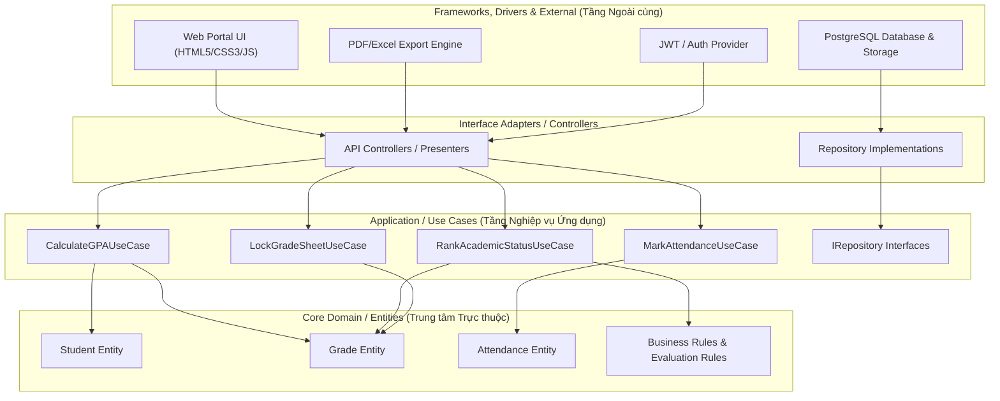
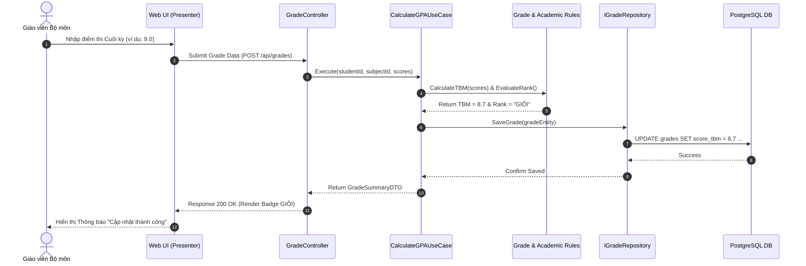

# BrainStorm Tuần 4: Chuyên Đề Nghiên Cứu Kiến Trúc Phần Mềm & Thiết Kế Clean Architecture Hệ Thống Quản Lý Trường Học (SMS)

Tài liệu nghiên cứu chuyên sâu về Kiến trúc Phần mềm (Software Architecture), đánh giá so sánh giữa 5 mô hình kiến trúc tiêu biểu: **3-Layer Architecture**, **N-Layer Architecture**, **Clean Architecture**, **Event-Driven Architecture** và **Microservices Architecture**; phân tích ưu nhược điểm và thiết kế chi tiết mô hình Clean Architecture cho **Hệ thống Quản lý Trường học (School Management System - SMS)**.

---

## CHƯƠNG I. MỤC TIÊU VÀ PHẠM VI NGHIÊN CỨU

### 1. Mục tiêu
Chuyên đề này được thực hiện nhằm đánh giá toàn diện các mô hình kiến trúc phần mềm từ truyền thống đến hiện đại. Kết quả nghiên cứu cung cấp luận cứ khoa học thực tiễn để nhóm chọn lựa giải pháp kiến trúc tối ưu nhất cho **Dự án Hệ thống Quản lý Trường học (SMS)**, đảm bảo tính bảo trì, khả năng mở rộng và dễ dàng kiểm thử Unit Test.

### 2. Giới hạn và Phạm vi nghiên cứu
Chuyên đề tập trung nghiên cứu và đối chiếu 5 mô hình kiến trúc phần mềm chính:
- **3-Layer Architecture**: Kiến trúc 3 tầng truyền thống (Presentation - BLL - DAL).
- **N-Layer Architecture**: Kiến trúc đa tầng mở rộng.
- **Clean Architecture (Onion / Hexagonal Architecture)**: Kiến trúc sạch dựa trên Nguyên lý Đảo ngược Phụ thuộc (Dependency Inversion Principle - DIP).
- **Event-Driven Architecture (EDA)**: Kiến trúc xử lý hướng sự kiện bất đồng bộ.
- **Microservices Architecture**: Kiến trúc phân tán theo các dịch vụ độc lập.

Các tiêu chí đối chiếu bao gồm: Độ phức tạp khởi tạo, mức độ phụ thuộc giữa các thành phần (Coupling), khả năng kiểm thử độc lập (Testability), khả năng mở rộng (Scalability), chi phí hạ tầng vận hành và độ phù hợp cho đồ án môn học.

---

## CHƯƠNG II. NGHIÊN CỨU VÀ SO SÁNH 5 MÔ HÌNH KIẾN TRÚC PHẦN MỀM

### 1. 3-Layer Architecture (Kiến trúc 3 Tầng Truyền thống)

#### 1.1. Đặc điểm chung
Kiến trúc 3 tầng phân chia hệ thống thành 3 lớp tuần tự xếp chồng lên nhau từ trên xuống dưới:
- **Presentation Layer (Tầng Giao diện)**: Hiển thị UI và tiếp nhận tương tác người dùng.
- **Business Logic Layer - BLL (Tầng Nghiệp vụ)**: Xử lý các quy tắc và tính toán nghiệp vụ.
- **Data Access Layer - DAL (Tầng Truy xuất Dữ liệu)**: Tương tác trực tiếp với CSDL (SQL/PostgreSQL).

#### 1.2. Hướng phụ thuộc & Đặc tính
Hướng phụ thuộc đi trực tiếp từ trên xuống dưới: `Presentation` $\rightarrow$ `BLL` $\rightarrow$ `DAL` $\rightarrow$ `Database`.

#### 1.3. Điểm mạnh và Hạn chế
- **Điểm mạnh**: Dễ hiểu, cấu trúc đơn giản, tốc độ triển khai ban đầu rất nhanh cho dự án quy mô nhỏ.
- **Hạn chế**:
  - Mức độ phụ thuộc cao (High Coupling): Tầng BLL bị phụ thuộc cứng vào DAL và Database.
  - Rất khó viết Unit Test độc lập cho Business Logic mà không cần kết nối với CSDL thật.
  - Khi thay đổi CSDL hoặc cấu trúc bảng, các tầng trên bị ảnh hưởng dây chuyền.

---

### 2. N-Layer Architecture (Kiến trúc N Tầng Đa Lớp)

#### 1.1. Đặc điểm chung
Mở rộng từ kiến trúc 3 tầng bằng cách tách nhỏ các trách nhiệm thành các tầng trung gian chuyên biệt: `Presentation Layer`, `Service Layer`, `Business Logic Layer`, `Data Access Layer`, `DTO (Data Transfer Object) Layer` và `Infrastructure Layer`.

#### 1.2. Điểm mạnh và Hạn chế
- **Điểm mạnh**: Tách biệt trách nhiệm rõ ràng hơn 3-Layer, dễ quản lý mã nguồn khi số lượng chức năng tăng lên.
- **Hạn chế**: Phát sinh quá nhiều mã nguồn trung gian (Boilerplate Code) để chuyển đổi dữ liệu giữa các tầng (Entity $\rightarrow$ DTO $\rightarrow$ View Model), độ phức tạp tăng nhưng chưa giải quyết triệt để sự phụ thuộc vào CSDL.

---

### 3. Clean Architecture / Onion Architecture (Kiến trúc Sạch - Đề xuất Chốt)

#### 3.1. Đặc điểm chung
Do Robert C. Martin (Uncle Bob) đề xướng, dựa trên **Nguyên lý Đảo ngược Phụ thuộc (Dependency Inversion Principle - DIP)** trong SOLID. Kiến trúc sắp xếp các tầng theo mô hình các vòng tròn đồng tâm, trong đó **Domain Entities** và **Core Business Logic** nằm ở vị trí trung tâm tuyệt đối.

#### 3.2. Hướng phụ thuộc & Quy tắc Vòng tròn (The Dependency Rule)
Quy tắc cốt lõi: Mọi phụ thuộc mã nguồn chỉ được phép trỏ **từ ngoài vào trong**. Các tầng bên trong tuyệt đối không được biết tới sự tồn tại của các tầng bên ngoài.
- `Entities (Core Domain)` $\leftarrow$ `Use Cases (Application)` $\leftarrow$ `Controllers / Presenters` $\leftarrow$ `Web / UI / PostgreSQL / External Services`.

#### 3.3. Điểm mạnh và Hạn chế
- **Điểm mạnh**:
  - **Độc lập hoàn toàn với CSDL & Framework**: Có thể đổi CSDL (từ SQL Server sang PostgreSQL) hoặc đổi Framework Web mà không phải sửa 1 dòng code nghiệp vụ tính GPA nào.
  - **Dễ dàng kiểm thử độc lập (Testability)**: Viết Unit Test phủ $100\%$ các hàm nghiệp vụ trong vài giây bằng cách Mock Data Access Interfaces.
  - Mức độ phụ thuộc lỏng lẻo (Loose Coupling) tối đa.
- **Hạn chế**: Cần thời gian thiết kế cấu trúc Interfaces và DTO ban đầu cho dự án.

---

### 4. Event-Driven Architecture (EDA - Kiến trúc Dựa trên Sự kiện)

#### 4.1. Đặc điểm chung
Kiến trúc kết nối các thành phần dựa trên việc phát hành (Publish) và tiêu thụ (Consume) các Sự kiện (Events) bất đồng bộ thông qua một Event Broker trung gian (Apache Kafka, RabbitMQ, Redis Pub/Sub).

#### 4.2. Luồng hoạt động
`Event Producer` $\rightarrow$ `Event Broker (Message Queue)` $\rightarrow$ `Event Consumers`.

#### 4.3. Điểm mạnh và Hạn chế
- **Điểm mạnh**: Phù hợp cho xử lý tác vụ nền thời gian thực (ví dụ: tự động gửi SMS/Email thông báo cho phụ huynh ngay khi giáo viên bấm điểm danh vắng học mà không làm treo màn hình).
- **Hạn chế**: Khó theo dõi luồng dữ liệu (Debugging), khó duy trì tính nhất quán dữ liệu tức thời (Eventual Consistency).

---

### 5. Microservices Architecture (Kiến trúc Vi dịch vụ)

#### 5.1. Đặc điểm chung
Phân chia ứng dụng monolith thành danh sách các dịch vụ nhỏ độc lập (Independent Services), mỗi dịch vụ quản lý một miền nghiệp vụ riêng (ví dụ: Auth Service, Student Service, Grade Service, Tuition Service) và sở hữu CSDL riêng biệt.

#### 5.2. Điểm mạnh và Hạn chế
- **Điểm mạnh**: Mở rộng quy mô độc lập từng dịch vụ (Horizontal Scaling), cho phép các team phát triển bằng các ngôn ngữ/công nghệ khác nhau.
- **Hạn chế**: Độ phức tạp quản trị hạ tầng rất cao (Container Orchestration với Kubernetes, API Gateway, Service Mesh), chi phí máy chủ và vận hành quá lớn so với đồ án sinh viên.

---

### 6. Bảng So Sánh Tổng Hợp 5 Mô Hình Kiến Trúc (Comparative Architectural Matrix)

| Tiêu chí Đánh giá | 3-Layer | N-Layer | Clean Architecture (Selected) | Event-Driven (EDA) | Microservices |
| :--- | :--- | :--- | :--- | :--- | :--- |
| **Hướng Phụ thuộc** | Trên $\rightarrow$ Dưới | Trên $\rightarrow$ Dưới | **Ngoài $\rightarrow$ Trong (DIP)** | Hướng Sự kiện (Broker) | Phân tán độc lập |
| **Khả năng Unit Test** | Khó | Trung bình | **Rất dễ (Tuyệt đối)** | Trung bình | Phức tạp (Integration) |
| **Độc lập với Database** | Phụ thuộc | Phụ thuộc | **Độc lập hoàn toàn** | Độc lập | Độc lập từng dịch vụ |
| **Độ phức tạp khởi tạo** | Thấp | Trung bình | **Trung bình** | Cao | Rất cao |
| **Tốc độ phản hồi API** | Nhanh | Nhanh | **Nhanh (Tối ưu)** | Bất đồng bộ | Phụ thuộc mạng API |
| **Chi phí Hạ tầng** | Thấp | Thấp | **Thấp (1 Server)** | Trung bình | Rất đắt (Cluster) |
| **Khả năng Bảo trì** | Kém khi code lớn | Khá | **Xuất sắc** | Phức tạp | Xuất sắc từng service |
| **Phù hợp cho Dự án SMS** | Tạm được | Phù hợp | **Tối ưu nhất** | Dùng cho Module Nhắc nhở | Quá phức tạp |

---

## CHƯƠNG III. THIẾT KẾ KIẾN TRÚC SẠCH (CLEAN ARCHITECTURE) CHO HỆ THỐNG (SMS ARCHITECTURE DESIGN)

### 1. Sơ đồ Vòng tròn Đồng tâm Clean Architecture (Mermaid Diagram)



---

### 2. Sơ đồ Luồng Dữ liệu Tương tác (Data Flow Diagram - Grade Calculation Use Case)



---

### 3. Cấu trúc Tổ chức Thư mục Mã nguồn Clean Architecture (Folder Structure)

```
src/
├── Core/                              # Tầng Trung tâm (Domain & Application)
│   ├── Domain/                        # 1. Domain Entities & Business Rules
│   │   ├── Entities/                  # Student, Grade, Class, Attendance
│   │   └── ValueObjects/              # ScoreValue, AcademicRank, Semester
│   └── Application/                   # 2. Use Cases & Interfaces
│       ├── UseCases/                  # CalculateGPA, RankAcademic, MarkAttendance
│       ├── Interfaces/                # IStudentRepository, IGradeRepository
│       └── DTOs/                      # GradeRequestDTO, StudentResponseDTO
│
├── Infrastructure/                    # Tầng Hạ tầng & Dữ liệu (Outermost Layer)
│   ├── Persistence/                   # PostgreSQL Data Access & Repositories
│   │   ├── Repositories/              # StudentRepositoryImpl, GradeRepositoryImpl
│   │   └── PostgreSQLContext.js       # Database Connection & Storage Store
│   └── Services/                      # External Services (JWT, PdfExport, AuditLogger)
│
└── Presentation/                      # Tầng Giao diện & API Controllers
    ├── Controllers/                   # AuthController, GradeController, AttendanceController
    └── WebUI/                         # HTML5, CSS3, JS App Portal
        ├── css/                       # Design System & Main CSS
        └── js/                        # Frontend Controllers & View Renderers
```

---

## CHƯƠNG IV. ĐỀ XUẤT VÀ LỰA CHỌN PHƯƠNG ÁN KIẾN TRÚC CHO DỰ ÁN (SMS)

### 1. Kết luận Phương án Công nghệ Chốt
Nhóm quyết định lựa chọn **Mô hình Clean Architecture (Onion Architecture)** kết hợp với phong cách **Modular Monolith** làm giải pháp kiến trúc phần mềm chính thức cho **Hệ thống Quản lý Trường học (SMS)**.

### 2. Luận cứ Khoa học cho Lựa chọn Clean Architecture

1. **Bảo vệ Tuyệt đối Thuật toán Tính Điểm & Xếp loại Học lực**:
   - Các quy tắc nghiệp vụ tính TBM, GPA hệ 10/4, xếp loại học lực theo Thông tư 22 nằm hoàn toàn ở tầng `Core Domain`. Không bị pha tạp với mã nguồn giao diện HTML/CSS hay câu lệnh SQL của PostgreSQL.
2. **Khả năng Viết Unit Test Đạt $100\%$ Coverage**:
   - Cho phép viết các kịch bản kiểm thử tự động cho toàn bộ Use Cases tính điểm mà không cần khởi động CSDL hay Server Web.
3. **Dễ dàng Bảo trì & Mở rộng Chức năng**:
   - Khi cần thay đổi giao diện hoặc đổi thư viện xuất PDF/Excel, lập trình viên chỉ cần thao tác ở tầng `Infrastructure` hoặc `Presentation` mà không ảnh hưởng tới logic hệ thống.
4. **Phù hợp với Năng lực & Quy mô Đồ án**:
   - Khắc phục sự phụ thuộc cứng của 3-Layer truyền thống nhưng không bị sa lầy vào độ phức tạp quản trị của Microservices.

---

## CHƯƠNG V. NGUỒN TÀI LIỆU THAM KHẢO CHÍNH THỐNG (OFFICIAL REFERENCES)

1. **The Clean Architecture Essay**: Robert C. Martin (Uncle Bob).  
   Link: [https://blog.cleancoder.com/uncle-bob/2012/08/13/the-clean-architecture.html](https://blog.cleancoder.com/uncle-bob/2012/08/13/the-clean-architecture.html)
2. **Common Web Application Architectures Guide**: Microsoft Learn.  
   Link: [https://learn.microsoft.com/en-us/dotnet/architecture/modern-web-apps-azure/common-web-application-architectures](https://learn.microsoft.com/en-us/dotnet/architecture/modern-web-apps-azure/common-web-application-architectures)
3. **N-tier Architecture Style Guide**: Microsoft Azure Architecture Center.  
   Link: [https://learn.microsoft.com/en-us/azure/architecture/guide/architecture-styles/n-tier](https://learn.microsoft.com/en-us/azure/architecture/guide/architecture-styles/n-tier)
4. **What is Event-Driven Architecture?**: Amazon Web Services (AWS Architecture Center).  
   Link: [https://aws.amazon.com/event-driven-architecture/](https://aws.amazon.com/event-driven-architecture/)
5. **Microservices Pattern & Architecture Guide**: Chris Richardson.  
   Link: [https://microservices.io](https://microservices.io)
6. **Software Architecture Patterns & Dependency Inversion Principle**: Martin Fowler.  
   Link: [https://martinfowler.com/architecture/](https://martinfowler.com/architecture/)
