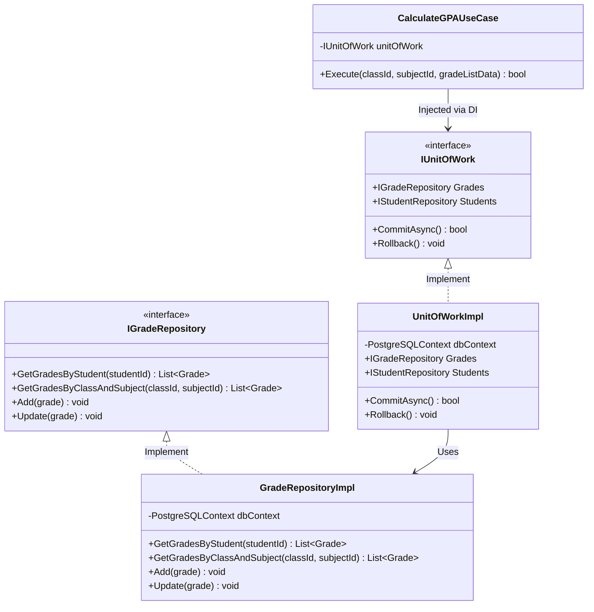

# BrainStorm Tuần 5: Chuyên Đề Nghiên Cứu Mẫu Thiết Kế Phần Mềm (Design Patterns) & Áp Dụng Cho Hệ Thống Quản Lý Trường Học (SMS)

Tài liệu nghiên cứu chuyên sâu về các Mẫu thiết kế phần mềm (Design Patterns) và Nguyên lý thiết kế hướng đối tượng (SOLID), đánh giá chi tiết 6 mẫu & nguyên lý cốt lõi: **MVC**, **MVVM**, **Repository Pattern**, **Unit of Work**, **Dependency Inversion Principle (DIP)** và **Dependency Injection (DI)**; phân tích ứng dụng thực tiễn cho **Hệ thống Quản lý Trường học (School Management System - SMS)**.

---

## CHƯƠNG I. MỤC TIÊU VÀ PHẠM VI NGHIÊN CỨU

### 1. Mục tiêu
Chuyên đề này được thực hiện nhằm nghiên cứu và phân tích các Mẫu thiết kế phần mềm (Design Patterns) và Nguyên lý thiết kế phần mềm sạch. Kết quả nghiên cứu cung cấp cơ sở lý luận và kỹ thuật để nhóm áp dụng bộ Pattern tối ưu nhất cho **Dự án Hệ thống Quản lý Trường học (SMS)**, giúp mã nguồn đạt tính mô-đun hóa cao, giảm sự phụ thuộc (Loose Coupling), đảm bảo an toàn giao dịch CSDL và dễ dàng kiểm thử Unit Test.

### 2. Giới hạn và Phạm vi nghiên cứu
Chuyên đề tập trung nghiên cứu 6 mẫu thiết kế và nguyên lý kỹ thuật cốt lõi:
- **MVC (Model-View-Controller)**: Mẫu kiến trúc phân tách giao diện và xử lý điều hướng Web.
- **MVVM (Model-View-ViewModel)**: Mẫu kiến trúc đồng bộ dữ liệu và giao diện phản hồi cho ứng dụng Web SPA.
- **Repository Pattern**: Mẫu trừu tượng hóa truy xuất cơ sở dữ liệu (Data Access Abstraction).
- **Unit of Work Pattern**: Mẫu quản lý giao dịch cơ sở dữ liệu (Database Transaction Management).
- **Dependency Inversion Principle (DIP)**: Nguyên lý Đảo ngược Phụ thuộc trong bộ nguyên lý SOLID.
- **Dependency Injection (DI)**: Kỹ thuật tiêm phụ thuộc giúp quản lý vòng đời và đảo ngược điều khiển (IoC).

Các tiêu chí đánh giá bao gồm: Mức độ giảm phụ thuộc, khả năng kiểm thử độc lập (Testability), khả năng quản lý toàn vẹn giao dịch (ACID Transaction), tính tái sử dụng mã nguồn và độ phù hợp cho đồ án.

---

## CHƯƠNG II. NGHIÊN CỨU VÀ SO SÁNH CÁC DESIGN PATTERNS & NGUYÊN LÝ CỐT LÕI

### 1. MVC (Model-View-Controller Pattern)

#### 1.1. Đặc điểm chung
MVC là mẫu kiến trúc phần mềm kinh điển trong phát triển ứng dụng Web, chia ứng dụng thành 3 thành phần có trách nhiệm riêng biệt:
- **Model**: Đại diện cho cấu trúc dữ liệu và quy tắc nghiệp vụ hệ thống.
- **View**: Hiển thị dữ liệu trực quan cho người dùng (HTML, CSS, UI Components).
- **Controller**: Tiếp nhận Yêu cầu (Request) từ View, xử lý gọi Model và trả về Phản hồi (Response) hiển thị trên View.

#### 1.2. Điểm mạnh và Hạn chế
- **Điểm mạnh**: Tách biệt rõ ràng giữa giao diện hiển thị và logic xử lý; dễ dàng phân công công việc cho Frontend và Backend.
- **Hạn chế**: Controller dễ bị phình to (Fat Controller) nếu lập trình viên viết trực tiếp logic truy xuất CSDL vào Controller mà không tách tầng Service/Repository.

---

### 2. MVVM (Model-View-ViewModel Pattern)

#### 2.1. Đặc điểm chung
MVVM thường được áp dụng cho các ứng dụng Web tương tác cao (Single Page Application - SPA như React, Vue) hoặc ứng dụng Mobile:
- **Model**: Dữ liệu gốc và Business Entities.
- **View**: Giao diện hiển thị trực quan.
- **ViewModel**: Lớp trung gian chứa Trạng thái Giao diện (UI State) và cơ chế Đồng bộ Dữ liệu 2 chiều (Data Binding) với View.

#### 2.2. Điểm mạnh và Hạn chế
- **Điểm mạnh**: Giao diện tự động cập nhật ngay khi dữ liệu thay đổi mà không cần viết thủ công các câu lệnh thao tác DOM.
- **Hạn chế**: Tốn thêm bộ nhớ RAM để duy trì trạng thái ViewModel khi dữ liệu danh sách học sinh quá lớn.

---

### 3. Repository Pattern (Mẫu Lưu Trữ Data Access)

#### 3.1. Đặc điểm chung
Repository Pattern đóng vai trò làm lớp đệm trung gian giữa Tầng Nghiệp vụ (Business Logic) và Tầng Truy xuất Cơ sở Dữ liệu (Data Access Layer / PostgreSQL / ORM), tạo ra cảm giác CSDL như một tập hợp bộ nhớ (In-Memory Collection).

#### 3.2. Cấu trúc Interfaces
Tạo các Interface chuẩn hóa thao tác dữ liệu:
`IStudentRepository`, `IGradeRepository`, `IAttendanceRepository` với các phương thức CRUD (`GetById`, `Add`, `Update`, `Delete`, `Find`).

#### 3.3. Điểm mạnh và Hạn chế
- **Điểm mạnh**:
  - **Giảm độ phụ thuộc cứng (Loose Coupling)**: Tầng Business Logic hoàn toàn không cần biết dữ liệu được lưu ở PostgreSQL, SQL Server hay LocalStorage.
  - **Tối ưu khả năng Unit Test**: Dễ dàng tạo các Mock Repository (ví dụ: `MockGradeRepository`) để chạy kiểm thử Unit Test cực nhanh mà không cần kết nối CSDL thật.
- **Hạn chế**: Tăng số lượng tệp tệp Interface và Class trong dự án.

---

### 4. Unit of Work Pattern (Mẫu Quản Lý Giao Dịch CSDL)

#### 4.1. Đặc điểm chung
Unit of Work duy trì danh sách các đối tượng dữ liệu bị thay đổi (Thêm mới, Chỉnh sửa, Xóa) trong một phiên làm việc (Transaction) duy nhất. Khi hoàn tất, Unit of Work sẽ thực hiện **Commit** toàn bộ thay đổi vào CSDL chỉ trong một thao tác duy nhất.

#### 4.2. Ứng dụng trong Giao dịch Điểm số & Học phí
Khi Giáo viên nhập điểm cho lớp 45 học sinh, Unit of Work gom 45 bản ghi điểm số vào một giao dịch CSDL (Database Transaction). Nếu bản ghi thứ 40 bị lỗi, Unit of Work tự động **Rollback** toàn bộ 39 bản ghi trước đó, bảo đảm CSDL không bị lệch hoặc rác.

#### 4.3. Điểm mạnh và Hạn chế
- **Điểm mạnh**: Đảm bảo tuyệt đối tính toàn vẹn giao dịch (ACID Transaction), giảm số lần kết nối và mở phiên làm việc với CSDL PostgreSQL.
- **Hạn chế**: Đòi hỏi thiết kế kỹ lưỡng cơ chế quản lý kết nối CSDL.

---

### 5. Dependency Inversion Principle (DIP - Nguyên Lý Đảo Ngược Phụ Thuộc)

#### 5.1. Đặc điểm chung
Là chữ **D** trong bộ 5 nguyên lý thiết kế **SOLID** do Robert C. Martin đề xướng.
- **Nội dung nguyên lý**:
  1. *Các module cấp cao (High-level modules) không được phụ thuộc vào các module cấp thấp (Low-level modules). Cả hai phải phụ thuộc vào sự trừu tượng (Abstractions/Interfaces).*
  2. *Sự trừu tượng (Abstractions) không được phụ thuộc vào chi tiết. Chi tiết phải phụ thuộc vào sự trừu tượng.*

#### 5.2. Điểm mạnh
Ngăn chặn hiện tượng thay đổi một câu lệnh SQL ở CSDL làm sụp đổ toàn bộ logic tính điểm GPA của hệ thống.

---

### 6. Dependency Injection (DI - Kỹ Thuật Tiêm Phụ Thuộc)

#### 6.1. Đặc điểm chung
Dependency Injection là kỹ thuật hiện thực hóa nguyên lý DIP bằng cách chuyển việc khởi tạo các đối tượng phụ thuộc ra bên ngoài và tiêm (Inject) chúng vào Class tiêu thụ thông qua **Constructor Injection**, **Property Injection** hoặc **Method Injection**.

#### 6.2. Các Vòng đời Quản lý Đối tượng (DI Lifetimes)
- **Transient**: Khởi tạo một đối tượng mới mỗi lần được yêu cầu.
- **Scoped**: Khởi tạo một đối tượng duy nhất trong một phiên Yêu cầu HTTP (Request).
- **Singleton**: Khởi tạo duy nhất một đối tượng trong suốt vòng đời ứng dụng.

---

### 7. Bảng So Sánh Tổng Hợp Các Patterns & Nguyên Lý (Comparative Pattern Matrix)

| Tiêu chí Đánh giá | MVC Pattern | MVVM Pattern | Repository Pattern | Unit of Work | Dependency Injection (DI) |
| :--- | :--- | :--- | :--- | :--- | :--- |
| **Phạm vi Áp dụng** | Tầng Presentation Web | Tầng UI State Web SPA | Tầng Data Access | Tầng Giao dịch CSDL | Toàn bộ Kiến trúc Hệ thống |
| **Mục tiêu Chính** | Phân tách UI và Logic | Đồng bộ UI & Data | Trừu tượng CSDL | Quản lý ACID Transaction | Đảo ngược phụ thuộc (IoC) |
| **Mức độ Loose Coupling** | Trung bình | Khá | **Rất cao** | **Rất cao** | **Tuyệt đối** |
| **Hỗ trợ Unit Test** | Khá | Tốt | **Xuất sắc (Mocking)** | **Xuất sắc** | **Xuất sắc (Tối thượng)** |
| **Quản lý Transaction** | Không | Không | Gián tiếp | **Chuyên trách (Commit/Rollback)**| Không |
| **Tái sử dụng Mã nguồn** | Trung bình | Khá | **Rất cao** | Khá | **Rất cao** |
| **Độ phù hợp cho Dự án SMS** | **Dùng cho Web UI** | **Dùng cho Dashboard** | **Tối ưu cho CSDL Điểm** | **Tối ưu cho Nhập điểm hàng loạt** | **Cốt lõi toàn hệ thống** |

---

## CHƯƠNG III. THIẾT KẾ ÁP DỤNG DESIGN PATTERNS TRONG HỆ THỐNG QUẢN LÝ TRƯỜNG HỌC (SMS)

### 1. Sơ đồ UML Tổng hợp (Repository + Unit of Work + Dependency Injection)



---

### 2. Kịch bản Mã Nguồn Minh Họa (JavaScript/TypeScript Code Sample)

#### a. Định nghĩa Interface & Implementation cho Repository & Unit of Work
```javascript
// 1. Interface & Class GradeRepository Implementation
class GradeRepositoryImpl {
    constructor(dbContext) {
        this.dbContext = dbContext;
    }

    async getByStudentAndSubject(studentId, subjectId, semester) {
        return await this.dbContext.query(
            'SELECT * FROM grades WHERE student_id = $1 AND subject_id = $2 AND semester = $3',
            [studentId, subjectId, semester]
        );
    }

    async save(gradeEntity) {
        return await this.dbContext.query(
            `INSERT INTO grades (student_id, subject_id, score_tbm, academic_rank) 
             VALUES ($1, $2, $3, $4) 
             ON CONFLICT (student_id, subject_id, semester) 
             DO UPDATE SET score_tbm = $3, academic_rank = $4`,
            [gradeEntity.studentId, gradeEntity.subjectId, gradeEntity.scoreTbm, gradeEntity.academicRank]
        );
    }
}

// 2. Unit of Work Implementation
class UnitOfWorkImpl {
    constructor(dbContext) {
        this.dbContext = dbContext;
        this.gradeRepository = new GradeRepositoryImpl(this.dbContext);
    }

    async beginTransaction() {
        await this.dbContext.query('BEGIN');
    }

    async commit() {
        await this.dbContext.query('COMMIT');
    }

    async rollback() {
        await this.dbContext.query('ROLLBACK');
    }
}
```

#### b. Use Case Tính Điểm & Xếp Loại Sử Dụng Dependency Injection
```javascript
// 3. Use Case tiêm phụ thuộc IUnitOfWork qua Constructor Injection
class CalculateGPAUseCase {
    constructor(unitOfWork) { // Dependency Injection
        this.unitOfWork = unitOfWork;
    }

    async execute(gradeBatchData) {
        try {
            await this.unitOfWork.beginTransaction();

            for (const item of gradeBatchData) {
                // Thuật toán nghiệp vụ tính Điểm trung bình môn (TBM)
                const scoreTbm = (item.oral + item.fifteenMin + (item.midterm * 2) + (item.final * 3)) / 7;
                
                // Thuật toán tự động xếp loại Học lực
                let academicRank = 'TRUNG BÌNH';
                if (scoreTbm >= 8.0) academicRank = 'GIỎI';
                else if (scoreTbm >= 6.5) academicRank = 'KHÁ';

                const gradeEntity = {
                    studentId: item.studentId,
                    subjectId: item.subjectId,
                    scoreTbm: parseFloat(scoreTbm.toFixed(1)),
                    academicRank: academicRank
                };

                // Gọi Repository qua Unit of Work
                await this.unitOfWork.gradeRepository.save(gradeEntity);
            }

            // Commit giao dịch toàn vẹn cho cả lớp học
            await this.unitOfWork.commit();
            return { success: true, message: 'Cập nhật sổ điểm thành công' };
        } catch (error) {
            // Tự động Rollback nếu có lỗi bất kỳ
            await this.unitOfWork.rollback();
            throw new Error('Lỗi giao dịch CSDL: ' + error.message);
        }
    }
}
```

---

## CHƯƠNG IV. ĐỀ XUẤT VÀ LỰA CHỌN BỘ DESIGN PATTERNS CHO DỰ ÁN (SMS)

### 1. Kết luận Bộ Design Patterns Chốt
Nhóm quyết định lựa chọn phối hợp **Bộ 4 Design Patterns & Nguyên lý**:
1. **MVC / MVVM Pattern**: Áp dụng tại Tầng Giao diện Web Portal (Presentation Layer).
2. **Repository Pattern**: Áp dụng làm lớp đệm trừu tượng hóa CSDL PostgreSQL.
3. **Unit of Work Pattern**: Áp dụng quản lý giao dịch CSDL toàn vẹn khi nhập điểm và thu học phí hàng loạt.
4. **Dependency Injection (DI) & DIP**: Áp dụng làm nguyên lý tiêm phụ thuộc toàn bộ hệ thống.

### 2. Luận cứ Khoa học cho Lựa chọn

1. **Bảo Đảm Toàn Vẹn Giao Dịch Điểm Số (ACID)**:
   - Kết hợp **Unit of Work** giúp loại bỏ nguy cơ lưu thiếu hoặc lỗi điểm số khi giáo viên bấm lưu bảng điểm sĩ số 45 học sinh cùng lúc.
2. **Cách Ly Tuyệt Đối Logic Nghiệp Vụ Với CSDL**:
   - **Repository Pattern** giúp Business Logic tính GPA không phụ thuộc vào câu lệnh SQL cụ thể. Khi thay đổi CSDL không cần sửa đổi logic nghiệp vụ.
3. **Nâng Cao Khả Năng Unit Test Đạt $100\%$ Coverage**:
   - **Dependency Injection** giúp lập trình viên truyền `MockUnitOfWork` vào `CalculateGPAUseCase` để chạy tự động 50 bài test kiểm thử các trường hợp điểm biên trong vài miligiây.

---

## CHƯƠNG V. NGUỒN TÀI LIỆU THAM KHẢO CHÍNH THỐNG (OFFICIAL REFERENCES)

1. **Design Patterns: Catalog of Patterns of Enterprise Application Architecture**: Martin Fowler.  
   - Repository Pattern: [https://martinfowler.com/eaaCatalog/repository.html](https://martinfowler.com/eaaCatalog/repository.html)  
   - Unit of Work Pattern: [https://martinfowler.com/eaaCatalog/unitOfWork.html](https://martinfowler.com/eaaCatalog/unitOfWork.html)
2. **The Dependency Inversion Principle**: Robert C. Martin (Uncle Bob).  
   Link: [https://blog.cleancoder.com/uncle-bob/2016/01/04/abstraction-levels.html](https://blog.cleancoder.com/uncle-bob/2016/01/04/abstraction-levels.html)
3. **Dependency Injection in .NET & Modern Software**: Microsoft Learn.  
   Link: [https://learn.microsoft.com/en-us/dotnet/core/extensions/dependency-injection](https://learn.microsoft.com/en-us/dotnet/core/extensions/dependency-injection)
4. **MVC Architecture Pattern Guide**: MDN Web Docs (Mozilla Developer Network).  
   Link: [https://developer.mozilla.org/en-US/docs/Glossary/MVC](https://developer.mozilla.org/en-US/docs/Glossary/MVC)
5. **Model-View-ViewModel (MVVM) Pattern Guide**: Microsoft Learn.  
   Link: [https://learn.microsoft.com/en-us/dotnet/architecture/maui/mvvm](https://learn.microsoft.com/en-us/dotnet/architecture/maui/mvvm)
