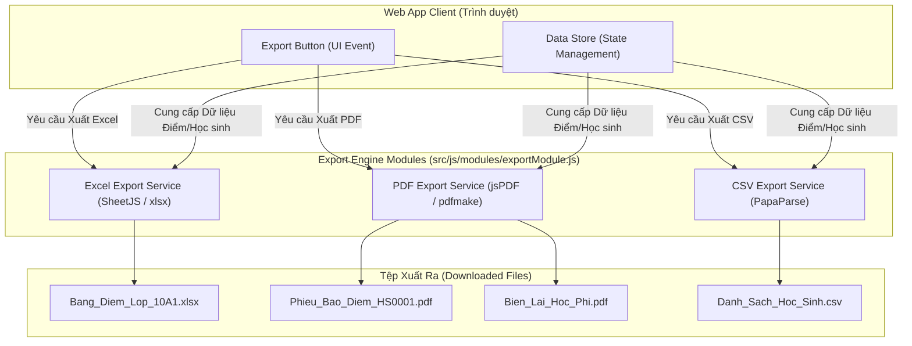
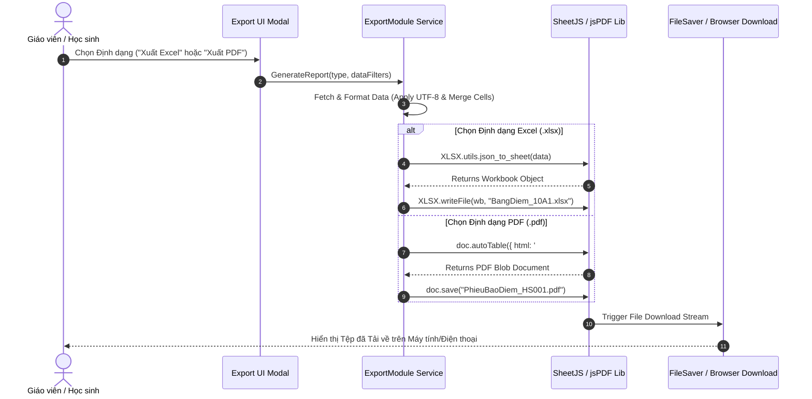

# BrainStorm Tuần 6: Chuyên Đề Nghiên Cứu Xuất Báo Cáo & Định Dạng Dữ Liệu (Export Engine) Hệ Thống Quản Lý Trường Học (SMS)

Tài liệu nghiên cứu chuyên sâu về các giải pháp Trích xuất Báo cáo và Định dạng Dữ liệu (Data Exporting & Reporting Engine), đánh giá so sánh giữa 3 định dạng phổ biến: **Excel (.xlsx)**, **PDF (.pdf)** và **CSV (.csv)**; phân tích các thư viện xử lý phía Client & Server (**SheetJS**, **ExcelJS**, **jsPDF**, **pdfmake**, **PapaParse**) và thiết kế phân hệ xuất báo cáo cho **Hệ thống Quản lý Trường học (School Management System - SMS)**.

---

## CHƯƠNG I. MỤC TIÊU VÀ PHẠM VI NGHIÊN CỨU

### 1. Mục tiêu
Chuyên đề này được thực hiện nhằm nghiên cứu các công nghệ trích xuất báo cáo dữ liệu tự động trong ứng dụng Web. Kết quả nghiên cứu cung cấp cơ sở kỹ thuật để nhóm lựa chọn và phát triển phân hệ **Export Engine** tối ưu cho **Dự án Hệ thống Quản lý Trường học (SMS)**, đáp ứng các nhu cầu hành chính: Xuất sổ điểm lớp, danh sách học sinh, phiếu báo điểm cá nhân, học bạ điện tử và biên lai thu học phí.

### 2. Giới hạn và Phạm vi nghiên cứu
Chuyên đề tập trung nghiên cứu 3 định dạng xuất dữ liệu tiêu biểu:
- **Microsoft Excel (.xlsx / .xls)**: Định dạng bảng tính thương mại phổ biến nhất.
- **PDF (Portable Document Format)**: Định dạng tài liệu di động chống sửa đổi chuẩn quốc tế.
- **CSV (Comma-Separated Values)**: Định dạng dữ liệu văn bản thuần phân tách bằng dấu phẩy.

Các công cụ và thư viện kỹ thuật được khảo sát gồm: **SheetJS (xlsx)**, **ExcelJS**, **jsPDF**, **pdfmake** và **PapaParse**.

Các tiêu chí đánh giá bao gồm: Khả năng giữ định dạng màu sắc/bố cục, khả năng nhúng công thức tính toán, tính bảo mật chống sửa đổi pháp lý, kích thước tệp xuất ra, tốc độ xử lý phía Client và độ phù hợp cho từng phân hệ trong dự án.

---

## CHƯƠNG II. NGHIÊN CỨU VÀ SO SÁNH 3 ĐỊNH DẠNG XUẤT DỮ LIỆU

### 1. Định dạng Microsoft Excel (.xlsx / .xls)

#### 1.1. Đặc điểm chung
Excel là định dạng bảng tính nhiều ngăn (Multi-worksheet Workbook) chuẩn mực trong môi trường doanh nghiệp và giáo dục, cho phép lưu trữ dữ liệu dạng lưới dòng/cột cùng các công thức tính toán và định dạng đồ họa.

#### 1.2. Thư viện Kỹ thuật Xử lý
- **SheetJS (xlsx)**: Thư viện JavaScript mã nguồn mở mạnh mẽ nhất hiện nay để đọc/ghi file Excel trên cả Trình duyệt (Client) và Node.js (Server).
- **ExcelJS**: Thư viện hỗ trợ nâng cao về định dạng ô (`Cell Styling`), màu sắc background, đường viền (`Borders`) và nhúng hình ảnh vào sheet.

#### 1.3. Điểm mạnh và Hạn chế
- **Điểm mạnh**:
  - Hỗ trợ lưu trữ nhiều Worksheet trong 1 tệp (ví dụ: Sheet1 - Điểm HK1, Sheet2 - Điểm HK2).
  - Cho phép nhúng công thức tính toán tự động (`SUM`, `AVERAGE`, `IF`).
  - Hỗ trợ gộp ô (`Merge Cells`), định dạng màu sắc cột điểm thường xuyên, giữa kỳ, cuối kỳ.
  - Giáo viên và cán bộ quản lý dễ dàng mở lại bằng Microsoft Excel/Google Sheets để tiếp tục xử lý.
- **Hạn chế**: Không có tính năng đóng băng chống sửa đổi (người dùng có thể tự ý sửa lại điểm số sau khi tải về).

---

### 2. Định dạng Portable Document Format (.pdf)

#### 2.1. Đặc điểm chung
PDF là tiêu chuẩn quốc tế (ISO 32000-1) về định dạng tài liệu cố định bố cục (Fixed-layout document), đảm bảo hiển thị và in ấn giống hệt nhau trên mọi thiết bị và hệ điều hành.

#### 2.2. Thư viện Kỹ thuật Xử lý
- **jsPDF**: Thư viện khởi tạo file PDF phía Client mạnh mẽ, hỗ trợ tạo bảng (`jsPDF-AutoTable`) và nhúng font chữ Unicode tiếng Việt.
- **pdfmake**: Thư viện tạo PDF theo nguyên lý Khhai báo Đấu cấu trúc JSON (Declarative Document Structure), tự động căn chỉnh trang và phân trang mượt mà.

#### 2.3. Điểm mạnh và Hạn chế
- **Điểm mạnh**:
  - **Tính bất biến và Giá trị Pháp lý cao**: Nội dung tài liệu bị đóng băng, không thể chỉnh sửa trực tiếp, chuẩn hóa cho việc in ấn Học bạ điện tử, Phiếu báo điểm và Biên lai thu tiền.
  - Hỗ trợ đóng dấu chữ ký số (Digital Signature) và watermark chống giả mạo.
  - Hiển thị chuẩn xác 100% font chữ, biểu trưng trường học và bố cục trang giấy (A4, Letter).
- **Hạn chế**: Dữ liệu không thể đưa vào các phần mềm bảng tính để tính toán tiếp; dung lượng tệp lớn hơn file CSV/Excel.

---

### 3. Định dạng Comma-Separated Values (.csv)

#### 3.1. Đặc điểm chung
CSV là định dạng dữ liệu văn bản thuần (Plain Text), lưu trữ các bản ghi dữ liệu phân tách nhau bằng dấu phẩy (`,`) hoặc dấu chấm phẩy (`;`).

#### 3.2. Thư viện Kỹ thuật Xử lý
- **PapaParse**: Thư viện JavaScript hàng đầu về Parse và Unparse dữ liệu CSV phía Client với tốc độ cực nhanh.

#### 3.3. Điểm mạnh và Hạn chế
- **Điểm mạnh**:
  - Dung lượng tệp siêu nhẹ (chỉ chứa ký tự văn bản thuần).
  - Tốc độ trích xuất dữ liệu cực nhanh, không tốn tài nguyên CPU/RAM.
  - Tương thích tốt khi trao đổi dữ liệu giữa các hệ thống phần mềm (Import/Export CSDL).
- **Hạn chế**:
  - Không hỗ trợ định dạng màu sắc, không có gộp ô (`Merge Cells`), không lưu được công thức.
  - Dễ bị lỗi font tiếng Việt khi mở bằng Excel nếu tệp không được chèn mã ký tự UTF-8 BOM (`\uFEFF`).

---

### 4. Bảng So Sánh Tổng Hợp 3 Định Dạng Xuất Dữ Liệu (Comparative Export Matrix)

| Tiêu chí Đánh giá | Microsoft Excel (.xlsx) | Portable Document (.pdf) | Comma-Separated (.csv) |
| :--- | :--- | :--- | :--- |
| **Tính Chống Sửa (Bảo mật)** | Kém (Sửa lại được dễ dàng) | **Rất cao (Đóng băng nội dung)** | Kém (File văn bản thuần) |
| **Hỗ trợ Công thức Tính** | **Có (`SUM`, `AVERAGE`)** | Không | Không |
| **Định dạng Màu / Bố cục** | **Phong phú (Styling/Merge)**| **Chuẩn in ấn A4 (Fixed UI)** | Không hỗ trợ |
| **Kích thước File** | Trung bình ($\sim 15 - 50\text{ KB}$) | Lớn ($\sim 100 - 500\text{ KB}$) | **Siêu nhẹ ($\sim 2 - 10\text{ KB}$)** |
| **Đa Bảng tính (Worksheets)**| **Có (Nhiều Sheet)** | Không (Chia theo trang) | Không (Chỉ 1 bảng) |
| **Tốc độ Sinh File phía Client**| Nhanh | Trung bình | **Cực nhanh** |
| **Mục đích Sử dụng Chính** | Bảng điểm Lớp, Báo cáo Tổng kết | Học bạ, Phiếu điểm, Biên lai | Import/Export CSDL thô |
| **Độ Phù hợp cho Dự án SMS** | **Tối ưu cho Giáo viên & BGH** | **Tối ưu cho Học sinh & Phụ huynh** | Phụ trợ cho Backup CSDL |

---

## CHƯƠNG III. THIẾT KẾ PHÂN HỆ XUẤT BÁO CÁO TRONG HỆ THỐNG (SMS EXPORT ENGINE DESIGN)

### 1. Sơ đồ Kiến trúc Phân hệ Xuất Báo cáo (Export Component Diagram)



---

### 2. Sơ đồ Luồng Xử lý Xuất File Excel & PDF (Sequence Diagram)



---

### 3. Kịch bản Mã Nguồn Minh Họa Trích Xuất Báo Cáo (JavaScript Code Samples)

#### a. Kịch bản Xuất Bảng Điểm Lớp ra File Excel (.xlsx) bằng SheetJS
```javascript
// Hàm xuất Bảng điểm Lớp ra file Excel sử dụng SheetJS (xlsx)
function exportGradeSheetToExcel(className, subjectName, gradeData) {
    // 1. Chuẩn hóa dữ liệu mảng đối tượng cho Excel
    const excelRows = gradeData.map((item, index) => ({
        "STT": index + 1,
        "Mã Học Sinh": item.studentCode,
        "Họ và Tên": item.fullName,
        "Điểm Miệng": item.scoreOral,
        "Điểm 15 Phút": item.score15min,
        "Điểm 1 Tiết": item.score1period,
        "Điểm Giữa Kỳ": item.scoreMidterm,
        "Điểm Cuối Kỳ": item.scoreFinal,
        "Điểm TBM": item.scoreTbm,
        "Xếp Loại": item.academicRank
    }));

    // 2. Tạo Worksheet từ dữ liệu JSON
    const worksheet = XLSX.utils.json_to_sheet(excelRows);

    // 3. Tự động chỉnh độ rộng cột (Column Widths)
    const colWidths = [
        { wch: 5 },  // STT
        { wch: 12 }, // Mã HS
        { wch: 25 }, // Họ tên
        { wch: 12 }, { wch: 12 }, { wch: 12 }, { wch: 12 }, { wch: 12 },
        { wch: 10 }, // TBM
        { wch: 15 }  // Xếp loại
    ];
    worksheet['!cols'] = colWidths;

    // 4. Tạo Workbook và chèn Worksheet
    const workbook = XLSX.utils.book_new();
    XLSX.utils.book_append_sheet(workbook, worksheet, `Sổ Điểm ${className}`);

    // 5. Tải file về máy người dùng
    const fileName = `Bang_Diem_${className}_Mon_${subjectName}.xlsx`;
    XLSX.writeFile(workbook, fileName);
}
```

#### b. Kịch bản Xuất Phiếu Báo Điểm Cá Nhân ra File PDF (.pdf) bằng jsPDF
```javascript
// Hàm xuất Phiếu báo điểm cá nhân ra file PDF hỗ trợ tiếng Việt
function exportStudentReportCardToPDF(studentInfo, gradeList) {
    // 1. Khởi tạo đối tượng jsPDF (Khổ giấy A4, Đơn vị mm)
    const { jsPDF } = window.jspdf;
    const doc = new jsPDF({ format: 'a4', unit: 'mm' });

    // 2. Thêm Tiêu đề Báo cáo
    doc.setFontSize(18);
    doc.text("TRƯỜNG THPT HOA SEN - HOASEEN HIGH SCHOOL", 105, 15, { align: "center" });
    doc.setFontSize(14);
    doc.text("PHIẾU BÁO ĐIỂM KẾT QUẢ HỌC TẬP HỌC KỲ 1", 105, 25, { align: "center" });

    // 3. Thêm Thông tin Học sinh
    doc.setFontSize(11);
    doc.text(`Họ và Tên: ${studentInfo.fullName}`, 14, 38);
    doc.text(`Mã Học Sinh: ${studentInfo.studentCode}`, 14, 44);
    doc.text(`Lớp: ${studentInfo.className}`, 120, 38);
    doc.text(`ĐTB Tích Lũy (GPA): ${studentInfo.gpa} / 10.0`, 120, 44);

    // 4. Xây dựng Bảng Điểm Chi tiết bằng jsPDF-AutoTable
    const tableColumns = ["Môn Học", "Đ.Miệng", "Đ.15p", "Đ.1Tiết", "Giữa Kỳ", "Cuối Kỳ", "TBM", "Đánh Giá"];
    const tableRows = gradeList.map(item => [
        item.subjectName, item.oral, item.fifteenMin, item.onePeriod,
        item.midterm, item.final, item.tbm, item.rank
    ]);

    doc.autoTable({
        startY: 50,
        head: [tableColumns],
        body: tableRows,
        theme: 'grid',
        headStyles: { fillColor: [41, 128, 185], textColor: 255, halign: 'center' },
        columnStyles: { 0: { cellWidth: 40 }, 6: { fontStyle: 'bold' } }
    });

    // 5. Lưu và tải tệp PDF về máy
    const fileName = `Phieu_Bao_Diem_${studentInfo.studentCode}.pdf`;
    doc.save(fileName);
}
```

---

## CHƯƠNG IV. ĐỀ XUẤT VÀ LỰA CHỌN PHƯƠNG ÁN XUẤT BÁO CÁO CHO DỰ ÁN (SMS)

### 1. Kết luận Phương án Công nghệ Chốt
Nhóm quyết định lựa chọn **Phương án Kết hợp Song song 2 Định dạng Excel (.xlsx) & PDF (.pdf)** cho **Hệ thống Quản lý Trường học (SMS)**.

---

### 2. Phân Vai Trò Ứng Dụng Từng Định Dạng Trong Hệ Thống

1. **Định dạng Microsoft Excel (.xlsx)**:
   - *Thư viện sử dụng*: **SheetJS (xlsx)**.
   - *Phạm vi áp dụng*: Phục vụ cho **Admin** và **Giáo viên**.
   - *Mục đích*: Xuất bảng điểm tổng hợp lớp, danh sách học sinh, nhật ký điểm danh tháng để lưu trữ hành chính và hỗ trợ giáo viên mở lại bằng Excel để tính toán mở rộng.

2. **Định dạng Portable Document Format (.pdf)**:
   - *Thư viện sử dụng*: **jsPDF** & **jsPDF-AutoTable**.
   - *Phạm vi áp dụng*: Phục vụ cho **Học sinh** và **Phụ huynh**.
   - *Mục đích*: Xuất Phiếu báo điểm cá nhân, Học bạ điện tử học kỳ/cả năm và Biên lai thu tiền học phí với bố cục chuẩn A4, chống chỉnh sửa và sẵn sàng in ấn.

---

## CHƯƠNG V. NGUỒN TÀI LIỆU THAM KHẢO CHÍNH THỐNG (OFFICIAL REFERENCES)

1. **SheetJS Community Edition Documentation**: SheetJS LLC.  
   Link: [https://sheetjs.com](https://sheetjs.com) (GitHub Repo: [https://github.com/SheetJS/sheetjs](https://github.com/SheetJS/sheetjs))
2. **ExcelJS Developer Guide & API Reference**: ExcelJS Core Team.  
   Link: [https://github.com/exceljs/exceljs](https://github.com/exceljs/exceljs)
3. **jsPDF API Documentation & Technical Manual**: James Hall & Parallax.  
   Link: [https://rawgit.com/MrRio/jsPDF/master/docs/index.html](https://rawgit.com/MrRio/jsPDF/master/docs/index.html)
4. **pdfmake Declarative Document Framework**: pdfmake Team.  
   Link: [https://pdfmake.org](https://pdfmake.org)
5. **PapaParse CSV Parser Documentation**: Matt Holt.  
   Link: [https://www.papaparse.com](https://www.papaparse.com)
6. **ISO 32000-1:2008 - Document management - Portable document format**: International Organization for Standardization (ISO).  
   Link: [https://www.iso.org/standard/51502.html](https://www.iso.org/standard/51502.html)
