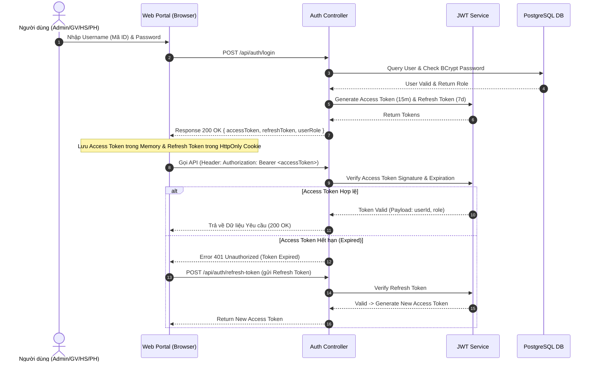

# BrainStorm Tuần 7: Chuyên Đề Nghiên Cứu Xác Thực, Phân Quyền & Bảo Mật Web (Auth & Security Engine) Hệ Thống Quản Lý Trường Học (SMS)

Tài liệu nghiên cứu chuyên sâu về các giải pháp Xác thực (Authentication), Phân quyền (Authorization) và Bảo mật ứng dụng Web, đánh giá chi tiết 3 công nghệ & cơ chế bảo mật cốt lõi: **JWT (JSON Web Token)**, **CORS (Cross-Origin Resource Sharing)** và **CSRF (Cross-Site Request Forgery)**; phân tích mô hình Phân quyền Vai trò (RBAC) cho **Hệ thống Quản lý Trường học (School Management System - SMS)**.

---

## CHƯƠNG I. MỤC TIÊU VÀ PHẠM VI NGHIÊN CỨU

### 1. Mục tiêu
Chuyên đề này được thực hiện nhằm nghiên cứu các công nghệ xác thực và cơ chế bảo mật an toàn cho ứng dụng Web. Kết quả nghiên cứu cung cấp cơ sở kỹ thuật để nhóm xây dựng phân hệ **Auth & Security Engine** tối ưu cho **Dự án Hệ thống Quản lý Trường học (SMS)**, bảo vệ tuyệt đối dữ liệu điểm số, thông tin lý lịch học sinh và giao dịch học phí khỏi các nguy cơ tấn công mạng.

### 2. Giới hạn và Phạm vi nghiên cứu
Chuyên đề tập trung nghiên cứu 3 công nghệ & cơ chế bảo mật Web cốt lõi:
- **JWT (JSON Web Token - RFC 7519)**: Cơ chế xác thực không trạng thái (Stateless Authentication) dựa trên mã hóa chữ ký số.
- **CORS (Cross-Origin Resource Sharing)**: Tiêu chuẩn W3C bảo vệ truy cập tài nguyên chia sẻ giữa các Tên miền khác nhau.
- **CSRF (Cross-Site Request Forgery)**: Tấn công giả mạo yêu cầu người dùng và các giải pháp phòng thủ chuyên sâu.

Đồng thời phân tích mô hình Phân quyền Vai trò (**RBAC - Role-Based Access Control**) cho 4 nhóm người dùng: Admin, Giáo viên, Học sinh và Phụ huynh.

Các tiêu chí đánh giá bao gồm: Mức độ an toàn thông tin, hiệu năng xử lý phía Server, độ linh hoạt khi mở rộng hệ thống, khả năng chống tấn công OWASP và độ phù hợp cho đồ án môn học.

---

## CHƯƠNG II. NGHIÊN CỨU VÀ SO SÁNH CÁC CÔNG NGHỆ BẢO MẬT & XÁC THỰC WEB

### 1. JSON Web Token (JWT - Standard RFC 7519)

#### 1.1. Cấu trúc Chuẩn của JWT Token
Tệp Token mã hóa dạng chuỗi ký tự phân tách bởi 2 dấu chấm (`.`), bao gồm 3 phần chính: `Header.Payload.Signature`.
- **Header**: Chứa loại Token (`typ: "JWT"`) và Thuật toán ký mã hóa (`alg: "HS256"` hoặc `"RS256"`).
- **Payload**: Chứa các Tuyên bố dữ liệu (Claims) như Mã người dùng (`sub`), Họ tên (`name`), Vai trò (`role`), Thời điểm phát hành (`iat`) và Thời điểm hết hạn (`exp`).
- **Signature**: Chữ ký số tạo từ việc mã hóa `Base64Url(Header) + "." + Base64Url(Payload)` cùng với một Chuỗi bí mật (Secret Key) phía Server.

#### 1.2. Cơ chế Xác thực Stateless (Không trạng thái Server)
Server không cần duy trì bảng lưu phiên làm việc (Session Storage/Redis). Khi Client gửi Yêu cầu đính kèm Token trong Header (`Authorization: Bearer <token>`), Server chỉ cần sử dụng Secret Key để giải mã và xác thực tính hợp lệ của Chữ ký số.

#### 1.3. Điểm mạnh và Hạn chế
- **Điểm mạnh**: Hiệu năng xử lý cực cao, mở rộng quy mô Server (Scale horizontal) dễ dàng, tương thích hoàn hảo với kiến trúc SPA và Mobile App.
- **Hạn chế**: Token khi đã phát hành sẽ có hiệu lực cho tới khi hết hạn (`exp`). Nếu muốn thu hồi Token tức thời (Revoke), Server cần duy trì danh sách đen Token (Token Blacklist).

---

### 2. Cross-Origin Resource Sharing (CORS - W3C Recommendation)

#### 2.1. Đặc điểm chung
CORS là một cơ chế bảo mật được tích hợp sẵn trên các Trình duyệt Web hiện đại, cho phép hoặc từ chối các Yêu cầu API được gửi từ một Tên miền (Origin) khác với Tên miền của máy chủ chứa API.

#### 2.2. Quy trình Yêu cầu Thử nghiệm (Preflight Request)
Khi Client gửi một Yêu cầu API phức tạp (có chứa Header tùy chỉnh hoặc phương thức `PUT`/`DELETE`), Trình duyệt sẽ tự động gửi một Yêu cầu thử nghiệm với phương thức `OPTIONS` để hỏi Server xem Origin đó có được phép truy cập hay không.

#### 2.3. Các HTTP Headers CORS Quan trọng Phía Server
- `Access-Control-Allow-Origin`: Khai báo danh sách Tên miền được phép gọi API (ví dụ: `https://truonghoc.edu.vn`).
- `Access-Control-Allow-Methods`: Khai báo các phương thức HTTP cho phép (`GET, POST, PUT, DELETE, OPTIONS`).
- `Access-Control-Allow-Headers`: Khai báo các Header cho phép (`Content-Type, Authorization`).
- `Access-Control-Allow-Credentials`: Cho phép gửi kèm Cookie hoặc thông tin xác thực (`true`).

#### 2.4. Nguy cơ khi Cấu hình CORS Sai sót
Nếu cấu hình `Access-Control-Allow-Origin: *` (Cho phép tất cả) kết hợp với `Credentials: true`, bất kỳ trang web độc hại nào cũng có thể gọi API của trường học để lấy dữ liệu học sinh.

---

### 3. Cross-Site Request Forgery (CSRF / XSRF)

#### 3.1. Kịch bản Tấn công CSRF
Kẻ tấn công lừa người dùng (ví dụ: Giáo viên đã đăng nhập hệ thống) truy cập vào một trang web độc hại. Trang web này tự động gửi một Yêu cầu ẩn (ví dụ: `POST /api/grades/update`) tới Server trường học. Vì Trình duyệt tự động đính kèm Cookie đăng nhập của Giáo viên, Server nhầm tưởng đó là Yêu cầu hợp lệ và thực hiện thay đổi điểm số.

#### 3.2. Các Giải pháp Phòng thủ CSRF Chuyên sâu
- **Sử dụng Custom Authorization Header (`Authorization: Bearer <JWT>`)**: Trình duyệt **không bao giờ** tự động gửi Authorization Header trong các Yêu cầu cross-site. Do đó, việc lưu JWT ở bộ nhớ Client và gửi qua Authorization Header sẽ triệt tiêu $100\%$ nguy cơ CSRF.
- **Cấu hình Thuộc tính Cookie SameSite**: Đặt `SameSite=Strict` hoặc `SameSite=Lax` để ngăn Trình duyệt tự động gửi Cookie khi truy cập từ trang web bên ngoài.
- **Anti-CSRF Tokens (Double Submit Cookie)**: Gửi kèm một Token ngẫu nhiên trong cả Cookie và Body Yêu cầu để Server đối chiếu.

---

### 4. Bảng So Sánh & Tổng Hợp Các Giải Pháp Bảo Mật (Security Strategy Matrix)

| Tiêu chí Đánh giá | JWT Authentication | CORS Policy | CSRF Defense |
| :--- | :--- | :--- | :--- |
| **Mục tiêu Bảo mật** | Xác thực danh tính & Phân quyền | Kiểm soát chia sẻ API giữa các Origin | Chống giả mạo Yêu cầu từ trang độc hại |
| **Vị trí Triển khai** | Client (Storage/Header) & Server | HTTP Server Response Headers | Server Middleware & Client Header |
| **Cơ chế Hoạt động** | Chữ ký số mã hóa Base64Url | Browser Preflight (`OPTIONS`) | Tách biệt Cookie và Bearer Token |
| **Rủi ro nếu Thiết sót** | Đăng nhập trái phép, mạo danh | Lộ API cho trang web lạ khai thác | Bị sửa điểm / đổi mật khẩu tự động |
| **Tác động Hiệu năng** | Rất thấp (Giải mã nhanh) | Không đáng kể | Không đáng kể |
| **Độ Phù hợp cho SMS** | **Cốt lõi Xác thực 4 Roles** | **Bảo vệ API Server Trường học** | **Bảo vệ Giao dịch Sửa điểm/Học phí** |

---

## CHƯƠNG III. THIẾT KẾ HẠ TẦNG BẢO MẬT & PHÂN QUYỀN RBAC TRONG HỆ THỐNG (SMS SECURITY DESIGN)

### 1. Sơ đồ Luồng Xác thực JWT & Làm mới Token (JWT Auth & Refresh Token Flow)



---

### 2. Kịch bản Mã Nguồn Minh Họa Bảo Mật (JavaScript Code Samples)

#### a. Kịch bản Mã hóa & Xác thực JWT Token phía Server
```javascript
const jwt = require('jsonwebtoken');
const bcrypt = require('bcryptjs');

const JWT_SECRET = process.env.JWT_SECRET || 'SMS_SECRET_KEY_2026_HOASEN';
const JWT_EXPIRES_IN = '15m'; // Access Token hết hạn sau 15 phút

// 1. Hàm khởi tạo Access Token chứa thông tin Vai trò (Role Claim)
function generateAccessToken(user) {
    const payload = {
        userId: user.id,
        username: user.username,
        role: user.roleCode // ROLE_ADMIN, ROLE_TEACHER, ROLE_STUDENT, ROLE_PARENT
    };
    return jwt.sign(payload, JWT_SECRET, { expiresIn: JWT_EXPIRES_IN });
}

// 2. Middleware Xác thực JWT Token từ Authorization Header
function authenticateJWT(req, res, next) {
    const authHeader = req.headers['authorization'];
    const token = authHeader && authHeader.split(' ')[1]; // Định dạng: "Bearer <token>"

    if (!token) {
        return res.status(401).json({ success: false, message: 'Yêu cầu Token xác thực' });
    }

    jwt.verify(token, JWT_SECRET, (err, decodedUser) => {
        if (err) {
            return res.status(403).json({ success: false, message: 'Token không hợp lệ hoặc đã hết hạn' });
        }
        req.user = decodedUser; // Đính kèm thông tin người dùng vào Request
        next();
    });
}
```

#### b. Kịch bản Middleware Phân quyền Vai trò (RBAC Authorization Middleware)
```javascript
// Middleware Phân quyền Vai trò linh hoạt (Check Role Authorization)
function authorizeRoles(...allowedRoles) {
    return (req, res, next) => {
        if (!req.user || !req.user.role) {
            return res.status(401).json({ success: false, message: 'Chưa xác thực người dùng' });
        }

        // Kiểm tra xem Vai trò của người dùng có nằm trong Danh sách được phép không
        if (!allowedRoles.includes(req.user.role)) {
            return res.status(403).json({ 
                success: false, 
                message: 'Bạn không có quyền truy cập vào chức năng này!' 
            });
        }

        next(); // Hợp lệ, cho phép tiếp tục truy cập API
    };
}

// Ví dụ áp dụng phân quyền API Sửa điểm: Chỉ Admin và Giáo viên mới được truy cập
// app.put('/api/grades/update', authenticateJWT, authorizeRoles('ROLE_ADMIN', 'ROLE_TEACHER'), updateGradeHandler);
```

#### c. Kịch bản Cấu hình Middleware CORS An toàn cho Server
```javascript
const cors = require('cors');

// Cấu hình CORS restricted origins an toàn cho Server Trường học
const allowedOrigins = ['https://truonghoc.edu.vn', 'http://localhost:3000'];

const corsOptions = {
    origin: function (origin, callback) {
        // Cho phép các Yêu cầu không có Origin (như Mobile App hoặc Postman kiểm thử)
        if (!origin || allowedOrigins.indexOf(origin) !== -1) {
            callback(null, true);
        } else {
            callback(new Error('CORS Policy: Tên miền này bị cấm truy cập API!'));
        }
    },
    methods: ['GET', 'POST', 'PUT', 'DELETE', 'OPTIONS'],
    allowedHeaders: ['Content-Type', 'Authorization'],
    credentials: true,
    optionsSuccessStatus: 200
};

// Áp dụng CORS Middleware toàn hệ thống
// app.use(cors(corsOptions));
```

---

## CHƯƠNG IV. ĐỀ XUẤT VÀ LỰA CHỌN PHƯƠNG ÁN BẢO MẬT CHO DỰ ÁN (SMS)

### 1. Kết luận Phương án Bảo mật Chốt
Nhóm quyết định lựa chọn **Hạ tầng Bảo mật Phối hợp**:
1. **Xác thực**: Sử dụng **JWT (JSON Web Token)** truyền qua `Authorization: Bearer <token>` Header.
2. **Phân quyền**: Áp dụng mô hình **RBAC Middleware** kiểm soát chặt chẽ 4 vai trò (`ROLE_ADMIN`, `ROLE_HOMEROOM_TEACHER`, `ROLE_SUBJECT_TEACHER`, `ROLE_STUDENT`, `ROLE_PARENT`).
3. **Bảo mật Web**: Cấu hình **Strict CORS Policy** giới hạn tên miền + Mã hóa mật khẩu người dùng bằng **BCrypt** (12 rounds) + Ghi nhật ký **Audit Log** cho mọi thao tác sửa điểm.

---

### 2. Luận cứ Khoa học cho Lựa chọn

1. **Triệt Tiêu $100\%$ Tấn Công Giả Mạo CSRF**:
   - Việc lưu Access Token trong bộ nhớ Client và gửi qua `Authorization: Bearer` Header đảm bảo các trang web độc hại bên ngoài không thể tự động gửi Token để sửa điểm hay thực hiện giao dịch học phí.
2. **Bảo Vệ Tuyệt Đối Quyền Riêng Tư Dữ Liệu Học Sinh**:
   - Phân quyền RBAC chặn đứng nguy cơ Học sinh hoặc Phụ huynh can thiệp vào các đường dẫn API sửa điểm hoặc xem bảng điểm của học sinh khác.
3. **Mở Rộng Linh Hoạt Cho Mobile App & Web Portal**:
   - Chuẩn JWT Stateless giúp một Server Backend phục vụ mượt mà đồng thời cả giao diện Web Portal trên Máy tính và Ứng dụng Di động sau này mà không cần sửa đổi cơ chế Auth.

---

## CHƯƠNG V. NGUỒN TÀI LIỆU THAM KHẢO CHÍNH THỐNG (OFFICIAL REFERENCES)

1. **RFC 7519 - JSON Web Token (JWT) Specification**: Internet Engineering Task Force (IETF).  
   Link: [https://datatracker.ietf.org/doc/html/rfc7519](https://datatracker.ietf.org/doc/html/rfc7519)
2. **JWT.io Debugger & Introduction Guide**: Auth0 by Okta.  
   Link: [https://jwt.io](https://jwt.io)
3. **Cross-Origin Resource Sharing (CORS) Technical Specification**: W3C & MDN Web Docs.  
   Link: [https://developer.mozilla.org/en-US/docs/Web/HTTP/CORS](https://developer.mozilla.org/en-US/docs/Web/HTTP/CORS)
4. **OWASP Cross-Site Request Forgery (CSRF) Prevention Cheat Sheet**: Open Web Application Security Project.  
   Link: [https://cheatsheetseries.owasp.org/cheatsheets/Cross-Site_Request_Forgery_Prevention_Cheat_Sheet.html](https://cheatsheetseries.owasp.org/cheatsheets/Cross-Site_Request_Forgery_Prevention_Cheat_Sheet.html)
5. **OWASP Top 10 API Security Risks Guide**: OWASP Foundation.  
   Link: [https://owasp.org/www-project-api-security/](https://owasp.org/www-project-api-security/)
6. **Bcryptjs Hashing Library Specification**: npm Registry.  
   Link: [https://www.npmjs.com/package/bcryptjs](https://www.npmjs.com/package/bcryptjs)
