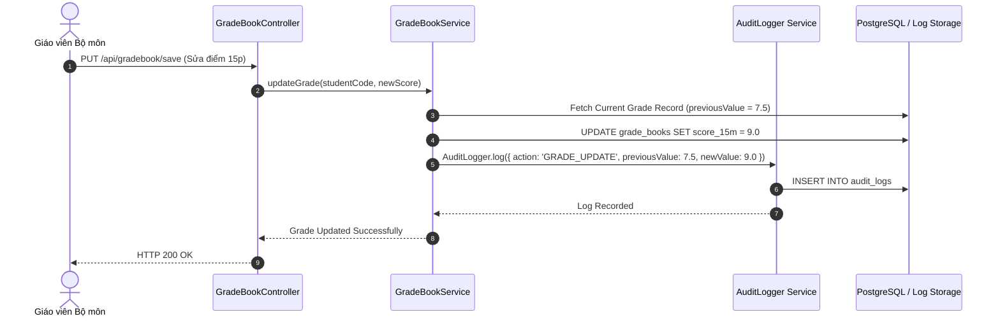

# BrainStorm Tuần 8: Chuyên Đề Nghiên Cứu Nhật Ký Hệ Thống (Centralized Audit Logging)

Tài liệu nghiên cứu chuyên sâu về thiết kế và triển khai Hệ thống Ghi nhật ký tập trung (Centralized Audit Logging System) cho **Hệ thống Quản lý Trường học (HTQLLH)**, đáp ứng các tiêu chuẩn bảo mật OWASP và quy định lưu vết sửa đổi điểm số học sinh.

---

## CHƯƠNG I. MỤC TIÊU VÀ PHẠM VI NGHIÊN CỨU

### 1. Mục tiêu
Nghiên cứu cơ chế ghi nhận vết thay đổi dữ liệu (Audit Trail) cho các thao tác nhạy cảm: Nhập/chỉnh sửa điểm số, chốt sổ điểm, duyệt đơn xin nghỉ học, thu học phí và đăng nhập hệ thống.

### 2. Yêu cầu Cốt lõi
1. **Tính Không Thể Phủ Nhận (Non-Repudiation)**: Mọi thao tác sửa điểm bắt buộc phải ghi lại người thực hiện (User ID/Role), thời gian chính xác (ISO Timestamp), địa chỉ IP, giá trị cũ và giá trị mới.
2. **Hiệu năng Ghi Log**: Sử dụng ghi nhận bất đồng bộ (Asynchronous Logging) để không làm giảm tốc độ xử lý REST API.
3. **Cấu trúc Dữ liệu Nhật ký Chuẩn**:
   - `id`: Mã nhật ký ngẫu nhiên hoặc tự tăng.
   - `timestamp`: Thời gian ghi vết.
   - `user`: Tên tài khoản người thực hiện.
   - `role`: Vai trò tác nhân (`ROLE_ADMIN`, `ROLE_HOMEROOM_TEACHER`, `ROLE_SUBJECT_TEACHER`).
   - `action`: Hành động (`GRADE_UPDATE`, `LOCK_GRADEBOOK`, `LEAVE_APPROVE`, `TUITION_PAYMENT`).
   - `entity`: Thực thể tác động (`GradeBook`, `LeaveRequest`, `Tuition`).
   - `entityId`: Mã định danh bản ghi.
   - `previousValue`: Giá trị dữ liệu trước khi sửa.
   - `newValue`: Giá trị dữ liệu mới sau khi sửa.
   - `ipAddress`: Địa chỉ IP thiết bị gửi request.

---

## CHƯƠNG II. THIẾT KẾ MÔ HÌNH VÀ MÃ NGUỒN TRIỂN KHAI

### 1. Sơ đồ Luồng Ghi vết (Audit Logging Sequence)

### 2. Triển khai Mã nguồn Thực tế
Dịch vụ Audit Logging tập trung đã được triển khai chính thức tại [members/member3_Backend_DB/school-management-nodejs/src/utils/AuditLogger.js](file:///d:/HSU/2631Semester 1(2026-2027)/PT_DA_PM/members/member3_Backend_DB/school-management-nodejs/src/utils/AuditLogger.js).

---

## CHƯƠNG III. NGƯỜI THỰC HIỆN & LIÊN HỆ

- **Trưởng nhóm / PM**: Võ Duy Bình (DYBInh2k5)
- **Thành viên phụ trách**: Backend Developer & Logic Security
- **Hệ thống**: HTQLLH (School Management System - SMS)
