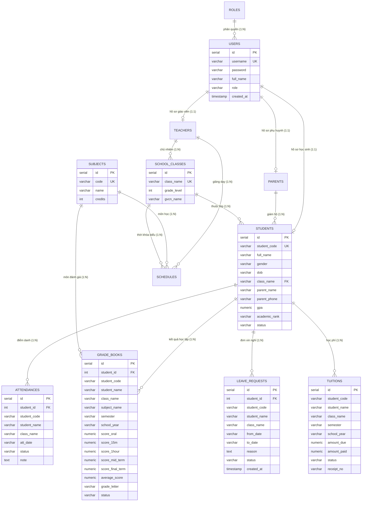

# Sơ Đồ Thực Thể Mối Quan Hệ (Entity Relationship Diagram - ERD)
## Hệ Thống Quản Lý Trường Học (HTQLLH / School Management System - SMS)

Tài liệu này tổng hợp Sơ đồ Quan hệ Thực thể (ERD) và Từ điển Dữ liệu (Data Dictionary) cho hệ thống HTQLLH, phục vụ việc lưu trữ trên cơ sở dữ liệu quan hệ PostgreSQL chuẩn ACID.

---

## 1. Sơ Đồ ERD Tổng Thể (Mermaid Diagram)

---

## 2. Từ Điển Dữ Liệu Các Thực Thể (Data Dictionary)

### 2.1. Bảng `users` (Tài khoản người dùng)
- `id`: Khóa chính (SERIAL, tự tăng).
- `username`: Tên đăng nhập duy nhất (VARCHAR(50), UNIQUE, NOT NULL).
- `password`: Mật khẩu băm an toàn bằng bcrypt (VARCHAR(255), NOT NULL).
- `full_name`: Họ và tên người dùng (VARCHAR(100), NOT NULL).
- `role`: Vai trò phân quyền (`ROLE_ADMIN`, `ROLE_HOMEROOM_TEACHER`, `ROLE_SUBJECT_TEACHER`, `ROLE_STUDENT`, `ROLE_PARENT`).
- `created_at`: Thời gian khởi tạo tài khoản (TIMESTAMP).

### 2.2. Bảng `students` (Hồ sơ học sinh)
- `id`: Khóa chính (SERIAL, tự tăng).
- `student_code`: Mã định danh học sinh duy nhất (VARCHAR(30), UNIQUE, NOT NULL, ví dụ: `HS001`).
- `full_name`: Họ và tên học sinh (VARCHAR(100), NOT NULL).
- `gender`: Giới tính (`Nam`, `Nữ`).
- `dob`: Ngày tháng năm sinh (VARCHAR(20), ví dụ: `2008-05-12`).
- `class_name`: Khóa ngoại liên kết bảng `school_classes(class_name)`.
- `parent_name`: Họ tên phụ huynh học sinh (VARCHAR(100)).
- `parent_phone`: Số điện thoại phụ huynh liên lạc (VARCHAR(20)).
- `gpa`: Điểm trung bình tích lũy thang 10.0 (NUMERIC(3,1)).
- `academic_rank`: Xếp loại học lực (`Giỏi`, `Khá`, `Trung bình`, `Yếu`).
- `status`: Trạng thái học tập (`ACTIVE`, `TRANSFERRED`, `GRADUATED`).

### 2.3. Bảng `school_classes` (Danh mục lớp học)
- `id`: Khóa chính (SERIAL, tự tăng).
- `class_name`: Tên lớp duy nhất (VARCHAR(30), UNIQUE, NOT NULL, ví dụ: `10A1`, `10A2`).
- `grade_level`: Khối lớp (INT, ví dụ: `10`, `11`, `12`).
- `gvcn_name`: Họ tên Giáo viên chủ nhiệm phụ trách (VARCHAR(100)).

### 2.4. Bảng `subjects` (Danh mục môn học)
- `id`: Khóa chính (SERIAL, tự tăng).
- `code`: Mã môn học duy nhất (VARCHAR(20), UNIQUE, NOT NULL, ví dụ: `MATH`, `LIT`).
- `name`: Tên đầy đủ của môn học (VARCHAR(50), NOT NULL, ví dụ: `Toán Học`, `Ngữ Văn`).
- `credits`: Hệ số số tiết/tín chỉ (INT).

### 2.5. Bảng `grade_books` (Sổ điểm điện tử)
- `id`: Khóa chính (SERIAL, tự tăng).
- `student_id`: Khóa ngoại tham chiếu `students(id)`.
- `student_code`: Mã học sinh (VARCHAR(30)).
- `student_name`: Họ tên học sinh (VARCHAR(100)).
- `class_name`: Tên lớp (VARCHAR(30)).
- `subject_name`: Tên môn học (VARCHAR(50)).
- `semester`: Học kỳ (`HK1`, `HK2`).
- `school_year`: Năm học (`2025-2026`).
- `score_oral`: Điểm kiểm tra miệng/thường xuyên (NUMERIC(3,1)).
- `score_15m`: Điểm kiểm tra 15 phút (NUMERIC(3,1)).
- `score_1hour`: Điểm kiểm tra 1 tiết (NUMERIC(3,1)).
- `score_mid_term`: Điểm thi giữa kỳ (NUMERIC(3,1)).
- `score_final_term`: Điểm thi cuối kỳ (NUMERIC(3,1)).
- `average_score`: Điểm trung bình môn TBM (NUMERIC(3,1)).
- `grade_letter`: Xếp loại môn (`Giỏi`, `Khá`, `Trung bình`, `Yếu`).
- `status`: Trạng thái sổ điểm (`APPROVED`, `LOCKED`, `DRAFT`).

### 2.6. Bảng `attendances` (Điểm danh chuyên cần)
- `id`: Khóa chính (SERIAL, tự tăng).
- `student_id`: Khóa ngoại tham chiếu `students(id)`.
- `student_code`: Mã học sinh (VARCHAR(30)).
- `student_name`: Họ tên học sinh (VARCHAR(100)).
- `class_name`: Tên lớp (VARCHAR(30)).
- `att_date`: Ngày điểm danh (VARCHAR(20), `YYYY-MM-DD`).
- `status`: Trạng thái chuyên cần (`PRESENT`, `ABSENT_PERMISSION`, `ABSENT_NO_PERMISSION`, `LATE`).
- `note`: Ghi chú nguyên nhân vắng.

### 2.7. Bảng `leave_requests` (Đơn xin nghỉ học)
- `id`: Khóa chính (SERIAL, tự tăng).
- `student_id`: Khóa ngoại tham chiếu `students(id)`.
- `student_code`: Mã học sinh (VARCHAR(30)).
- `student_name`: Họ tên học sinh (VARCHAR(100)).
- `class_name`: Tên lớp (VARCHAR(30)).
- `from_date`: Ngày bắt đầu nghỉ (VARCHAR(20)).
- `to_date`: Ngày kết thúc nghỉ (VARCHAR(20)).
- `reason`: Lý do xin nghỉ (TEXT).
- `status`: Trạng thái xét duyệt (`PENDING`, `APPROVED`, `REJECTED`).
- `created_at`: Thời gian nộp đơn (TIMESTAMP).

### 2.8. Bảng `tuitions` (Quản lý học phí)
- `id`: Khóa chính (SERIAL, tự tăng).
- `student_code`: Mã học sinh (VARCHAR(30)).
- `student_name`: Họ tên học sinh (VARCHAR(100)).
- `class_name`: Tên lớp (VARCHAR(30)).
- `semester`: Học kỳ (`HK1`, `HK2`).
- `school_year`: Năm học (`2025-2026`).
- `amount_due`: Số tiền học phí phải nộp (NUMERIC(12,2)).
- `amount_paid`: Số tiền đã thanh toán (NUMERIC(12,2)).
- `status`: Trạng thái thanh toán (`PAID`, `UNPAID`, `PARTIAL`).
- `receipt_no`: Mã biên lai điện tử (VARCHAR(50)).
