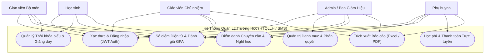
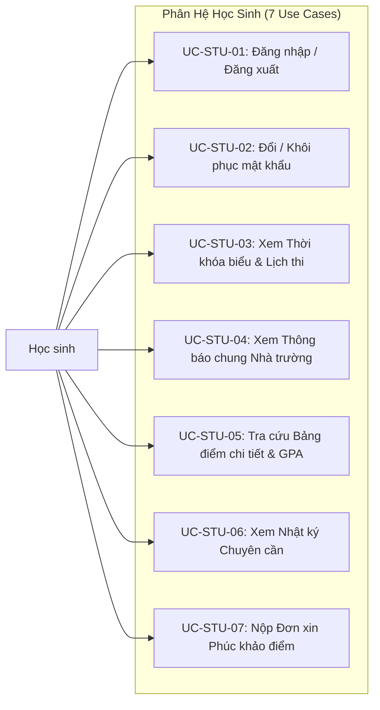
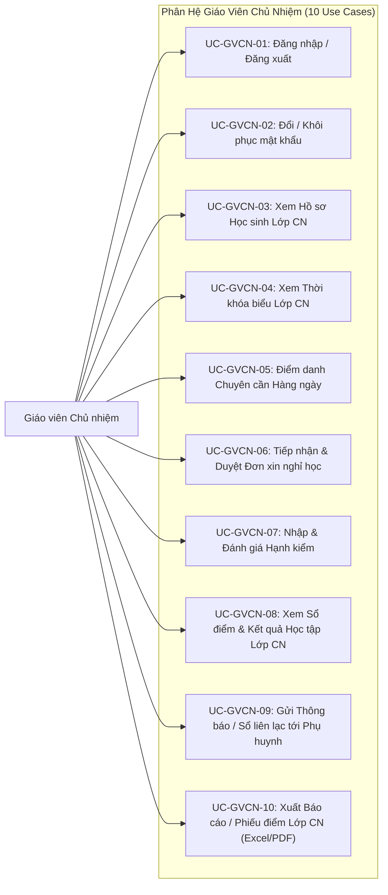
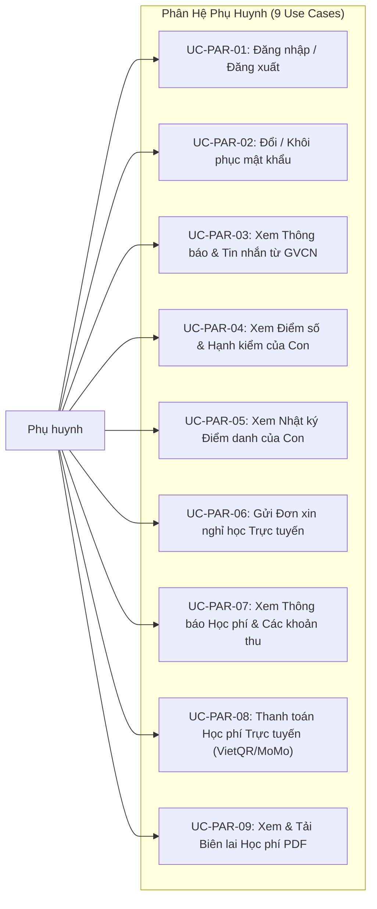
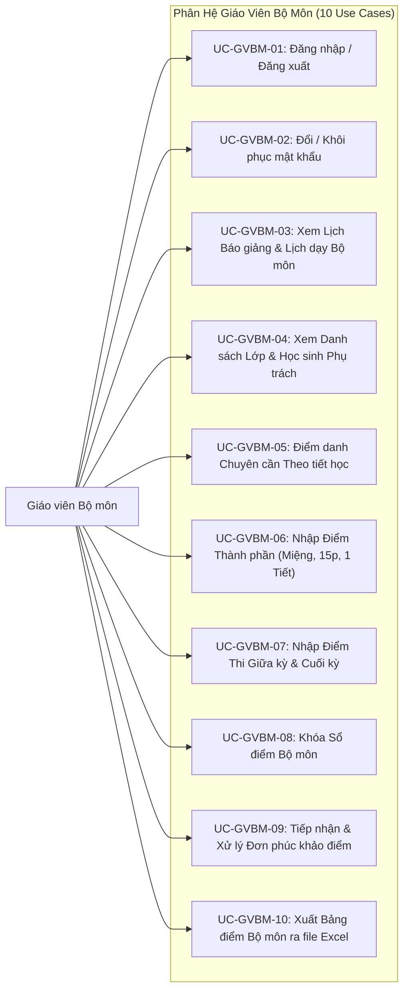
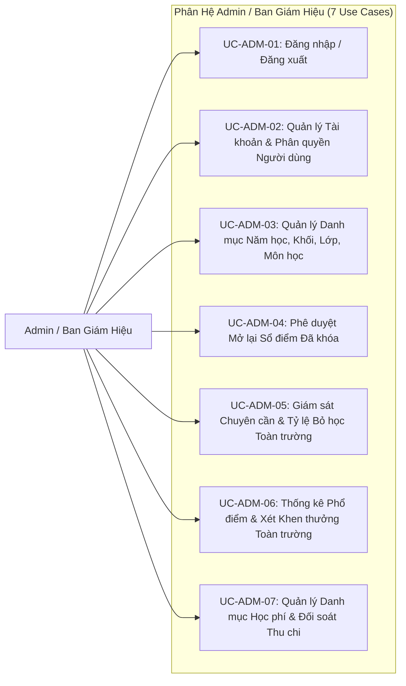
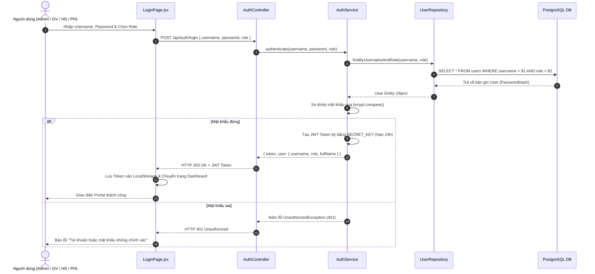
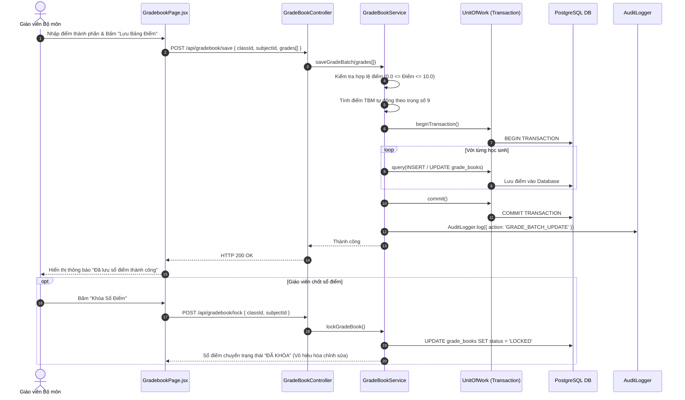
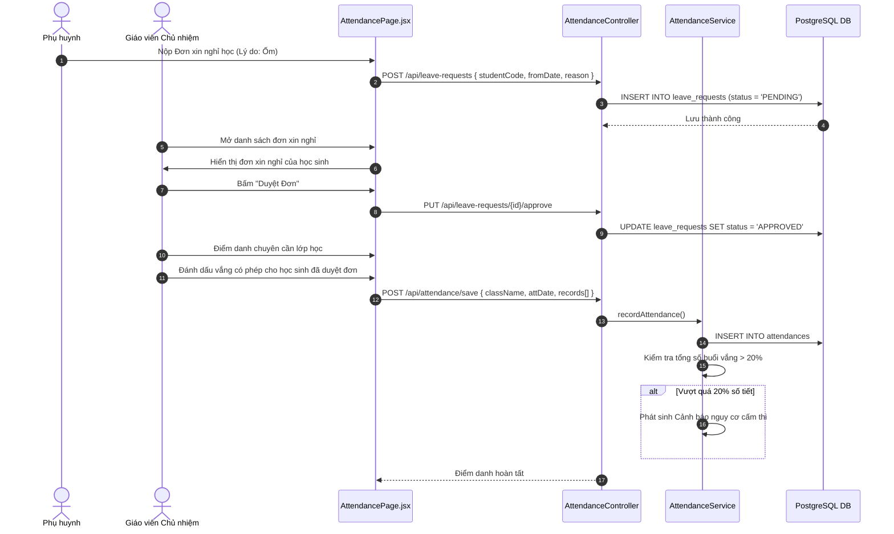
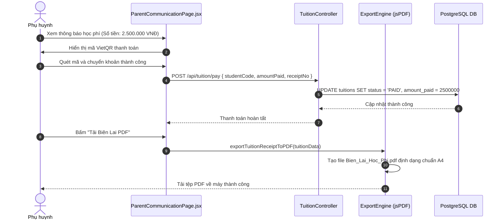

# Tài Liệu Đặc Tả Chi Tiết Use Case (Use Case Specification Document)
## Hệ Thống Quản Lý Trường Học (HTQLLH / School Management System - SMS)

- **Đơn vị thực hiện**: Nhóm Đồ Án Phát Triển Dự Án Phần Mềm (SW320DV01) - Đại học Hoa Sen (HSU)
- **Chủ sở hữu & Trưởng nhóm (PM / Lead BA)**: Võ Duy Bình (DYBInh2k5)
- **Tiêu chuẩn kỹ thuật**: IEEE 830 Software Requirements Specification & UML 2.5 Standard
- **Phiên bản tài liệu**: 2.0 (Cập nhật hoàn chỉnh cho 5 vai trò người dùng)

---

## MỤC LỤC
1. [Tổng Quan Hệ Thống & Danh Sách Tác Nhân (Actors)](#1-tổng-quan-hệ-thống--danh-sách-tác-nhân-actors)
2. [Sơ Đồ Use Case Tổng Thể Hệ Thống (System Use Case Diagram)](#2-sơ-đồ-use-case-tổng-thể-hệ-thống-system-use-case-diagram)
3. [Sơ Đồ Phân Rã Use Case Chi Tiết Theo Từng Vai Trò](#3-sơ-đồ-phân-rã-use-case-chi-tiết-theo-từng-vai-trò)
   - [3.1. Phân hệ Học Sinh (ROLE_STUDENT)](#31-phân-hệ-học-sinh-role_student)
   - [3.2. Phân hệ Giáo Viên Chủ Nhiệm (ROLE_HOMEROOM_TEACHER)](#32-phân-hệ-giáo-viên-chủ-nhiệm-role_homeroom_teacher)
   - [3.3. Phân hệ Phụ Huynh (ROLE_PARENT)](#33-phân-hệ-phụ-huynh-role_parent)
   - [3.4. Phân hệ Giáo Viên Bộ Môn (ROLE_SUBJECT_TEACHER)](#34-phân-hệ-giáo-viên-bộ-môn-role_subject_teacher)
   - [3.5. Phân hệ Admin / Ban Giám Hiệu (ROLE_ADMIN)](#35-phân-hệ-admin--ban-giám-hiệu-role_admin)
4. [Đặc Tả Chi Tiết Toàn Bộ 43 Use Cases (Use Case Specifications)](#4-đặc-tả-chi-tiết-toàn-bộ-43-use-cases-use-case-specifications)
5. [Các Sơ Đồ Tuần Tự Cốt Lõi (Core Sequence Diagrams)](#5-các-sơ-đồ-tuần-tự-cốt-lõi-core-sequence-diagrams)
6. [Ma Trận Truy Xuất Yêu Cầu (Requirements Traceability Matrix - RTM)](#6-ma-trận-truy-xuất-yêu-cầu-requirements-traceability-matrix---rtm)

---

## 1. Tổng Quan Hệ Thống & Danh Sách Tác Nhân (Actors)

Hệ thống Quản lý Trường học (HTQLLH) phục vụ công tác số hóa toàn diện học vụ, chuyên cần, sổ điểm điện tử và thu học phí cho nhà trường. Hệ thống xác định 5 tác nhân người dùng (Actors) chính:

| STT | Tác Nhân (Actor) | Mã Vai Trò | Phạm Vi Trách Nhiệm & Quyền Hạn |
| :---: | :--- | :--- | :--- |
| 1 | **Học Sinh** *(Student)* | `ROLE_STUDENT` | Tra cứu thời khóa biểu, lịch thi, bảng điểm chi tiết, GPA hệ 10/4, nhật ký điểm danh chuyên cần, thông báo chung và nộp đơn phúc khảo. |
| 2 | **Giáo Viên Chủ Nhiệm** *(Homeroom Teacher)* | `ROLE_HOMEROOM_TEACHER` | Điểm danh chuyên cần hàng ngày lớp chủ nhiệm, tiếp nhận và duyệt đơn xin nghỉ học, đánh giá xếp loại hạnh kiểm, quản lý học bạ lớp, xuất báo cáo lớp. |
| 3 | **Phụ Huynh** *(Parent)* | `ROLE_PARENT` | Đóng vai trò Sổ liên lạc điện tử: Tra cứu kết quả học tập và hạnh kiểm của con em, nộp đơn xin nghỉ học trực tuyến, nhận cảnh báo vắng học, thanh toán học phí qua mã VietQR và tải biên lai PDF. |
| 4 | **Giáo Viên Bộ Môn** *(Subject Teacher)* | `ROLE_SUBJECT_TEACHER` | Điểm danh theo tiết dạy được phân công, nhập và chỉnh sửa điểm thành phần (miệng, 15p, 1 tiết, giữa kỳ, cuối kỳ), xem thống kê điểm TBM tự động, yêu cầu khóa sổ điểm bộ môn. |
| 5 | **Admin / Ban Giám Hiệu** *(System Admin / Principal)* | `ROLE_ADMIN` | Quản trị tài khoản và phân quyền người dùng, quản lý danh mục lớp, khối, môn học, phân công giảng dạy, duyệt mở lại sổ điểm đã khóa, giám sát chuyên cần và thống kê phổ điểm toàn trường. |

---

## 2. Sơ Đồ Use Case Tổng Thể Hệ Thống (System Use Case Diagram)

---

## 3. Sơ Đồ Phân Rã Use Case Chi Tiết Theo Từng Vai Trò

### 3.1. Phân hệ Học Sinh (`ROLE_STUDENT`)

### 3.2. Phân hệ Giáo Viên Chủ Nhiệm (`ROLE_HOMEROOM_TEACHER`)

### 3.3. Phân hệ Phụ Huynh (`ROLE_PARENT`)

### 3.4. Phân hệ Giáo Viên Bộ Môn (`ROLE_SUBJECT_TEACHER`)

### 3.5. Phân hệ Admin / Ban Giám Hiệu (`ROLE_ADMIN`)

---

## 4. Đặc Tả Chi Tiết Toàn Bộ 43 Use Cases (Use Case Specifications)

### Nhóm 1: Các Use Cases Của Học Sinh (`ROLE_STUDENT`)

#### [UC-STU-01] Đăng nhập / Đăng xuất
- **Tác nhân chính**: Học sinh.
- **Mục tiêu**: Xác thực danh tính học sinh vào hệ thống.
- **Tiền điều kiện**: Học sinh đã được nhà trường cấp tài khoản hợp lệ.
- **Luồng sự kiện chính (Basic Flow)**:
  1. Học sinh truy cập trang `LoginPage.jsx` trên trình duyệt.
  2. Chọn tab vai trò "Học sinh" và nhập Mã học sinh, Mật khẩu.
  3. Bấm nút "Đăng nhập".
  4. Hệ thống kiểm tra thông tin, tạo mã JWT Token hợp lệ và chuyển hướng đến trang `StudentSchedulePage.jsx`.
- **Luồng ngoại lệ (Exception Flow)**:
  - Nhập sai mật khẩu: Hệ thống hiển thị thông báo lỗi "Mã định danh hoặc mật khẩu không chính xác".
- **Hậu điều kiện**: Phiên đăng nhập được kích hoạt và lưu trữ Token trong localStorage.

#### [UC-STU-02] Đổi / Khôi phục Mật khẩu
- **Tác nhân chính**: Học sinh.
- **Mục tiêu**: Bảo vệ an toàn tài khoản hoặc khôi phục khi quên mật khẩu.
- **Tiền điều kiện**: Đã có tài khoản hoặc xác nhận thông qua Email/SĐT phụ huynh.
- **Luồng sự kiện chính**:
  1. Học sinh bấm "Đổi mật khẩu" tại giao diện cá nhân.
  2. Nhập mật khẩu hiện tại, mật khẩu mới và xác nhận mật khẩu mới.
  3. Hệ thống kiểm tra độ mạnh mật khẩu (tối thiểu 6 ký tự) và băm mã hóa lưu vào CSDL.
  4. Thông báo đổi mật khẩu thành công.

#### [UC-STU-03] Xem Thời Khóa Biểu & Lịch Thi
- **Tác nhân chính**: Học sinh.
- **Tiền điều kiện**: Ban Giám Hiệu đã phê duyệt phân công TKB cho lớp.
- **Luồng sự kiện chính**:
  1. Học sinh chọn mục "Thời khóa biểu" trên thanh điều hướng.
  2. Hệ thống tải dữ liệu ma trận tiết học từ Thứ 2 đến Thứ 7 của lớp học sinh.
  3. Hiển thị trực quan môn học, giáo viên phụ trách và phòng học.

#### [UC-STU-04] Xem Thông Báo Chung Nhà Trường
- **Tác nhân chính**: Học sinh.
- **Luồng sự kiện chính**: Hệ thống hiển thị bảng tin thông báo mới nhất từ Ban Giám Hiệu và Đoàn trường (lịch nghỉ lễ, kế hoạch thi học kỳ).

#### [UC-STU-05] Tra Cứu Bảng Điểm Chi Tiết & GPA
- **Tác nhân chính**: Học sinh.
- **Tiền điều kiện**: Giáo viên bộ môn đã nhập điểm thành phần.
- **Luồng sự kiện chính**:
  1. Học sinh chọn tab "Kết quả học tập".
  2. Hệ thống truy vấn điểm các môn (Miệng, 15p, 1 tiết, Giữa kỳ, Cuối kỳ) và điểm TBM.
  3. Tự động tính toán và hiển thị Điểm GPA hệ 10.0, Quy đổi hệ 4.0 và Xếp loại học lực.

#### [UC-STU-06] Xem Nhật Ký Điểm Danh Chuyên Cần
- **Tác nhân chính**: Học sinh.
- **Luồng sự kiện chính**: Hiển thị bảng tổng hợp ngày học, số buổi có mặt, số buổi nghỉ phép và số buổi nghỉ không phép. Nếu tỷ lệ nghỉ vượt 15%, hiển thị cảnh báo đỏ nguy cơ cấm thi.

#### [UC-STU-07] Nộp Đơn Xin Phúc Khảo Điểm
- **Tác nhân chính**: Học sinh.
- **Tiền điều kiện**: Trong thời hạn mở phúc khảo sau khi công bố điểm thi học kỳ.
- **Luồng sự kiện chính**:
  1. Học sinh chọn môn học cần phúc khảo và nhập lý do sai sót.
  2. Bấm "Nộp đơn phúc khảo". Đơn được lưu vào hệ thống ở trạng thái `PENDING` và gửi tới GVBM.

---

### Nhóm 2: Các Use Cases Của Giáo Viên Chủ Nhiệm (`ROLE_HOMEROOM_TEACHER`)

#### [UC-GVCN-01] Đăng nhập / Đăng xuất GVCN
- Xác thực tài khoản giáo viên chủ nhiệm và cấp quyền truy cập các tính năng quản lý lớp chủ nhiệm.

#### [UC-GVCN-02] Đổi Mật khẩu Cá nhân
- Cập nhật thông tin mật khẩu bảo mật của giáo viên.

#### [UC-GVCN-03] Xem Hồ sơ Học sinh Lớp Chủ Nhiệm
- **Luồng sự kiện chính**:
  1. GVCN chọn "Danh sách lớp".
  2. Hệ thống hiển thị danh sách 40-45 học sinh lớp chủ nhiệm kèm số điện thoại phụ huynh, địa chỉ và tình trạng học tập.

#### [UC-GVCN-04] Xem Thời Khóa Biểu Lớp Chủ Nhiệm
- Hiển thị lịch giảng dạy và học tập toàn bộ các môn của lớp chủ nhiệm theo từng tuần.

#### [UC-GVCN-05] Điểm Danh Chuyên Cần Hàng Ngày
- **Tiền điều kiện**: Vào đầu mỗi buổi học.
- **Luồng sự kiện chính**:
  1. GVCN mở trang `AttendancePage.jsx`.
  2. Hệ thống mặc định tất cả học sinh là "Có mặt" (PRESENT).
  3. GVCN chọn các học sinh vắng có phép, vắng không phép hoặc đi trễ.
  4. Bấm "Lưu điểm danh". Hệ thống lưu dữ liệu vào CSDL và tự động phát thông báo tới phụ huynh học sinh vắng.

#### [UC-GVCN-06] Tiếp Nhận & Duyệt Đơn Xin Nghỉ Học
- **Luồng sự kiện chính**:
  1. GVCN mở danh sách "Đơn xin nghỉ học" từ phụ huynh.
  2. Xem lý do, ngày nghỉ xin phép.
  3. Bấm "Duyệt" (Trạng thái chuyển sang `APPROVED`) hoặc "Từ chối".
  4. Khi duyệt, hệ thống tự động cập nhật trạng thái điểm danh ngày đó thành "Vắng có phép".

#### [UC-GVCN-07] Nhập & Đánh Giá Xếp Loại Hạnh Kiểm
- **Luồng sự kiện chính**:
  1. Cuối học kỳ, GVCN vào chức năng "Đánh giá hạnh kiểm".
  2. Chọn mức hạnh kiểm: Tốt, Khá, Trung bình, Yếu cho từng học sinh.
  3. Nhập nhận xét quá trình rèn luyện và lưu vào sổ học bạ điện tử.

#### [UC-GVCN-08] Xem Sổ Điểm Tổng Hợp & Kết Quả Lớp CN
- Tra cứu bảng điểm tổng hợp tất cả các môn của lớp, tỷ lệ học lực Giỏi/Khá/TB và danh sách học sinh có nguy cơ thi lại hoặc rèn luyện hè.

#### [UC-GVCN-09] Gửi Thông Báo / Sổ Liên Lạc Điện Tử
- Soạn và phát hành thông báo họp phụ huynh, thông báo đóng học phí hoặc tin nhắn riêng tới từng phụ huynh.

#### [UC-GVCN-10] Xuất Báo Cáo / Phiếu Báo Điểm Lớp CN (Excel / PDF)
- Sử dụng module [exportEngine.js](file:///d:/HSU/2631Semester 1(2026-2027)/PT_DA_PM/members/member5_Modules_QA/exportEngine.js) xuất danh sách học sinh, bảng điểm lớp ra file Excel (`.xlsx`) hoặc in phiếu báo điểm từng học sinh ra file PDF (`.pdf`).

---

### Nhóm 3: Các Use Cases Của Phụ Huynh (`ROLE_PARENT`)

#### [UC-PAR-01] Đăng nhập Tài khoản Phụ huynh
- Đăng nhập bằng số điện thoại hoặc mã học sinh của con em.

#### [UC-PAR-02] Đổi / Khôi phục Mật khẩu Phụ huynh
- Thiết lập lại mật khẩu qua mã xác nhận SMS/Email.

#### [UC-PAR-03] Xem Thông Báo & Tin Nhắn Từ GVCN
- Xem tin tức từ nhà trường và trao đổi thông tin giáo dục với giáo viên chủ nhiệm.

#### [UC-PAR-04] Xem Điểm Số & Hạnh Kiểm Của Con Em
- Tra cứu điểm thi các môn học và nhận xét rèn luyện hạnh kiểm của con trong thời gian thực.

#### [UC-PAR-05] Xem Nhật Ký Điểm Danh Chuyên Cần
- Theo dõi lịch sử chuyên cần hàng ngày, nhận cảnh báo khi con vắng mặt không phép.

#### [UC-PAR-06] Gửi Đơn Xin Nghỉ Học Trực Tuyến
- **Luồng sự kiện chính**:
  1. Phụ huynh mở giao diện `ParentCommunicationPage.jsx`.
  2. Điền ngày bắt đầu, ngày kết thúc và lý do nghỉ (bị ốm, việc gia đình).
  3. Bấm "Gửi đơn nghỉ học". Đơn được chuyển tức thì tới tài khoản GVCN.

#### [UC-PAR-07] Xem Thông Báo Học Phí & Các Khoản Thu
- Tra cứu danh mục học phí học kỳ, tiền bán trú, bảo hiểm y tế và số tiền còn nợ.

#### [UC-PAR-08] Thanh Toán Học Phí Trực Tuyến
- **Luồng sự kiện chính**:
  1. Phụ huynh bấm "Thanh toán học phí".
  2. Hệ thống hiển thị mã VietQR chuyển khoản ngân hàng tự động kèm số tiền chính xác.
  3. Phụ huynh quét mã thanh toán thành công, hệ thống cập nhật trạng thái `PAID`.

#### [UC-PAR-09] Xem & Tải Biên Lai Điện Tử PDF
- Hệ thống tự động sinh và cho phép tải file Biên lai thu tiền học phí điện tử (`Bien_Lai_Hoc_Phi.pdf`) có mã số xác thực.

---

### Nhóm 4: Các Use Cases Của Giáo Viên Bộ Môn (`ROLE_SUBJECT_TEACHER`)

#### [UC-GVBM-01] Đăng nhập / Đăng xuất GVBM
- Xác thực tài khoản giáo viên bộ môn.

#### [UC-GVBM-02] Đổi Mật khẩu GVBM
- Bảo mật tài khoản giảng dạy.

#### [UC-GVBM-03] Xem Lịch Dạy & Lịch Báo Giảng
- Xem thời khóa biểu các lớp được phân công giảng dạy trong tuần.

#### [UC-GVBM-04] Xem Danh Sách Học Sinh Lớp Phụ Trách
- Tra cứu danh sách học sinh theo từng lớp để gọi kiểm tra bài hoặc theo dõi học lực.

#### [UC-GVBM-05] Điểm Danh Tiết Học Phụ Trách
- Điểm danh học sinh có mặt trong tiết học được phân công.

#### [UC-GVBM-06] Nhập Điểm Thành Phần Thường Xuyên
- **Tiền điều kiện**: Sổ điểm chưa bị khóa (`status != LOCKED`).
- **Luồng sự kiện chính**:
  1. GVBM mở `GradebookPage.jsx`, chọn Lớp và Môn học.
  2. Nhập điểm miệng, điểm 15 phút, điểm 1 tiết (hệ số 2) cho từng học sinh.
  3. Hệ thống tự động kiểm tra điểm nằm trong khoảng từ `0.0` đến `10.0`.
  4. Bấm "Lưu tạm", hệ thống lưu thay đổi và kích hoạt dịch vụ Audit Log.

#### [UC-GVBM-07] Nhập Điểm Thi Giữa Kỳ & Cuối Kỳ
- Nhập điểm thi tập trung; hệ thống tự động tính Điểm trung bình môn (TBM) theo công thức trọng số chuẩn:
  $$\text{TBM} = \frac{\text{Miệng} + 15\text{p} + (\text{1 Tiết} \times 2) + (\text{Giữa Kỳ} \times 2) + (\text{Cuối Kỳ} \times 3)}{9}$$

#### [UC-GVBM-08] Khóa Sổ Điểm Bộ Môn
- **Tiền điều kiện**: Đã nhập đầy đủ điểm thành phần và điểm thi cuối kỳ cho cả lớp.
- **Luồng sự kiện chính**:
  1. GVBM kiểm tra lại bảng điểm toàn lớp.
  2. Bấm nút "Chốt khóa sổ điểm".
  3. Trạng thái sổ điểm chuyển sang `LOCKED`. Kể từ thời điểm này, mọi thao tác sửa điểm đều bị chặn tuyệt đối.

#### [UC-GVBM-09] Xử Lý Đơn Phúc Khảo Điểm
- Tiếp nhận đơn phúc khảo từ BGH, chấm lại bài thi và gửi đề xuất sửa điểm lên BGH duyệt.

#### [UC-GVBM-10] Xuất Bảng Điểm Bộ Môn Ra File Excel
- Xuất toàn bộ bảng điểm lớp môn phụ trách ra file `.xlsx` bằng thư viện SheetJS.

---

### Nhóm 5: Các Use Cases Của Admin / Ban Giám Hiệu (`ROLE_ADMIN`)

#### [UC-ADM-01] Đăng nhập / Đăng xuất Admin
- Xác thực quyền quản trị tối cao của hệ thống.

#### [UC-ADM-02] Quản Lý Tài Khoản & Phân Quyền Người Dùng
- Tạo mới tài khoản, phân quyền 5 Roles, khóa tài khoản vi phạm hoặc đặt lại mật khẩu mặc định.

#### [UC-ADM-03] Quản Lý Danh Mục Năm Học, Khối, Lớp, Môn Học & Phân Công
- Tạo năm học mới, chia lớp học sinh, cấu hình danh mục môn và phân công giảng dạy cho giáo viên.

#### [UC-ADM-04] Phê Duyệt Mở Lại Sổ Điểm Đã Khóa
- **Luồng sự kiện chính**:
  1. Admin mở trang `SystemSettingsPage.jsx`.
  2. Xem danh sách yêu cầu mở khóa sổ điểm kèm lý do phúc khảo từ GVBM.
  3. Bấm "Duyệt mở khóa". Sổ điểm chuyển về trạng thái `OPEN` trong vòng 24 giờ để GVBM sửa điểm. Mọi thay đổi được Audit Log ghi lại chi tiết.

#### [UC-ADM-05] Giám Sát Chuyên Cần & Cảnh Báo Bỏ Học Toàn Trường
- Theo dõi biểu đồ tỷ lệ chuyên cần thời gian thực của các lớp, phát hiện sớm các trường hợp nghỉ học nhiều buổi liên tiếp.

#### [UC-ADM-06] Thống Kê Phổ Điểm & Xét Khen Thưởng Toàn Trường
- Xem báo cáo phổ điểm thi học kỳ các môn, danh sách học sinh đạt danh hiệu Học sinh Xuất sắc/Giỏi và danh sách học sinh cần rèn luyện hè.

#### [UC-ADM-07] Quản Lý Danh Mục Học Phí & Đối Soát Thu Chi
- Cấu hình mức thu học phí cho từng khối lớp, kiểm tra tiến độ nộp học phí và đối soát ngân hàng.

---

## 5. Các Sơ Đồ Tuần Tự Cốt Lõi (Core Sequence Diagrams)

### 5.1. Sơ đồ SD-01: Đăng nhập & Cấp phát JWT Token Đa Vai Trò

---

### 5.2. Sơ đồ SD-02: Nhập Điểm, Tính Điểm TBM & Khóa Sổ Điểm

---

### 5.3. Sơ đồ SD-03: Điểm Danh Chuyên Cần, Cảnh Báo Vắng & Duyệt Đơn Nghỉ

---

### 5.4. Sơ đồ SD-04: Đóng Học Phí Trực Tuyến & Xuất Biên Lai PDF

---

## 6. Ma Trận Truy Xuất Yêu Cầu (Requirements Traceability Matrix - RTM)

| Quy Tắc Nghiệp Vụ (BR) | Mã Phân Hệ | Mã Use Case Liên Quan | API Endpoint Backend | Giao Diện Frontend | Test Case QA |
| :--- | :---: | :--- | :--- | :--- | :--- |
| **BR-01** (Công thức TBM) | FC-04 | `UC-GVBM-06`, `UC-GVBM-07` | `POST /api/gradebook/save` | `GradebookPage.jsx` | Test 1: GPA Weight Calculation |
| **BR-02** (Xếp loại Học lực) | FC-04 | `UC-STU-05`, `UC-GVCN-08` | `POST /api/students/{id}/calculate-gpa` | `StudentSchedulePage.jsx` | Test 2: Academic Rank Evaluation |
| **BR-03** (Chống Sửa Điểm) | FC-04 | `UC-GVBM-08`, `UC-ADM-04` | `POST /api/gradebook/lock` | `SystemSettingsPage.jsx` | Test 3: Grade Lock Security |
| **BR-04** (Cảnh báo Chuyên cần) | FC-05 | `UC-GVCN-05`, `UC-ADM-05` | `GET /api/attendance` | `BGHAttendanceMonitorPage.jsx` | Test 4: Attendance Warning |
| **BR-05** (Thi đua Khen thưởng) | FC-04 | `UC-GVCN-07`, `UC-ADM-06` | `GET /api/students` | `BGHReportCenterPage.jsx` | Test 5: Award Title Evaluation |
| **BR-06** (Trích xuất Báo cáo) | FC-07 | `UC-GVCN-10`, `UC-PAR-09` | `POST /api/reports/export` | `exportEngine.js` | Test 6: Export Engine Validation |
